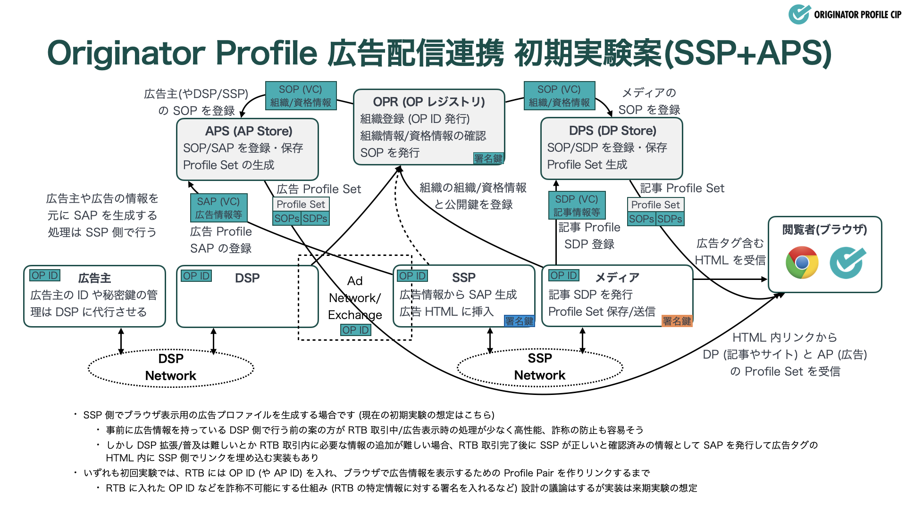
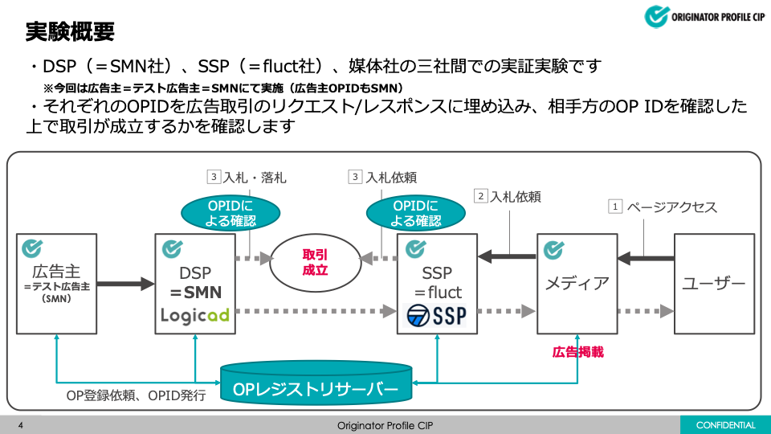

# 実験概要・構成・スケジュール

## 背景と目的

[Originator Profile 技術研究組合 (OP CIP)](https://originator-profile.org/) では、これまでニュースやブログなどといった一般的なメディアサイトのメイン記事コンテンツを中心として、Web コンテンツに対し検証可能で信頼性のある発信者情報の付与方法を検討・プロトタイプ開発を進めてきました。また、そのプロトタイプを実際のメディア各社の CMS や記事の配信システムに試験実装することで、組合員各社の理解を深めつつ実利用する際の課題の洗い出し・実用性の検証などを行う為、メディア側実証実験を進めています。

本実証実験では、メディア側実証実験をベースとしつつ、メディアサイトのメイン記事コンテンツではなく、広告コンテンツに対して同様の枠組みで信頼性のある発信者情報の付与が可能であるか、その場合に広告クリエイティブの自動生成しシステムや RTB 取引に仕組みを組み込み流通させる上で最適な方法を検討しつつ、DSP と SSP 間の実際の RTB 取引システム上に発信者情報を流通・記録・検証などが可能であるか確認することを目的としています。

## システム構成概要

本実証実験では[先の実験](/media-study-202307/)を通じて OP 対応試験を進めているメディアの CMS と RTB 取引に於ける OP 利用に対応するよう拡張実装を段階的に進める DSP/SSP とを組み合わせる実証実験を行います。

全体のシステム構成の概念図としては当初コンセプト図の通り、メディアの記事と同様に広告に対しても [Advertisement Profile (AP)](/terminology/advertisement-profile.md) を付与すると共に Ad Network での RTB 取引内に OP 情報を含めて実施する形です。

但し、OP 対応広告取引に於ける検証要素の議論・検討を待って実装するなどの都合により、AP の生成、登録、付与などの仕組みについては次に示すような実装パターンにしたり、ダミーの広告プロファイルデータを用いた実験から開始するなど、段階的な実証実験とします。

こちらの構成概要図はあくまでもコンセプト的な概要図であり、実験の各段階における具体的な実装には正確には対応していません。各段階での具体的な実装と検証範囲については、広告連携実験の集中検討グループ内で調整しつつ進行します。

## 実証実験ステップ概要

広告連携実験については次のように段階的に検証・検討しつつ進めていく想定です。

0. 事前準備
   - レジストリ登録や実験仕様とスケジュールの調整など
1. OP 対応 RTB 広告取引の基礎動作確認 (2023/11-12)
   - DSP/SSP (および広告主/メディア) が双方 の OP ID を確認した取引を可能に
   - ダミー広告プロファイルを HTML に挿入/リンクしブラウザで(簡易的に)表示
   - RTB 内のデータの署名や検証は行わず、広告プロファイルの検証も部分的とする
2. RTB 広告取引の検証可能化 (2024/1-3)
   - DSP/DSP が OP の資格情報を利用した取引を可能に
   - RTB 内の OP データと一部重要データの検証可能化(詐称防止)
   - 広告プロファイルの定義と実装を更新しブラウザでの表示を実装
3. RTB 広告取引の検証可能領域拡大、効果測定やインセンティブ設計 (2024 年度以降)
   - 履歴検証の検討など、引き続き RTB 広告取引における検証可能領域の拡大を行う
     - 配信経路プロファイルやログフォーマットなども必要に応じて導入を検討
   - 基礎技術検証を踏まえ、OP 対応取引の広告価値向上を実現する設計を行う
     - 効果測定・履歴検証などの要件/実装はガバナンス設計・議論次第

OP 技術を広告取引に利用することで様々な問題の解消が可能であると考えられますが、問題の重要度と対応の容易性(採用の広がり)とも関係するため、1st, 2nd ステップ (24 年 3 月末まで) には「広告主とメディアがそれぞれ相手の信頼性を OP を用いて確認した上での取引を可能とする事」に重点を置いて進行します。

出所とその信頼性を明らかにするという OP の基本理念・基本機能をそのまま広告取引に適用した上で、OP 技術を応用して実現可能なことに取り組むという方針です。

:::note

全ての実験は前のステップでの実験結果と検討内容を踏まえて進行するため、特に 2nd 以降の実施スコープやスケジュールについては流動的に変更されます。

:::

## 実証実験ステップの実施内容

各ステップで実施していく内容、特に 1st ステップでの実装内容の想定は次の通りです。

0. 事前準備
   - OP レジストリ登録
     - OP ID と SOP の発行
   - ブラウザ UI 検討
     - 開発チーム内での検討結果/案を踏まえて主にガバナンス WG などと検討
1. OP 対応 RTB 広告取引の基礎動作確認
   - 1a. OP ID を用いた取引の実装 (DSP/SSP 対応)
     - DSP/SSP, 広告主/メディアの OP ID を RTB 入応札の拡張データとして埋め込み
     - OP ID を持つ相手に限定した入応札に対応したシステムを準備
       - RTB bid req/res に OP ID があることを入応札要件とする
   - 1b. OP ID を用いた取引の実証 (メディアの実験サイト/ブラウザ対応)
     - OP 対応広告枠を実験メディアのサイトに組み込み
       - 初回実験は Google Ad Manager を用いた広告タグの設定を原則とする
     - OP 対応取引の実行ログを残し、その記録を確認
     - 実験メディアサイトにサイトプロファイルとダミー広告プロファイルへのリンクを追加
       - AP 仕様や検証の設計が進むまではダミーのプロファイルを用いる
     - ブラウザでのサイト・メイン記事・ダミー広告プロファイルの表示確認
       - 当初は Figma での UI/UX 検討と簡易的なブラウザ拡張機能実装とする
   - 1c. OP 検証可能 RTB 取引の準備
     - OP 情報への署名付加など、検証可能データを用いる実験の仕様検討
     - AP のデータモデルと署名範囲、入手・配付方法など更新検討
2. RTB 広告取引の検証可能化
   - 2a OP 資格情報を用いた取引の実装 (DSP/SSP 対応)
     - RTB 取引に OP ID の持つ資格情報を利用
     - RTB bid req/res に資格情報などの OP データを追加する可能性も検討
   - 2b OP 資格情報を用いた取引の実証 (実験サイト/ブラウザ対応)
     - サイト側はサイト・ページの情報を検証可能なデータに含める場合に対応
     - SSP がサイト・ページの情報を効率的に取得可能にする仕様変更の検討
     - AP の仕様変更や検証可能になった範囲の変更に伴うブラウザ表示側の更新
       - 検討してきた UI と機能の基本的なブラウザ拡張機能側の実装を進める
   - 2c OP 検証可能 RTB 取引の実装 (DSP/SSP対応)
     - RTB 入応札のうち詐称されてはならないデータを特定
     - OP ID と共に詐称されてはならないデータに対する署名付与など検証可能化
     - 検証可能データの検証タイミングの検討 (事後検証やログだけの可能性もあり)
   - 2d 署名付き取引の実証 (実験サイト/ブラウザ対応)
     - RTB 内の署名対応はサイトやブラウザには影響が小さい想定
     - DSP/SSP 側の変更を踏まえて改めて実験を実施
3. RTB 広告取引の検証可能領域拡大、効果測定やインセンティブ設計
   - OP 対応取引の広告価値向上を実現する設計を行う
   - 効果測定・履歴検証などの要件/実装はガバナンス設計・議論次第
     - 効果測定や履歴検証に要件を設けるかどうかはインセンティブ設計次第
   - 配信経路プロファイルやログフォーマットなども必要に応じて導入を検討
     - 第三者検証可能な OP 取引ログを要求するならその仕様を検討

:::note

全ての実験は前のステップでの実験結果と検討内容を踏まえて進行するため、特に 2nd 以降の実施スコープやスケジュールについては流動的に変更されます。

:::

## 検証要素

本実験においては、広告流通システムへの適用については初回の実験であるため、RTB 取引の中でそれぞれの OP ID を記載・流通させること、それを元に広告の閲覧者が広告に関する情報の確認も (サイトや主コンテンツなどの情報と合わせて) 確認可能に出来ることを検証する。

- 広告の RTB 取引 Request/Response のデータを (まずは確実性のため ext プロパティ配下のみ) 拡張し各ステークホルダの OP ID を記載、流通させて取引を実施する
- SSP 側では SSP 自身の OP ID の他、メディアサイトやコンテンツの OP ID をサイトから読み取り RTB 取引に埋め込む
- DSP 側では DSP 自身の OP ID の他、広告主の OP ID を広告主から受け取るか代理で OP レジストリに登録・管理するなどした上で RTB 取引に埋め込む

既存のメディア側実証実験ではメディアサイトのコンテンツをブラウザで検証・表示するのに適したフォーマットのみが定義されており、これをそのまま広告取引において利用できないまたはスケールしない可能性があり、適したフォーマットや取り扱いを議論した上で流通させる仕組みを検討・実装する。

## 非検証要素

以下のような点については当初の実験には含めず、継続実験において随時検証範囲の拡大を行っていく想定です。

- 広告クリエイティブへの署名
  - 既存のプロトタイプでは記事本文テキストへの署名を主として実装しており、画像・動画などを主としたメディアファイルを主とした広告クリエイティブ自体への署名については未検討であり、実装・検証の対象としない
- RTB 取引内での OP 関連情報 (OP ID 以外) への署名と検証
  - RTB においては OP に関わる処理以外にも様々なアルゴリズムによる処理を行いつつも短時間内で応答を返す必要性があり、OP の署名と検証を都度リアルタイムに実施する事には処理時間へのオーバーヘッドが発生する
  - RTB 取引中の何処について署名検証を個なうべきか、事前署名したデータの作成によるオーバーヘッドの解消や、事後検証であっても不適切な広告の掲出が抑制できる仕組みなども議論・検討を進めた上で次回以降の実験で段階的に署名・検証の扱いの導入を想定する

## 検討要素

本実験の進行と共に、プロトタイプ実装の改訂を並行して実施したり、次回以降の継続実験の準備として、以下のような点について順次議論・検討を進める想定です。

- 広告取引における OP の設計と役割の整理
  - メディアの発信者情報の透明化などだけでなく、広告取引に有用な形で OP を利用・発展可能にするために適切な OP の設計・役割・ガバナンスなどの検討を行う
- DSP/SSP や検索エンジン向けの OP Profile ファイル
  - DSP/SSP などがサイトの運営者やページあるいはその主コンテンツの作成者の OP ID や OP の登録情報を効率的に取得可能な仕組みを作る
- 広告用プロファイルのデータモデル
  - 各ステークホルダが OP としてレジストリに登録すべき組織情報 (メディア OP との違い)
  - 広告用プロファイル AP = Advertisement Profile (仮) に記載可能とすべき情報
    - 広告主に関する情報
    - 広告クリエイティブに関する情報
    - DSP に関する情報
    - SSP に関する情報
    - アドベリに関する情報
    - その他
  - AP として記載した情報の検証タイミング
    - 全取引でリアルタイム検証可能なものはあるか
    - ログに残して必要時に事後検証や
  - RTB 取引内で流通させる検証可能データとメディア Web サイト (広告視聴者) への掲出をすべきデータの関係性
    - OP は RTB req/res に含めるか、リンクだけ入れたり別途 ID から解決させるのか
    - 上記 AP 記載情報のうち、いずれを RTB req/res およびメディア Web に含めるべきか
    - RTB req/res の AP とメディア Web 掲出 AP が別形式の可能性はないか
- ブラウザへの表示
  - メディアのメイン記事コンテンツの DP と広告クリエイティブの AP との表示関係
    - 単純に AP は下に表示するだけか、広告情報を分けてグループ化するなどするか
    - AP 記載内容の内どこまでを概要画面・詳細画面に分けて表示すべきか
    - オーバーレイ表示において DP, AP をどのように表示し分けるか
  - コンテキストメニュー (右クリックメニュー) の利用
    - リンクや画像などのコンテキストメニューを拡張して OP 表示させる可能性

:::note

検証要素、非検証要素についてもですが、特に検討要素については集中検討グループ内で「OP 対応広告取引

:::

## スケジュール

現時点では以下のスケジュールにて実証実験の進行を想定しております:

- 11 月以前
  - 実験計画・仕様検討と DSP/SSP を含む集中検討グループ内調整
  - 広告連携実験に於けるブラウザ UI の下検討
- 11 月 7 日
  - 広告連携集中検討グループによる実験開始前キックオフ
  - 年度内 (3 月まで) の進行スケジュールや方針の確認
- 11 月
  - 実験準備、1st 実験仕様の調整
  - DSP/SSP 側の実験対応実装 (12 月も継続)
  - 広告連携実験に於けるブラウザ UI の仮確定
- 12 月 4 日
  - 実験参加/検討メディアの担当者向け説明会
- 12 月
  - 広告連携 1st 実験対応実装
  - 広告連携 1st 実験の実施
    - 実施時間枠を決めて疎通実験 (2 回程度を想定)
  - 広告連携実験に於けるブラウザ UI の(簡易)実装
  - 広告連携 2nd 実験の仕様・検証要素調整
- 1 月〜2 月
  - 広告連携 1st 実験結果の報告
  - 広告連携 2nd 実験対応実装
  - 広告連携実験に於けるブラウザ UI の実装/更新
- 2 月〜3 月
  - 広告連携 2nd 実験の実施
    - 同じく実施時間枠を決めて実験の実施を想定
  - 実験参画企業からのフィードバック取りまとめ
- 3 月
  - 広告連携 2nd 実験結果の報告
