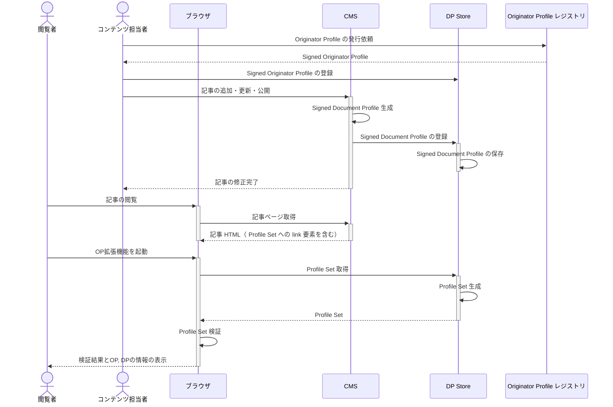

# DP Store を使った実装ガイド

このガイドでは DP Store を使って CMS を実装する方法を説明します。

DP Store は、 SDP と SOP を保存・管理し、 Profile Set を配信するためのサービスです。このサービスを使うことで、 CMS を OP 対応する際に必要な機能を簡単に実装することができます。

import dpStoreJpeg from "./assets/dp-store.jpeg";


DP Store を使って CMP を OP 対応にする場合、次のようなシステム構成で実装してください。


シーケンス図は次のようになります。



CMS に実装する必要のある機能は次の3つであり、このうち、 DP Store を利用できるのは2, 3の実装です。

1. SDP の生成・署名
2. SDP の保存・管理
3. Profile Set の配信

[Originator Profile 技術研究組合 (OP CIP)](https://originator-profile.org/) が開発した DP Store はこれらの機能を REST API として提供しています。詳細は[CIP 提供 DP レジストリについて](/media-study-202307/howto.md#cip-提供-dp-レジストリについて)を参照してください。

2\. に対応する API は[/admin/publisher/\{アカウントID\}/dp/](pathname:///api/index.html#operation/registerSignedDocumentProfile)エンドポイントです。このエンドポイントは更新にも対応しています。登録する SDP と id の等しい SDP がすでに DP Store に存在する場合には、既存の SDP を上書き更新します。

3\. では、 DP Store の [Profile Set 取得 API](pathname:///api/index.html#operation/website.getProfileSet) を利用してください。このエンドポイントはクエリパラメータとして記事の URL を受け取り、その URL に対応する SDP を SOP と一緒に Profile Set 形式で返します。記事ページの HTML にこのエンドポイントの URL をクエリパラメータも含めて link 要素として配置することで、記事に SDP を紐づけることが可能になります。記事ページ上で OP 拡張機能を開くとこの link 要素から Profile Set を取得し、検証、表示します。

1\. の実装では、 DP Store の機能を使うことはできません。署名用のライブラリなどを利用して独自に実装していただく必要があります。

## 2. SDP の保存・管理

SDP を DP Store に登録します。これには DP Store (`dprexpt.originator-profile.org`) の [SDP登録用のエンドポイント](pathname:///api/index.html#operation/registerSignedDocumentProfile) を利用します。

登録の場合には DP Store の API を呼び出してください。次のようなリクエストを送ることで登録できます。

```shell
curl -X POST https://dprexpt.originator-profile.org/admin/publisher/8fe1b860-558c-5107-a9af-21c376a6a27c/dp/ \
    -u 8fe1b860-558c-5107-a9af-21c376a6a27c:eqjyPR--HaS0mMj0wiDP1HA7yT1WGgYpHcUjDia3py8 \
    -H 'Content-Type: application/json' \
    -d '{"jwt":"eyJhbGciOiJFUzI1NiIsImtpZCI6IkQ1RDVQM1VyVjFWXzZVX3E5eUt2X2paX3E4U2hJdnJ4eTdFMlF5T2ZXWUUiLCJ0eXAiOiJKV1QifQ.eyJpc3MiOiJtZWRpYS5leGFtcGxlLmNvbSIsInN1YiI6IjAwZjQ3MGViLWVhZmQtNGEzOC04NTRjLWZiYjY5NjhhMTU5ZSIsImlhdCI6MTY4NzgyNzQ1OCwiZXhwIjoxNzE5NDQ5ODU4LCJodHRwczovL29yaWdpbmF0b3ItcHJvZmlsZS5vcmcvZHAiOnsiaXRlbSI6W3sidHlwZSI6IndlYnNpdGUiLCJ1cmwiOiJodHRwczovL21lZGlhLmV4YW1wbGUuY29tL2FydGljbGVzL2hlbGxvLXdvcmxkLyIsInRpdGxlIjoi44Oh44OH44Kj44KiICjoqabpqJPnlKgpIn0seyJ0eXBlIjoidGV4dCIsInVybCI6Imh0dHBzOi8vbWVkaWEuZXhhbXBsZS5jb20vYXJ0aWNsZXMvaGVsbG8td29ybGQvIiwibG9jYXRpb24iOiIud3AtYmxvY2stcG9zdC1jb250ZW50IiwicHJvb2YiOnsiandzIjoiZXlKaGJHY2lPaUpGVXpJMU5pSXNJbXRwWkNJNklrUTFSRFZRTTFWeVZqRldYelpWWDNFNWVVdDJYMnBhWDNFNFUyaEpkbko0ZVRkRk1sRjVUMlpYV1VVaUxDSmlOalFpT21aaGJITmxMQ0pqY21sMElqcGJJbUkyTkNKZGZRLi5vc1d3SkVPLVRZNDhZQldRMEhRYVE0cGZOWm9UZEtWZ3U1YlBfbVVFbW1GNHowMGxhelZkcjFlTF93dUxBTXo3ZjItd084UVp2OGtXUElUcTVDLW80ZyJ9fV19fQ.ZXRG71IWfgt7MNoqt_sXSLOl7wkqqHsDXJL85UlUd-w0GxXOrFHziv11KXwBp5Wd8zoCZ5euGpn0t4zPxyPKSQ"}'
```

上記の例は、 curl コマンドで DP Store (`dprexpt.originator-profile.org`) の DP 登録エンドポイントへ POST リクエストを送っています。CIP から受け取った認証情報が `8fe1b860-558c-5107-a9af-21c376a6a27c:eqjyPR--HaS0mMj0wiDP1HA7yT1WGgYpHcUjDia3py8` だとしています。

エンドポイントの URL は、アカウント ID を入れて `https://dprexpt.originator-profile.org/admin/publisher/8fe1b860-558c-5107-a9af-21c376a6a27c/dp/` とし、 `-u` オプションで上記アカウント ID とパスワードを `:` で連結した値を Basic 認証の認証情報として利用するようにしています。

`-d` オプションでパラメータを指定しています。パラメータはリクエストのボディ部に JSON 形式で渡されます。このエンドポイントが受け付けるパラメータは `jwt` だけです。このパラメータにコンテンツに対する署名付き DP (SDP) を与えてください。

記事公開後に記事を更新した場合、 SDP に記載した情報が古くなる場合があります。その場合は、新しい情報に更新した SDP を生成し、 DP Store に登録してください。

上記のエンドポイントは記事新規作成時だけでなく記事更新時に SDP を修正したいときにも使用することができます。 API の呼び出し方は登録のときと変わりません。登録する SDP と DP ID の等しい SDP がすでに DP Store に存在する場合には、既存の SDP を上書き更新します。そのため、 SDP 修正時もこのエンドポイントを利用して SDP の更新ができます。

:::note

SDP を更新したいときには **DP ID を変更しないでください**。 DP ID を変更した場合は新規作成として扱われ、[/website/profiles エンドポイント](pathname:///api/index.html#operation/website.getProfileSet)使用時に古い SDP が Profile Set に残ります。

:::

記事を非公開にするなどで、登録した SDP を DP Store から削除したい場合には[記事を削除・非公開にした場合](sdp-case-study.md#記事を削除非公開にした場合)を参照してください。

その他 SDP 発行に関する疑問点は [記事管理に関するケース毎の対応方法](sdp-case-study.md)を参照してください。

## 3. Profile Set の配信

公開した記事に SDP を紐づけるには、記事の HTML に Profile Set へのリンクを埋め込んでください。元の記事ページの HTML が左だとすると、右のように Profile Set へのリンクを追加します。記事を閲覧するユーザーはこのページで OP 拡張機能を開き、 OP 拡張機能が link 要素から Profile Set を取得し検証し、ユーザーに検証結果を表示します。

<div style={{display: "flex", "align-items": "center", "justify-content": "space-evenly"}}>
```
<!doctype html>
<html lang="ja">
  <head>
    <meta ... />
    ...
  </head>
  <body>
    ...
  </body>
</html>
```

<span style={{ "font-size": "60px" }}>➡️</span>

```
<!doctype html>
<html lang="ja">
  <head>
    <meta ... />
    ...
    <link
      href="<Profile Set の URL>"
      rel="alternate"
      type="application/ld+json"
    />
    ...
  </head>
  <body>
    ...
  </body>
</html>
```

</div>

Profile Set の URL として、 DP Store が提供する API の URL を指定することができます。OP CIP 提供 DP Store の Profile Set 配信 API は、認証なしの GET リクエストに Profile Set を返却するため、 link 要素の href 属性にそのまま指定することができます。

SDP の指定方法に応じて2つの API が利用できます。記事の URL で SDP を指定する [/website/profiles エンドポイント](pathname:///api/index.html#operation/website.getProfileSet)と、 DP ID（ SDP の sub クレーム）で指定する[/website/\{id\}/profiles エンドポイント](pathname:///api/index.html#operation/getDocumentProfileSet)です。どちらも GET リクエストに対して Profile Set を返します。

例えば [/website/profiles エンドポイント](pathname:///api/index.html#operation/website.getProfileSet)を使う場合は、 href 属性に指定する値は次のようになります。

```
https://dprexpt.originator-profile.org/website/profiles?url=<記事のURL (RFC 3986 でエンコード) >
```

[/website/\{id\}/profiles エンドポイント](pathname:///api/index.html#operation/getDocumentProfileSet)を使う場合は次のようになります。 DP ID は SDP の sub クレームの値です。

```
https://dprexpt.originator-profile.org/website/<SDP の DP ID>/profiles
```

CMS の実装としては、SDP を発行した記事に対して、このような link 要素の挿入を CMS が自動で行うようにしてください。

どちらのエンドポイントを利用した場合でも、 SDP/SOP が存在する場合には次のような Profile Set が返されます。存在しない場合はステータスコード 404 でエラーメッセージを含む JSON が返されます。

```json
{
  "@context": "https://originator-profile.org/context.jsonld",
  "main": "0421885c-0ac0-4a36-af02-46c1c400b239",
  "profile": [
    "eyJhbGciOiJFUzI1NiIsImtpZCI6IkdQLXV5QThvYlBrclU2S3Nhdl8wOVZCclZFOHVjWFdPdFc0OGR3NlY0clkiLCJ0eXAiOiJKV1QifQ.eyJodHRwczovL29wci53ZWJkaW5vLm9yZy9qd3QvY2xhaW1zL29wIjp7Iml0ZW0iOlt7InR5cGUiOiJjZXJ0aWZpZXIiLCJkb21haW5OYW1lIjoib3ByZGV2Lmhlcm9rdWFwcC5jb20iLCJ1cmwiOiJodHRwczovL29yaWdpbmF0b3ItcHJvZmlsZS5vcmcvIiwibmFtZSI6Ik9yaWdpbmF0b3IgUHJvZmlsZSDmioDooZPnoJTnqbbntYTlkIgiLCJwb3N0YWxDb2RlIjoiMTA4LTAwNzMiLCJhZGRyZXNzQ291bnRyeSI6IkpQIiwiYWRkcmVzc1JlZ2lvbiI6IuadseS6rOmDvSIsImFkZHJlc3NMb2NhbGl0eSI6Iua4r-WMuiIsInN0cmVldEFkZHJlc3MiOiLkuInnlLAiLCJjb250YWN0VGl0bGUiOiLjgYrllY_jgYTlkIjjgo_jgZsiLCJjb250YWN0VXJsIjoiaHR0cHM6Ly9vcmlnaW5hdG9yLXByb2ZpbGUub3JnL2phLUpQLyIsImxvZ29zIjpbeyJ1cmwiOiJodHRwczovL29yaWdpbmF0b3ItcHJvZmlsZS5vcmcvaW1hZ2UvaWNvbi5zdmciLCJpc01haW4iOnRydWV9XX0seyJ0eXBlIjoiaG9sZGVyIiwiZG9tYWluTmFtZSI6Im9wcmRldi5oZXJva3VhcHAuY29tIiwidXJsIjoiaHR0cHM6Ly9vcmlnaW5hdG9yLXByb2ZpbGUub3JnLyIsIm5hbWUiOiJPcmlnaW5hdG9yIFByb2ZpbGUg5oqA6KGT56CU56m257WE5ZCIIiwicG9zdGFsQ29kZSI6IjEwOC0wMDczIiwiYWRkcmVzc0NvdW50cnkiOiJKUCIsImFkZHJlc3NSZWdpb24iOiLmnbHkuqzpg70iLCJhZGRyZXNzTG9jYWxpdHkiOiLmuK_ljLoiLCJzdHJlZXRBZGRyZXNzIjoi5LiJ55SwIiwiY29udGFjdFRpdGxlIjoi44GK5ZWP44GE5ZCI44KP44GbIiwiY29udGFjdFVybCI6Imh0dHBzOi8vb3JpZ2luYXRvci1wcm9maWxlLm9yZy9qYS1KUC8iLCJsb2dvcyI6W3sidXJsIjoiaHR0cHM6Ly9vcmlnaW5hdG9yLXByb2ZpbGUub3JnL2ltYWdlL2ljb24uc3ZnIiwiaXNNYWluIjp0cnVlfV19XSwiandrcyI6eyJrZXlzIjpbeyJ4IjoibGpiNGs2UDBQYkdwbHRPRDN6TF94cDlNOEFnSXlaYmdCXzFER2c4em8tayIsInkiOiJTbHUtNUhDcEI3ZzRhcDBTcS1XWThvdjFyc1hUUmtvNGdKMzNWc1RYXzRrIiwiY3J2IjoiUC0yNTYiLCJraWQiOiJHUC11eUE4b2JQa3JVNktzYXZfMDlWQnJWRTh1Y1hXT3RXNDhkdzZWNHJZIiwia3R5IjoiRUMifV19fSwiaXNzIjoib3ByZGV2Lmhlcm9rdWFwcC5jb20iLCJzdWIiOiJvcHJkZXYuaGVyb2t1YXBwLmNvbSIsImlhdCI6MTY4MTcwMzQxNCwiZXhwIjoxNzEzMzI1ODE0fQ.a3FnDEhZF8psz0DJvptfgk_48f0ERqlxDIyOxS88P2Wd95ipDzieMogIJNFhHMFm0SPcdolpOis15z121t1VHg",
    "eyJhbGciOiJFUzI1NiIsImtpZCI6IkdQLXV5QThvYlBrclU2S3Nhdl8wOVZCclZFOHVjWFdPdFc0OGR3NlY0clkiLCJ0eXAiOiJKV1QifQ.eyJodHRwczovL29wci53ZWJkaW5vLm9yZy9qd3QvY2xhaW1zL2RwIjp7Iml0ZW0iOlt7InR5cGUiOiJ3ZWJzaXRlIiwidXJsIjoiaHR0cHM6Ly9vcHJkZXYuaGVyb2t1YXBwLmNvbSIsInRpdGxlIjoiT1Ag56K66KqN44GP44KTIn0seyJ0eXBlIjoidmlzaWJsZVRleHQiLCJ1cmwiOiJodHRwczovL29wcmRldi5oZXJva3VhcHAuY29tIiwibG9jYXRpb24iOiJoMSIsInByb29mIjp7Imp3cyI6ImV5SmhiR2NpT2lKRlV6STFOaUlzSW10cFpDSTZJa2RRTFhWNVFUaHZZbEJyY2xVMlMzTmhkbDh3T1ZaQ2NsWkZPSFZqV0ZkUGRGYzBPR1IzTmxZMGNsa2lMQ0ppTmpRaU9tWmhiSE5sTENKamNtbDBJanBiSW1JMk5DSmRmUS4ueDcxemxFSmk4cWkxNUtFRTQycm0wY3c3bWEwa0VJemtETUtwTk5DSmtVT2EyQ1hxbXJZclJzdTA4WWppVWk4cERSSmdwdG45NUdlMkM1Qi1uRHlQNHcifX1dfSwiaXNzIjoib3ByZGV2Lmhlcm9rdWFwcC5jb20iLCJzdWIiOiJodHRwczovL29wcmRldi5oZXJva3VhcHAuY29tIiwiaWF0IjoxNjg0MTI1MTg3LCJleHAiOjE3MTU3NDc1ODd9.j5vtZ3dHDm7B5ZWx2fsf0WW2JHouuwpZSP1Dq9QELLVSRCJngoibCjwfCMfYfcZS8MGsFb2g4kdUWfehK1M9Nw"
  ]
}
```

## ブラウザでの表示結果確認

正しく OP 対応できていることを確認しましょう。 SDP を発行した記事のページに、ブラウザでアクセスしてください。出力 HTML に Profile Set への \<link\> 要素が含まれていることを確認します。


拡張機能を起動してみましょう。 Profile Set が取得、検証され、情報が表示されることを確認してください。署名したコンテンツがハイライトされていることも確認できます。


拡張機能中の「この記事についてさらに詳しく」をクリックすると、 SDP に入れた情報が表示されることも確認ください。


## Profile Set Debugger での確認

SDP の検証には OP CIP 開発の[Profile Set Debugger](https://oprexpt.originator-profile.org/app/debugger)を使うこともできます。
このページは開発者向けのものであり、SDP が OP 拡張機能で正しく表示されない場合に、修正が必要な点を詳しく確認することができます。

1. OP レジストリの [Profile Set Debugger](https://oprexpt.originator-profile.org/app/debugger) にアクセスします。
2. _Registry_ が oprexpt.originator-profile.org になっていることを確認します。
3. SDP を発行したページがパブリックアクセス可能な場合には、 _Profile Set Presentation_ で URL を選択し、 _Endpoint_ にそのページの URL を入力してください。パブリックでない場合には、 _Profile Set Presentation_ で Direct Input を選択し、選択すると表示される _Profile Set_ の欄に Profile Set を入力してください。
4. _Verify_ ボタンをクリックします。
5. Result の中の results の値を確認します。ERROR で検索してヒットする場合は、検証に失敗しています。見つからない場合は成功しています。
