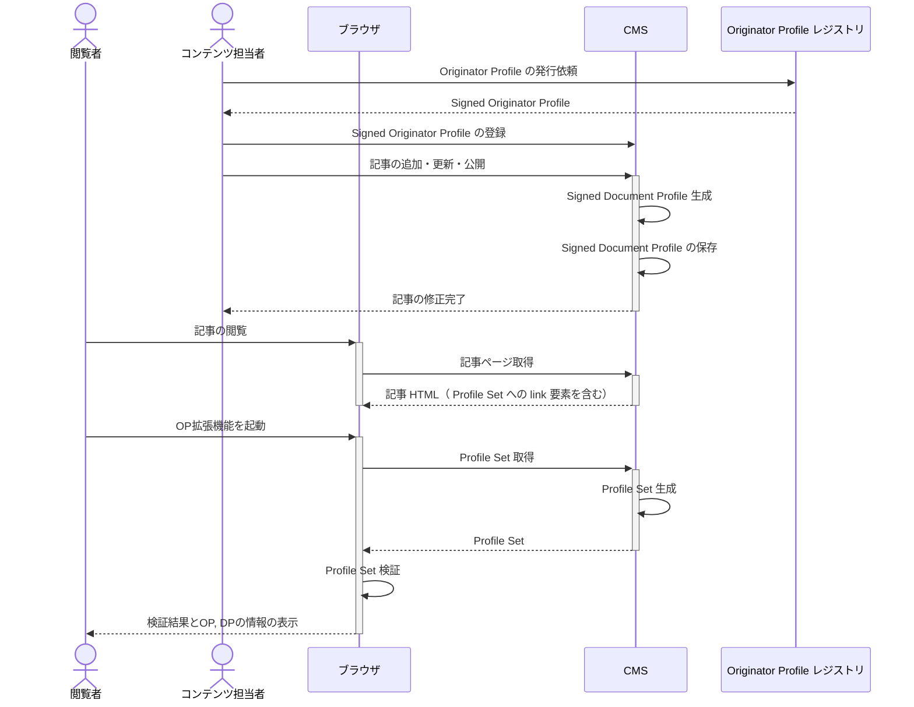

# 実装方法概要

このページでは CMS に OP を組み込む際の手順を解説します。メディアに OP を導入して実際に運用していく場合、記事の執筆や公開と同時に SDP が自動で発行され記事とともに配信されるほうが運用上好ましいでしょう。 このような自動化を実装する方法として、メディア各社が、自社で利用している CMS を SDP の発行や配信ができるように改修することが考えられます。

このガイドでは、 CMS 連携実装にあたっての特定の CMS によらない一般的な実装ガイドを提供します。特定の CMS を使っての実装については他のページを参照してください。

## システム構成と基本シーケンス

CMS 上での記事の追加・更新と連動して SDP を発行するシステムを開発する場合、このようなシステム構成でレジストリ、CMS、ブラウザが連携することを想定しています。


シーケンス図は次のようになります。



コンテンツ担当者は事前準備として OP レジストリから受け取った Signed Originator Profile (SOP) を CMS に登録します。コンテンツ担当者が記事を公開する際に、 CMS は記事に対応する Signed Document Profile (SDP) を生成します。これには OP レジストリに登録した公開鍵に対応するプライベート鍵を使って署名をする必要があります。CMS は生成した SDP を保存します。記事が公開され、ユーザーが記事ページを閲覧すると、 CMS から Profile Set への link 要素を含む記事ページの HTML が配信されます。 Profile Set には先ほど発行した SDP とあらかじめ登録した SOP が含まれます。ユーザーが OP 拡張機能を開くと link 要素の href 属性にある URL から Profile Set を取得し、 OP 拡張機能がそれを検証します。検証に成功した場合には、ユーザーに SOP, SDP 記載の情報が表示されます。

記事を更新する際も同様で、更新後の記事情報を反映した新しい SDP を発行し、古い SDP の代わりに新しい SDP が配信されるようにします。記事削除時の SDP 削除処理も必要となります。

このような仕組みを実装するためには、 CMS に次の3つの機能を追加する必要があります。

1. SDP 生成・プライベート鍵による署名
   - 記事の新規作成時やその後の更新・削除の際に、記事に対応する SDP を発行してください
2. SDP の保存・管理
   - 発行した SDP を適切に保存・管理してください
3. Profile Set の生成・配信
   - SDP は Profile Set という SOP, SDP をまとめた JSON として提示する必要があります。この Profile Set を記事ページに埋め込むことで配信できます。

実装においては [Originator Profile 技術研究組合 (OP CIP)](https://originator-profile.org/) が開発したサービス・ツールを利用することで実装コストを下げられる可能性があります。

OP CIP では現状 2, 3 の機能を有した DP Store を提供しています。DP Store を利用した CMS OP 連携の実装ガイドとしては[DP Store を使った実装ガイド](./dp-store.mdx)を参照してください。

1 の機能を有した profile-registry CLI も提供しています。これは SDP の生成を自動化せずに手動で行う場合や、 Static Site Generator (SSG) で作られたサイトのビルド時に使うことを想定しています。[CLI を使った実装ガイド](./ssg.md)を参照してください。

将来的には各社の OP 実装を容易にするために次のようなものの提供を予定しています。

- 署名サービス（署名用のプライベート鍵の管理、 SDP の署名・生成）
- SDP 生成・署名用の各言語のライブラリ

自社メディア用の DP Store を各企業が実装したり、 OP CIP の開発物に頼らずに CMS を OP 対応にすることも可能です。

## 実装方針

### 1. 署名付き Document Profile (SDP) の生成・署名

SDP を生成するためには、必要な記事に関する情報を[仕様](/spec.md#document-profile-データモデル)で規定されたフォーマットのJSONにし、プライベート鍵で署名してください。
プライベート鍵は漏洩しないよう厳重に管理するようにしてください。

SDP は記事情報についてのクレームを含む JWT です。詳細については[仕様](/spec.md#document-profile-データモデル)をご確認ください。

詳細な実装ガイドは[SDP生成・署名](./sdp-issuance.mdx)を参照ください。

メディアサイトが SSG の場合は profile-registry CLI を使って実装することができます。詳細は[CLIを使った実装ガイド](./ssg.md) を参照してください。

### 2. SDP の保存・管理

SDP を保存・管理する機能も必要です。
ユーザーが記事ページを訪れた際に SDP を Profile Set に含めて配信します。

記事を更新・削除・非公開などした場合には、古い SDP を削除するなどして古い情報が配信され続けることがないようにしてください。

この部分の実装については、 DP Store を利用することができます。 DP Store に SDP を保存することで、次の Profile Set の生成・配信も DP Store を使って実装することができます。
詳細については[DP Store を使った実装ガイド](./dp-store.mdx)を参照してください。

### 3. Profile Set の生成・配信

Profile Set の構造は次のようになっています。この例の場合、 `profile` プロパティの配列の1つ目の要素は署名付き Originator Profile (SOP)、 2つめが SDP です。詳細は[仕様](/spec.md#profile-set)を参照してください。

```json
{
  "@context": "https://originator-profile.org/context.jsonld",
  "main": "0421885c-0ac0-4a36-af02-46c1c400b239",
  "profile": [
    "eyJhbGciOiJFUzI1NiIsImtpZCI6IkdQLXV5QThvYlBrclU2S3Nhdl8wOVZCclZFOHVjWFdPdFc0OGR3NlY0clkiLCJ0eXAiOiJKV1QifQ.eyJodHRwczovL29wci53ZWJkaW5vLm9yZy9qd3QvY2xhaW1zL29wIjp7Iml0ZW0iOlt7InR5cGUiOiJjZXJ0aWZpZXIiLCJkb21haW5OYW1lIjoib3ByZGV2Lmhlcm9rdWFwcC5jb20iLCJ1cmwiOiJodHRwczovL29yaWdpbmF0b3ItcHJvZmlsZS5vcmcvIiwibmFtZSI6Ik9yaWdpbmF0b3IgUHJvZmlsZSDmioDooZPnoJTnqbbntYTlkIgiLCJwb3N0YWxDb2RlIjoiMTA4LTAwNzMiLCJhZGRyZXNzQ291bnRyeSI6IkpQIiwiYWRkcmVzc1JlZ2lvbiI6IuadseS6rOmDvSIsImFkZHJlc3NMb2NhbGl0eSI6Iua4r-WMuiIsInN0cmVldEFkZHJlc3MiOiLkuInnlLAiLCJjb250YWN0VGl0bGUiOiLjgYrllY_jgYTlkIjjgo_jgZsiLCJjb250YWN0VXJsIjoiaHR0cHM6Ly9vcmlnaW5hdG9yLXByb2ZpbGUub3JnL2phLUpQLyIsImxvZ29zIjpbeyJ1cmwiOiJodHRwczovL29yaWdpbmF0b3ItcHJvZmlsZS5vcmcvaW1hZ2UvaWNvbi5zdmciLCJpc01haW4iOnRydWV9XX0seyJ0eXBlIjoiaG9sZGVyIiwiZG9tYWluTmFtZSI6Im9wcmRldi5oZXJva3VhcHAuY29tIiwidXJsIjoiaHR0cHM6Ly9vcmlnaW5hdG9yLXByb2ZpbGUub3JnLyIsIm5hbWUiOiJPcmlnaW5hdG9yIFByb2ZpbGUg5oqA6KGT56CU56m257WE5ZCIIiwicG9zdGFsQ29kZSI6IjEwOC0wMDczIiwiYWRkcmVzc0NvdW50cnkiOiJKUCIsImFkZHJlc3NSZWdpb24iOiLmnbHkuqzpg70iLCJhZGRyZXNzTG9jYWxpdHkiOiLmuK_ljLoiLCJzdHJlZXRBZGRyZXNzIjoi5LiJ55SwIiwiY29udGFjdFRpdGxlIjoi44GK5ZWP44GE5ZCI44KP44GbIiwiY29udGFjdFVybCI6Imh0dHBzOi8vb3JpZ2luYXRvci1wcm9maWxlLm9yZy9qYS1KUC8iLCJsb2dvcyI6W3sidXJsIjoiaHR0cHM6Ly9vcmlnaW5hdG9yLXByb2ZpbGUub3JnL2ltYWdlL2ljb24uc3ZnIiwiaXNNYWluIjp0cnVlfV19XSwiandrcyI6eyJrZXlzIjpbeyJ4IjoibGpiNGs2UDBQYkdwbHRPRDN6TF94cDlNOEFnSXlaYmdCXzFER2c4em8tayIsInkiOiJTbHUtNUhDcEI3ZzRhcDBTcS1XWThvdjFyc1hUUmtvNGdKMzNWc1RYXzRrIiwiY3J2IjoiUC0yNTYiLCJraWQiOiJHUC11eUE4b2JQa3JVNktzYXZfMDlWQnJWRTh1Y1hXT3RXNDhkdzZWNHJZIiwia3R5IjoiRUMifV19fSwiaXNzIjoib3ByZGV2Lmhlcm9rdWFwcC5jb20iLCJzdWIiOiJvcHJkZXYuaGVyb2t1YXBwLmNvbSIsImlhdCI6MTY4MTcwMzQxNCwiZXhwIjoxNzEzMzI1ODE0fQ.a3FnDEhZF8psz0DJvptfgk_48f0ERqlxDIyOxS88P2Wd95ipDzieMogIJNFhHMFm0SPcdolpOis15z121t1VHg",
    "eyJhbGciOiJFUzI1NiIsImtpZCI6IkdQLXV5QThvYlBrclU2S3Nhdl8wOVZCclZFOHVjWFdPdFc0OGR3NlY0clkiLCJ0eXAiOiJKV1QifQ.eyJodHRwczovL29wci53ZWJkaW5vLm9yZy9qd3QvY2xhaW1zL2RwIjp7Iml0ZW0iOlt7InR5cGUiOiJ3ZWJzaXRlIiwidXJsIjoiaHR0cHM6Ly9vcHJkZXYuaGVyb2t1YXBwLmNvbSIsInRpdGxlIjoiT1Ag56K66KqN44GP44KTIn0seyJ0eXBlIjoidmlzaWJsZVRleHQiLCJ1cmwiOiJodHRwczovL29wcmRldi5oZXJva3VhcHAuY29tIiwibG9jYXRpb24iOiJoMSIsInByb29mIjp7Imp3cyI6ImV5SmhiR2NpT2lKRlV6STFOaUlzSW10cFpDSTZJa2RRTFhWNVFUaHZZbEJyY2xVMlMzTmhkbDh3T1ZaQ2NsWkZPSFZqV0ZkUGRGYzBPR1IzTmxZMGNsa2lMQ0ppTmpRaU9tWmhiSE5sTENKamNtbDBJanBiSW1JMk5DSmRmUS4ueDcxemxFSmk4cWkxNUtFRTQycm0wY3c3bWEwa0VJemtETUtwTk5DSmtVT2EyQ1hxbXJZclJzdTA4WWppVWk4cERSSmdwdG45NUdlMkM1Qi1uRHlQNHcifX1dfSwiaXNzIjoib3ByZGV2Lmhlcm9rdWFwcC5jb20iLCJzdWIiOiJodHRwczovL29wcmRldi5oZXJva3VhcHAuY29tIiwiaWF0IjoxNjg0MTI1MTg3LCJleHAiOjE3MTU3NDc1ODd9.j5vtZ3dHDm7B5ZWx2fsf0WW2JHouuwpZSP1Dq9QELLVSRCJngoibCjwfCMfYfcZS8MGsFb2g4kdUWfehK1M9Nw"
  ]
}
```

生成した SDP を記事に紐づけるためには、記事 HTML に link 要素で Profile Set の url を挿入します。

```html
<link
  href="https://<Profile SetのURL>"
  rel="alternate"
  type="application/ld+json"
/>
```

記事を閲覧しているユーザーが OP 拡張機能を開くと、 link 要素から Profile Set を取得し、検証、拡張機能に表示します。
この方法は Profile Set をパブリックアクセス可能な URL に配置したり、 API 呼び出しによって得る場合に有効です。

OP CIP 実装の DP Store を利用する場合、 DP Store の Profile Set 取得APIエンドポイントの url を href 属性に指定することで設置が完了します。

また、script 要素で Profile Set 自体を記事 HTML に埋め込むこともできます。詳細は[仕様](/spec.md#script)を参照してください。
