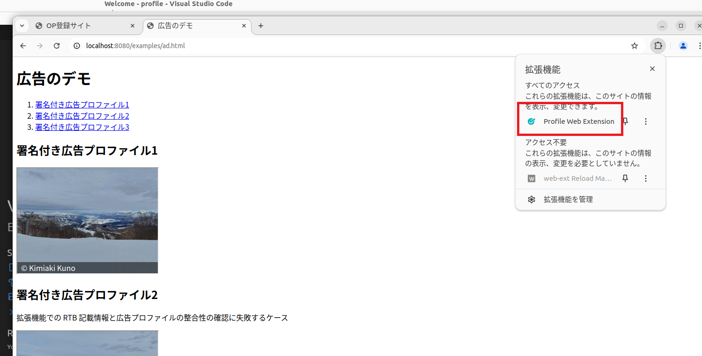
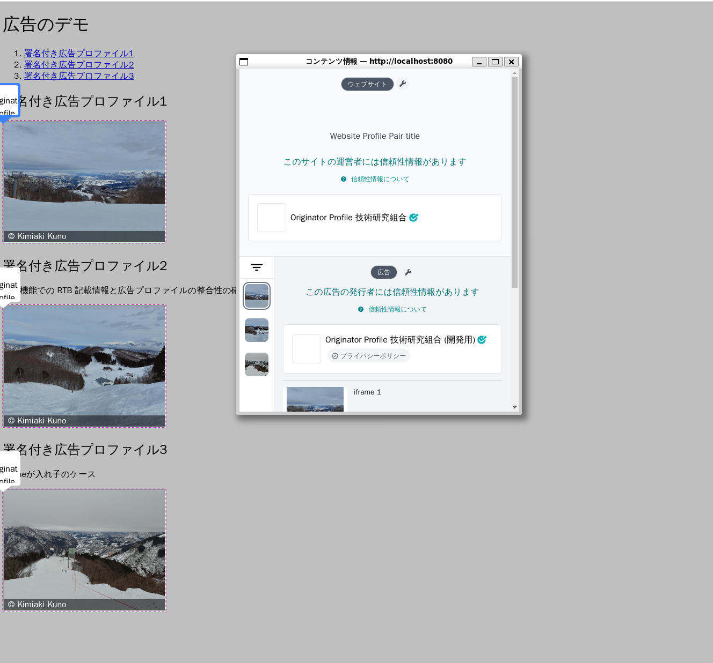

# 開発ガイド

本書はローカル環境で実行するための手順を説明します。

## はじめに

1. Linux, macOS または Windows ([WSL2](https://docs.microsoft.com/ja-jp/windows/wsl/install)) 環境を用意
2. [Google Chrome](https://support.google.com/chrome/answer/95346)のインストール
   - WSL2 使用の場合、ホスト側ではなく [WSL 側に Chrome をインストール](https://learn.microsoft.com/ja-jp/windows/wsl/tutorials/gui-apps#install-google-chrome-for-linux)する必要があります
   - WSL2 にChromeをインストール後、日本語フォントをインストール`$ sudo apt-get install -y fonts-noto-cjk` してください
   - WSL2 で Google Chrome 使用時、バージョンにより GUI 環境を用意する必要があるのであらかじめ`wsl --update`しておくこと
3. [Node.js](https://nodejs.org/) のインストール
   - WSL2 使用の場合、ホスト側ではなく[Node.js を Linux 用 Windows サブシステム (WSL2) にインストールする](https://learn.microsoft.com/ja-jp/windows/dev-environment/javascript/nodejs-on-wsl) 必要があります
4. [Docker](https://www.docker.com/get-started) と [Compose v2](https://docs.docker.com/compose/cli-command/) のインストール
   - Windows では[WSL 2 での Docker リモート コンテナーの概要 \| Microsoft Docs](https://learn.microsoft.com/ja-jp/windows/wsl/tutorials/wsl-containers)も参照してください
5. 下記のコマンドをターミナルで実行

```sh
git clone -c core.symlinks=true https://github.com/originator-profile/profile-share profile
cd profile
corepack enable pnpm
pnpm install
pnpm --filter @originator-profile/registry exec playwright install --with-deps
pnpm build
# profile-registry CLIのインストール
npm i -g ./apps/registry
# 開発用サーバーの起動
pnpm dev
# WSL2 使用の場合、ホスト側ではなく WSL 側の Chrome を使用します
CHROME_PATH=/usr/bin/google-chrome pnpm dev
# => 開発用サーバーとWebブラウザーが起動します (<Ctrl-C>: 終了)
```

6. 開発用サーバーとWebブラウザーが起動したら実際にWebページの検証を行う
   - [広告のデモ](http://localhost:8080/examples/ad.html)にアクセスする
   - アクセスしたらProfile Web Extensionを起動してページの検証を行う
   - 広告のデモ以外は
     - [複数のコンテンツプロファイル](http://localhost:8080/examples/many-dps.html)
     - [コンテンツプロファイルなし](http://localhost:8080/examples/ad.html)
     - これらのページがあります

検証の実行方法


広告のデモで検証が成功した場合の表示


あとはそれぞれのソースコードを編集することで開発を行うことができます。自由にカスタマイズしましょう。

import DocCardList from "@theme/DocCardList";

<DocCardList />

## 全体構成

- apps/ … アプリケーションのソースコード
  - registry … [Profile Registry](/registry/)
  - web-ext … [Profile Web Extension](/web-ext/)
- docs/ … ドキュメント
- packages/ … アプリケーションの使用するモジュールのソースコード
  - model … システムのコアとなる静的構造のためのパッケージ
  - core … システムのコアとなる関数のためのパッケージ
- package.json … プロジェクトの付帯情報 ([package.json](https://docs.npmjs.com/files/package.json/))
- .github/workflows/ … GitHub Actions のワークフローの定義

## Swagger UI

開発用サーバーの起動後、http://localhost:8080/documentation にアクセスすることでAPIの詳細の閲覧とサーバーへのリクエストの試行を行えます。

### 認証

Step1. Authorize -> bearerAuth (OAuth2, authorization_code with PKCE) -> [Authorize] を選択

Step2. ログイン (またはサインアップ)

## 便利なコマンド

テストやビルドの実行など開発に便利なコマンドを紹介します。

npm scripts の実行:

```
$ pnpm run
```

### npm scripts

dev
: 開発用サーバーと拡張機能つきChromeを起動します

ブラウザ拡張機能は設定言語が日本語であれば日本語で、それ以外では英語で表示をします。日本語にする場合 OS により以下のような方法があります。

Linux系OSで:
環境変数`LANG`または`LC_ALL`をja_JP.utf-8またはその他のjaに設定すると日本語、それ以外では英語で表示されます。

macOSで:
以下のいずれかで言語を日本語またはそれ以外に設定できます。

1. システム環境設定の「一般」 -> 「言語と地域」 -> 「アプリケーション」にGoogle Chromeを加え日本語またはそれ以外に設定する。Chromeにのみ影響します。
2. `defaults write com.google.Chrome AppleLanguages '(ja-JP)'`を実行する。ja-JPの部分はenなどに変更してください。1と同じ効果があります。
3. システム環境設定の「言語と地域」で日本語を優先する言語の最上位にする。システム全体に影響します。
4. `defaults write -g AppleLanguages '(ja-JP)'`を実行する。ja-JPの部分はenなどに変更してください。3とほぼ同じ効果がありますが、他の言語の優先順位が消去されます。

lint
: すべてのパッケージの静的コード解析を行います。

test
: すべてのパッケージのテストを行います。

e2e
: 開発用サーバーを起動し E2E テストを行います。

macOSの場合はあらかじめChromiumが日本語を優先して表示するように設定して実行してください。設定されていない場合以下のいずれか一つを実行してください。

1. システム環境設定の「一般」 -> 「言語と地域」 -> 「アプリケーション」にChromiumを加え日本語に設定する。Chromiumにのみ影響します。
2. `defaults read org.chromium.Chromium AppleLanguages '(ja-JP)'`を実行する。1と同じ効果があります。
3. システム環境設定の「言語と地域」で日本語を優先する言語の最上位にする。システム全体に影響します。
4. `defaults write -g AppleLanguages '(ja-JP)'`を実行する。3とほぼ同じ効果がありますが、他の言語の優先順位が消去されます。

wordpress:e2e
: 開発用サーバーを起動し WordPress プラグインの E2E テストを行います。

ただし、実行するにはあらかじめ Composer の依存関係を解決する必要があります。

Composer 依存関係の解決:

```
cd packages/wordpress
docker compose run --rm -w /var/www/html/wp-content/plugins/profile wordpress composer install
```

build
: 拡張機能の生成などすべてのパッケージのビルドを行います。

format
: コードの整形を行います。

## Docker

### minio

ローカルでの開発では、 S3 互換ストレージとして minio を利用しています（試験運用環境、本番環境では R2 を利用）。

次のような手順で minio へのファイルアップロードを試すことができます。

#### ファイルアップロードのテスト (minio)

Step1.

[aws-cli](https://github.com/aws/aws-cli)をインストールする。例として、Ubuntu(WSL含む)の場合`apt install awscli`, macOSの場合`brew install awscli`

Step2.

apps/registry/.env.development の S3_ACCOUNT_LOGO_BUCKET_NAME の値を覚えておきます。このバケットにファイルをアップロードします。以下ではこの値が oprdev-account-logos だとします。

Step2.

```
$ pnpm dev
```

Step3.

```console
$ cat << EOF > test-file
test file
EOF
$ AWS_ACCESS_KEY_ID=root AWS_SECRET_ACCESS_KEY=kHslkqy4n2hMDvQabcwkOl_NCqdX1M2QEX_XjGe807o aws --endpoint-url http://localhost:19000 s3 cp test-file s3://oprdev-account-logos/
$ AWS_ACCESS_KEY_ID=root AWS_SECRET_ACCESS_KEY=kHslkqy4n2hMDvQabcwkOl_NCqdX1M2QEX_XjGe807o aws --endpoint-url http://localhost:19000 s3 ls s3://oprdev-account-logos/
2023-09-04 13:26:06         10 test-file
```

Step4.

http://localhost:19001/ にブラウザして確認。`Username`として`root`、`Password`として`kHslkqy4n2hMDvQabcwkOl_NCqdX1M2QEX_XjGe807o`を入力しログインすること

## GitHub Actions

GitHub リポジトリ上での変更は自動的にチェックされます。

### originator-profile/profile/test

パッケージの生成、コードの整形、静的コード解析、E2E テストを含むすべてのテストを実施します。

### E2E テストのレポート

GitHub Actions での E2E テストに失敗すると playwright によるレポートおよびスナップショット画像が artifacts としてアップロードされます。Zip ファイルを展開することで得られるレポートディレクトリ`playwright-report`を以下のように使用することで、失敗の原因を知ることができるかもしれません。

```
npx playwright@latest show-report path-to/playwright-report
```
