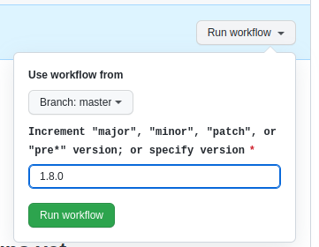

# リリース方法

リリースする方法を説明します。

## 対象読者

- 開発チームメンバー

## 前提事項

GitHubリポジトリへのアクセス権限が必要です:

- https://github.com/originator-profile/profile-share
- https://github.com/originator-profile/profile

## 手順

全体の流れ:

1. シークレットの作成
2. バージョンの決定
3. フォークの同期
4. リリースの作成
5. リリースアセットのアップロード

Step 1
: シークレットの作成

レジストリ API の Basic 認証に使用する以下の[シークレットを作成](https://docs.github.com/ja/actions/security-for-github-actions/security-guides/using-secrets-in-github-actions#creating-secrets-for-a-repository)します。作成済みであればこの手順を省略します。

- `BASIC_AUTH` (形式: `true` or `false`)
- `BASIC_AUTH_CREDENTIALS` (形式: [拡張機能のソースコード](https://github.com/originator-profile/profile-share/blob/main/apps/web-ext) を参照してください)

Step 2
: バージョンの決定

新しいリリースのバージョン番号は[セマンティックバージョニング仕様](https://semver.org/lang/ja/)に準拠して決めます。

「[release ワークフロー](https://github.com/originator-profile/profile/actions/workflows/release.yml)」を実行します。

Step 3
: フォークを同期

https://github.com/originator-profile/profile-share にアクセスし「[上流リポジトリと同期](https://docs.github.com/ja/pull-requests/collaborating-with-pull-requests/working-with-forks/syncing-a-fork)」します。

上流リポジトリは <https://github.com/originator-profile/profile> です。

Step 4
: リリースの作成

https://github.com/originator-profile/profile-share にアクセスし「[リリースを作成](https://docs.github.com/ja/repositories/releasing-projects-on-github/managing-releases-in-a-repository#creating-a-release)」します。

Step 5
: リリースアセットのアップロード

1. 「[release ワークフロー](https://github.com/originator-profile/profile/actions/workflows/release.yml?query=branch%3Amain)」にアクセス
2. 対象のバージョンのワークフローを選択
3. Artifacts > [web-ext] と [wordpress] から、Zipファイルをそれぞれダウンロード
4. ダウンロードしたZipファイルをそれぞれ展開
5. web-ext-artifacts/\*.zip と wordpress-profile-plugin.zip をリリースアセットとしてアップロード
