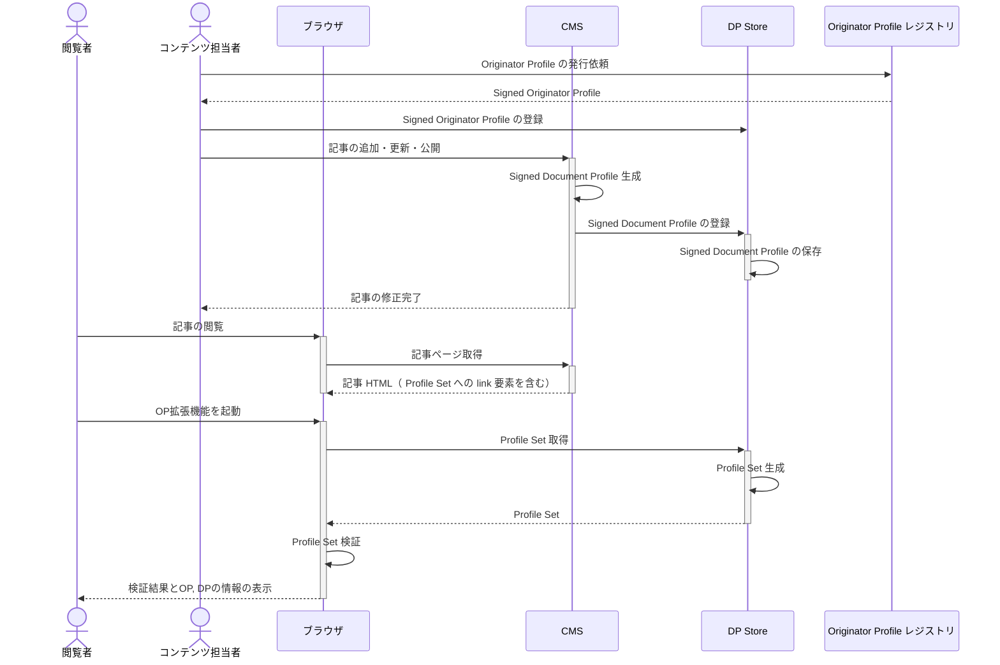
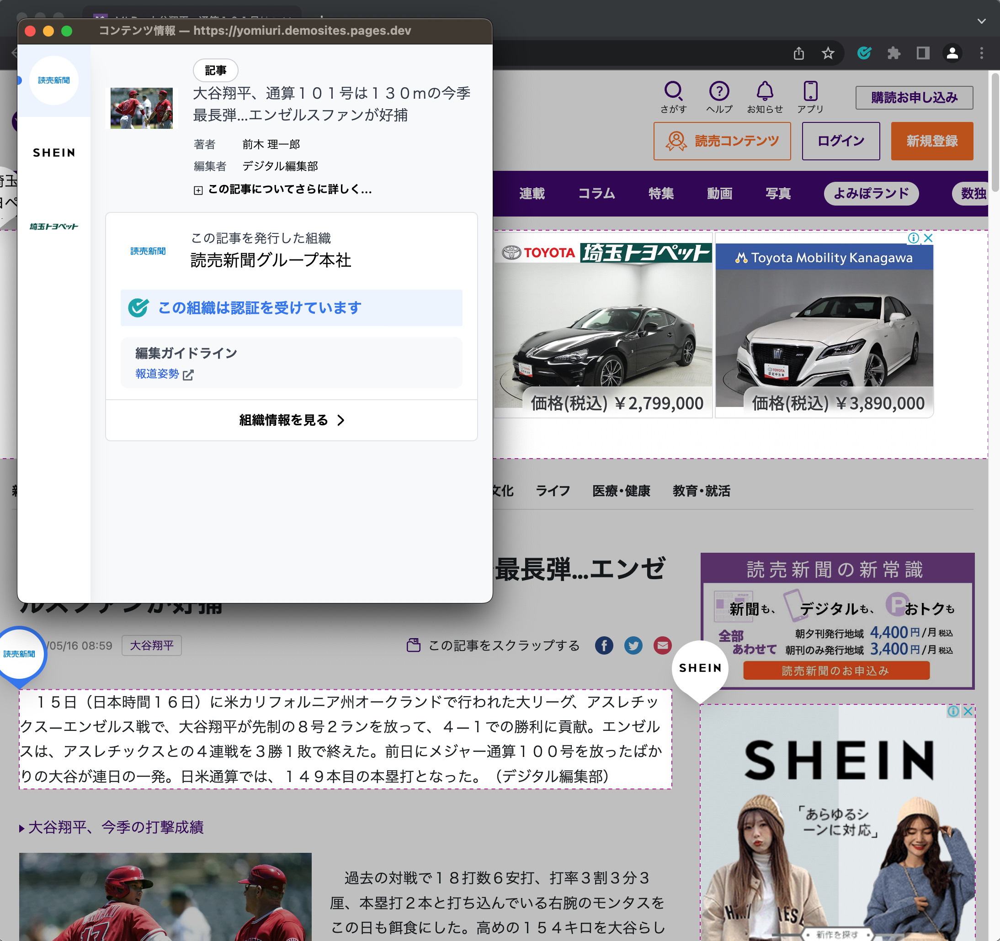

# DP Store を使った実装ガイド

このガイドでは DP Store を使って CMS を実装する方法を説明します。

DP Store は、 SDP と SOP を保存・管理し、 Profile Set を配信するためのサービスです。このサービスを使うことで、 CMS を OP 対応する際に必要な機能を簡単に実装することができます。

{/* DP Store 自体に関する図が必要 */}

DP Store を使って CMP を OP 対応にする場合、次のようなシステム構成で実装してください。


シーケンス図は次のようになります。



CMS に実装する必要のある機能は次の3つであり、このうち、 DP Store を利用できるのは2, 3の実装です。

1. SDP の生成・署名
2. SDP の保存・管理
3. Profile Set の配信

OP CIP が開発した DP Store はこれらの機能を REST API として提供しています。詳細は[CIP 提供 DP レジストリについて](/media-study-202307/howto.md#cip-提供-dp-レジストリについて)を参照してください。

2\. に対応する API は[/admin/publisher/\{アカウントID\}/dp/](/media-study-202307/howto.md#パラメータadminpublisherアカウントiddp-エンドポイント)エンドポイントです。このエンドポイントは更新にも対応しています。登録する SDP と id の等しい SDP がすでに DP Store に存在する場合には、既存の SDP を上書き更新します。

3\. では、 DP Store の [Profile Set 取得 API](/media-study-202307/howto.md#パラメータwebsiteprofiles-エンドポイント) を利用してください。このエンドポイントはクエリパラメータとして記事の URL を受け取り、その URL に対応する SDP を SOP と一緒に Profile Set 形式で返します。記事ページの HTML にこのエンドポイントの URL をクエリパラメータも含めて link 要素として配置することで、記事に SDP を紐づけることが可能になります。記事ページ上で OP 拡張機能を開くとこの link 要素から Profile Set を取得し、検証、表示します。

1\. の実装では、 DP Store の機能を使うことはできません。署名用のライブラリなどを利用して独自に実装していただく必要があります。

## 2. SDP の保存・管理

SDP を DP Store に登録します。これには DP Store (`dprexpt.originator-profile.org`) の [SDP登録用のエンドポイント](/media-study-202307/howto.md#パラメータadminpublisherアカウントiddp-エンドポイント) を利用します。

このエンドポイントは、記事新規作成時だけでなく、記事更新時に SDP を修正したいときにも使用することができます。
登録する SDP と id の等しい SDP がすでに DP Store に存在する場合には、既存の SDP を上書き更新します。そのため、 SDP 修正時もこのエンドポイントを利用して SDP の更新ができます。
1つの URL に対して ID の異なる SDP を複数登録した場合、Profile Set に複数の SDP が入ります。

記事を非公開にするなどで、登録した SDP を DP Store から削除したい場合には[記事を削除・非公開にした場合](/media-study-202307/sdp-case-study.md#記事を削除非公開にした場合)を参照してください。

## 3. Profile Set の配信

DP Store には保存された SDP と SOP から記事ページでの配信のためのフォーマットである Profile Set を配信する API があります。記事の URL で SDP を指定する [/website/profiles エンドポイント](/media-study-202307/howto.md#websiteprofiles-エンドポイント詳細)と、 DP ID（ SDP の sub クレーム）で指定する[/website/\{id\}/profiles エンドポイント](/registry/assets/api/#getdocumentprofileset)があります。どちらも GET リクエストに対して Profile Set をレスポンスとして返すため、 link 要素の href 属性にこれらのエンドポイントの URL をクエリパラメータを付けて設定することで、記事に Profile Set を紐づけることができます。

例えば [/website/profiles エンドポイント](/media-study-202307/howto.md#websiteprofiles-エンドポイント詳細)を使う場合は、次のように link 要素を記事ページの HTML の head 要素配下に挿入します。

```html
<link
  href="https://dprexpt.originator-profile.org/website/profiles?url=<記事のURL (RFC 3986 でエンコード) >"
  rel="alternate"
  type="application/ld+json"
/>
```

CMS の実装としては、SDP を発行した記事に対して、このような link 要素の挿入を CMS が自動で行うようにしてください。

:::note

[/website/profiles エンドポイント](/media-study-202307/howto.md#websiteprofiles-エンドポイント詳細)は、指定した url にマッチするIDの異なる SDP が複数存在する場合、 **それら全てが Profile Set に含まれます。** 同じ ID の SDP が Profile Set に複数含まれることはありません。
詳細は[同じ url の SDP を複数登録した場合](/media-study-202307/sdp-case-study.md#同じ-url-の-sdp-を複数登録した場合) を参照してください。

:::

[/website/\{id\}/profiles エンドポイント](/registry/assets/api/#getdocumentprofileset)を使う場合も同様で、次のような link 要素を CMS が自動で挿入するようにしてください。

```html
<link
  href="https://dprexpt.originator-profile.org/website/<SDP の DP ID>/profiles"
  rel="alternate"
  type="application/ld+json"
/>
```

どちらのエンドポイントを利用した場合でも、 SDP/SOP が存在する場合には 200 レスポンスで次のような Profile Set が返されます。存在しない場合は 404 レスポンスが返されます。

```json
{
  "@context": "https://originator-profile.org/context.jsonld",
  "main": "0421885c-0ac0-4a36-af02-46c1c400b239",
  "profile": [
    "eyJhbGciOiJFUzI1NiIsImtpZCI6IkdQLXV5QThvYlBrclU2S3Nhdl8wOVZCclZFOHVjWFdPdFc0OGR3NlY0clkiLCJ0eXAiOiJKV1QifQ.eyJodHRwczovL29wci53ZWJkaW5vLm9yZy9qd3QvY2xhaW1zL29wIjp7Iml0ZW0iOlt7InR5cGUiOiJjZXJ0aWZpZXIiLCJkb21haW5OYW1lIjoib3ByZGV2Lmhlcm9rdWFwcC5jb20iLCJ1cmwiOiJodHRwczovL29yaWdpbmF0b3ItcHJvZmlsZS5vcmcvIiwibmFtZSI6Ik9yaWdpbmF0b3IgUHJvZmlsZSDmioDooZPnoJTnqbbntYTlkIgiLCJwb3N0YWxDb2RlIjoiMTA4LTAwNzMiLCJhZGRyZXNzQ291bnRyeSI6IkpQIiwiYWRkcmVzc1JlZ2lvbiI6IuadseS6rOmDvSIsImFkZHJlc3NMb2NhbGl0eSI6Iua4r-WMuiIsInN0cmVldEFkZHJlc3MiOiLkuInnlLAiLCJjb250YWN0VGl0bGUiOiLjgYrllY_jgYTlkIjjgo_jgZsiLCJjb250YWN0VXJsIjoiaHR0cHM6Ly9vcmlnaW5hdG9yLXByb2ZpbGUub3JnL2phLUpQLyIsImxvZ29zIjpbeyJ1cmwiOiJodHRwczovL29yaWdpbmF0b3ItcHJvZmlsZS5vcmcvaW1hZ2UvaWNvbi5zdmciLCJpc01haW4iOnRydWV9XX0seyJ0eXBlIjoiaG9sZGVyIiwiZG9tYWluTmFtZSI6Im9wcmRldi5oZXJva3VhcHAuY29tIiwidXJsIjoiaHR0cHM6Ly9vcmlnaW5hdG9yLXByb2ZpbGUub3JnLyIsIm5hbWUiOiJPcmlnaW5hdG9yIFByb2ZpbGUg5oqA6KGT56CU56m257WE5ZCIIiwicG9zdGFsQ29kZSI6IjEwOC0wMDczIiwiYWRkcmVzc0NvdW50cnkiOiJKUCIsImFkZHJlc3NSZWdpb24iOiLmnbHkuqzpg70iLCJhZGRyZXNzTG9jYWxpdHkiOiLmuK_ljLoiLCJzdHJlZXRBZGRyZXNzIjoi5LiJ55SwIiwiY29udGFjdFRpdGxlIjoi44GK5ZWP44GE5ZCI44KP44GbIiwiY29udGFjdFVybCI6Imh0dHBzOi8vb3JpZ2luYXRvci1wcm9maWxlLm9yZy9qYS1KUC8iLCJsb2dvcyI6W3sidXJsIjoiaHR0cHM6Ly9vcmlnaW5hdG9yLXByb2ZpbGUub3JnL2ltYWdlL2ljb24uc3ZnIiwiaXNNYWluIjp0cnVlfV19XSwiandrcyI6eyJrZXlzIjpbeyJ4IjoibGpiNGs2UDBQYkdwbHRPRDN6TF94cDlNOEFnSXlaYmdCXzFER2c4em8tayIsInkiOiJTbHUtNUhDcEI3ZzRhcDBTcS1XWThvdjFyc1hUUmtvNGdKMzNWc1RYXzRrIiwiY3J2IjoiUC0yNTYiLCJraWQiOiJHUC11eUE4b2JQa3JVNktzYXZfMDlWQnJWRTh1Y1hXT3RXNDhkdzZWNHJZIiwia3R5IjoiRUMifV19fSwiaXNzIjoib3ByZGV2Lmhlcm9rdWFwcC5jb20iLCJzdWIiOiJvcHJkZXYuaGVyb2t1YXBwLmNvbSIsImlhdCI6MTY4MTcwMzQxNCwiZXhwIjoxNzEzMzI1ODE0fQ.a3FnDEhZF8psz0DJvptfgk_48f0ERqlxDIyOxS88P2Wd95ipDzieMogIJNFhHMFm0SPcdolpOis15z121t1VHg",
    "eyJhbGciOiJFUzI1NiIsImtpZCI6IkdQLXV5QThvYlBrclU2S3Nhdl8wOVZCclZFOHVjWFdPdFc0OGR3NlY0clkiLCJ0eXAiOiJKV1QifQ.eyJodHRwczovL29wci53ZWJkaW5vLm9yZy9qd3QvY2xhaW1zL2RwIjp7Iml0ZW0iOlt7InR5cGUiOiJ3ZWJzaXRlIiwidXJsIjoiaHR0cHM6Ly9vcHJkZXYuaGVyb2t1YXBwLmNvbSIsInRpdGxlIjoiT1Ag56K66KqN44GP44KTIn0seyJ0eXBlIjoidmlzaWJsZVRleHQiLCJ1cmwiOiJodHRwczovL29wcmRldi5oZXJva3VhcHAuY29tIiwibG9jYXRpb24iOiJoMSIsInByb29mIjp7Imp3cyI6ImV5SmhiR2NpT2lKRlV6STFOaUlzSW10cFpDSTZJa2RRTFhWNVFUaHZZbEJyY2xVMlMzTmhkbDh3T1ZaQ2NsWkZPSFZqV0ZkUGRGYzBPR1IzTmxZMGNsa2lMQ0ppTmpRaU9tWmhiSE5sTENKamNtbDBJanBiSW1JMk5DSmRmUS4ueDcxemxFSmk4cWkxNUtFRTQycm0wY3c3bWEwa0VJemtETUtwTk5DSmtVT2EyQ1hxbXJZclJzdTA4WWppVWk4cERSSmdwdG45NUdlMkM1Qi1uRHlQNHcifX1dfSwiaXNzIjoib3ByZGV2Lmhlcm9rdWFwcC5jb20iLCJzdWIiOiJodHRwczovL29wcmRldi5oZXJva3VhcHAuY29tIiwiaWF0IjoxNjg0MTI1MTg3LCJleHAiOjE3MTU3NDc1ODd9.j5vtZ3dHDm7B5ZWx2fsf0WW2JHouuwpZSP1Dq9QELLVSRCJngoibCjwfCMfYfcZS8MGsFb2g4kdUWfehK1M9Nw"
  ]
}
```

## ブラウザでの表示結果確認

正しく OP 対応できていることを確認しましょう。 SDP を発行した記事のページに、ブラウザでアクセスしてください。出力 HTML に Profile Set への \<link\> 要素が含まれていることを確認します。


拡張機能を起動してみましょう。 Profile Set が取得、検証され、情報が表示されることを確認してください。署名したコンテンツがハイライトされていることも確認できます。



拡張機能中の「この記事についてさらに詳しく」をクリックすると、 SDP に入れた情報が表示されることも確認ください。


## Profile Set Debugger での確認

SDP の検証には OP CIP 開発の[Profile Set Debugger](https://oprexpt.originator-profile.org/app/debugger)を使うこともできます。
このページは開発者向けのものであり、SDP が OP 拡張機能で正しく表示されない場合に、修正が必要な点を詳しく確認することができます。

1. OP レジストリの [Profile Set Debugger](https://oprexpt.originator-profile.org/app/debugger) にアクセスします。
2. _Registry_ が oprexpt.originator-profile.org になっていることを確認します。
3. SDP を発行したページがパブリックアクセス可能な場合には、 _Profile Set Presentation_ で URL を選択し、 _Endpoint_ にそのページの URL を入力してください。パブリックでない場合には、 _Profile Set Presentation_ で Direct Input を選択し、選択すると表示される _Profile Set_ の欄に Profile Set を入力してください。
4. _Verify_ ボタンをクリックします。
5. Result の中の results の値を確認します。ERROR で検索してヒットする場合は、検証に失敗しています。見つからない場合は成功しています。
