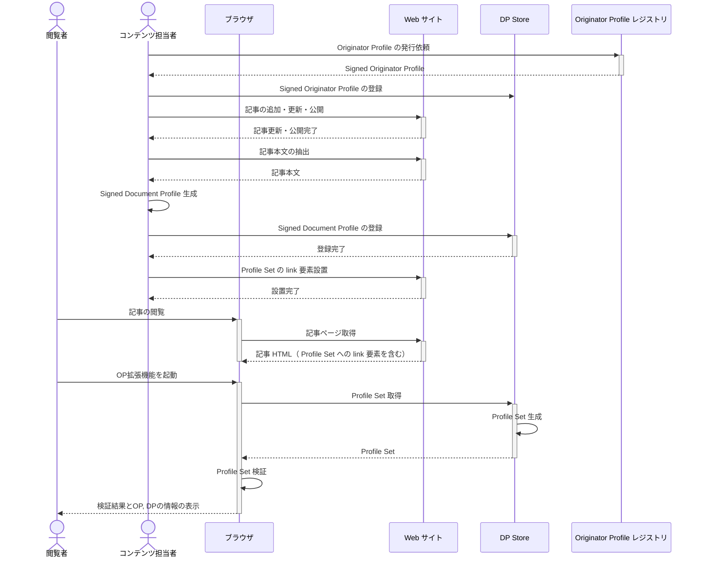

# CLI を使った実装ガイド

このページでは [Profile Registry CLI](https://github.com/originator-profile/profile-share/blob/main/apps/registry#commands) を利用してメディアサイトに OP 連携を実装する方法を解説します。

SDP 発行の自動化において CLI を利用できる場合とそうでない場合がありますが、もし利用できる場合には次のようなメリットがあります。

- 実装コストの削減
- [profile-registry publisher:extract-website コマンド](https://github.com/originator-profile/profile-share/tree/main/apps/registry#profile-registry-publisherextract-website) により [visibleText 型](/spec/index.md#visibletext-type)などで利用する署名対象文字列の抽出が可能。このコマンドによる抽出は OP 拡張機能と同じアルゴリズムを使用しているため、抽出した文字列の正確さが期待できます

また試験的利用や小規模なサイトでの運用において手動で SDP を発行する際には CLI を利用するのが手軽です。

:::note

将来的には CLI より多くの実装パターンに対応できるように、 Profile Registry CLI と同等の機能を持つ各言語のライブラリを提供する予定です。

:::

以下の図は Web サイト連携に関するプロセスの概要を示しています。



## SDP の生成

DP レジストリに登録するにはまず、Signed Document Profile (SDP) を発行する必要があります。
前提条件として組織情報の登録、公開鍵の登録、Signed Originator Profile 発行を行う必要があります。
今回は下記を使用して実行します。

- プライベート鍵のパス: key.priv.json
- 登録する組織: media.example.com

### 記事本文の抽出 {#extract-website}

[profile-registry publisher:extract-website コマンド](https://github.com/originator-profile/profile-share/tree/main/apps/registry#profile-registry-publisherextract-website)を利用して、改ざん防止の署名をする対象文字列を抽出します。

#### .extract.json の用意

記事の URL、検証対象となるテキストの範囲、抽出結果の保存先を表明する JSON ファイルを作成します。[profile-registry publisher:extract-website コマンド](https://github.com/originator-profile/profile-share/tree/main/apps/registry#profile-registry-publisherextract-website)は、複数の Web ページに対して一括で実行することができます。それぞれの結果を `output` プロパティで指定したファイル名で出力します。

Web サイト https://originator-profile.org のうちの複数のページに対して実行したい場合は、次のような JSON ファイルを用意してください。

```json
[
  {
    "url": "https://originator-profile.org/ja-JP/",
    "bodyFormat": "visibleText",
    "location": "[itemprop=articleBody]",
    "output": "src/ja-JP/.website.json"
  },
  {
    "url": "https://originator-profile.org/ja-JP/about/",
    "bodyFormat": "visibleText",
    "location": "[itemprop=articleBody]",
    "output": "src/ja-JP/about/.website.json"
  },
  {
    "url": "https://originator-profile.org/ja-JP/for-viewer/",
    "bodyFormat": "visibleText",
    "location": "[itemprop=articleBody]",
    "output": "src/ja-JP/for-viewer/.website.json"
  },
  {
    "url": "https://originator-profile.org/ja-JP/future/",
    "bodyFormat": "visibleText",
    "location": "[itemprop=articleBody]",
    "output": "src/ja-JP/future/.website.json"
  },
  {
    "url": "https://originator-profile.org/ja-JP/structure/",
    "bodyFormat": "visibleText",
    "location": "[itemprop=articleBody]",
    "output": "src/ja-JP/structure/.website.json"
  }
]
```

詳細は [Profile Registry CLI ドキュメント](https://github.com/originator-profile/profile-share/blob/main/apps/registry#commands)を参照してください。

#### .website.json の用意

記事の OGP 等メタデータ、検証対象となるテキストの抽出をおこないます。前節で用意した JSON ファイルが .extract.json だとします。

```
$ profile-registry publisher:extract-website --input .extract.json
```

前項で示した .extract.json から得られる .website.json の例:

```json
{
  "url": "https://originator-profile.org/ja-JP/",
  "location": "[itemprop=articleBody]",
  "bodyFormat": "visibleText",
  "body": "一般的なネットユーザーの課題\nちゃんと事実を伝えているウェブ上の記事とか広告とかって、信頼できる情報だけ見る方法はないのかしら...？\nフェイクニュースや有害サイトってどうやってもなくならないの...？\n\nアテンションエコノミー（関心を引くことの価値化）を背景に、事実を伝える記事より例えフェイクニュースであっても目立つ記事の方が利益が上がる構造ができています。これはコンテンツ発信者とその信頼性を確認する一般的な手段が無いことが大きな原因の一つです。閲覧者や広告配信システムが良質な記事やメディアを識別可能にすれば、インターネットの情報流通はより健全化できます。\n\nウェブコンテンツを閲覧される方へ\n\n広告・メディア関係者の課題\nえええー！？ こんな危険なサイトにウチの広告が！！\nあれ、この記事の内容にウチの広告は合わないのでは！？\n\n不適切なサイト (メディア) に広告が掲載されたり、逆に、表示して欲しくない広告が掲載されることがあります。検索結果に偽サイトなどが表示されたり、SNS でもフェイクニュースが目立った形で拡散されたりしています。適切なサイトや広告主を識別し、適切なサイトと広告のマッチングをしたり、その配信記録を残すことでブランド毀損を防げます。\n\n一方で...\nでも、情報の規制は良くないよね、言論の自由も認められなければいけない。\n\nそのとおりです。ただし、Originator Profile技術はメディアや広告主の峻別しゅんべつをおこなうものではありません。現存する認証機関などに活用してもらうことを考えています。\n\n課題を解決するために\nコンテンツの発信元や流通経路を透明化する手段を提供します\n\nウェブ上の記事や広告といったコンテンツの発信者や掲載サイトの運営者の情報を付与し、公正な基準で第三者認証された発信者や運営者を確認出来るようにします。現在、これを実現するための技術と仕組みの開発と運用試験を、広告やメディアの関係企業や大学の研究機関と共に行っています。\n\n「Originator Profile 技術とは」についてもご覧ください。\n\nウェブ標準化に向けて\n\n情報の発信者や流通経路、広告主を透明化することで、様々な問題を解決できます。\n\nコンテンツ発信元や第三者認証情報をウェブブラウザで簡単に確認できます\nなりすましや改変を防ぎ安心してコンテンツを閲覧できます\n不適切な広告の掲載や、不適切なサイトへの広告掲載を防げます\n目をひくだけでなく、適切な記事の配信者の収益性を高めることができます\n\n次代のウェブをより健全で公益性の高いものとするべく、これらの問題を解決するため Originator Profile 技術を標準規格として Web 技術の標準化団体（W3C）に提案し、世界標準化と普及を目指した取り組みを行っています。",
  "datePublished": null,
  "author": null,
  "description": "Originator Profileの紹介ページ",
  "image": "https://originator-profile.org/image/ogp.png",
  "title": "Originator Profile"
}
```

詳細は [Profile Registry CLI ドキュメント](https://github.com/originator-profile/profile-share/blob/main/apps/registry#commands)を参照してください。

上記のファイルを [profile-registry publisher:sign コマンド](https://github.com/originator-profile/profile-share/tree/main/apps/registry#profile-registry-publishersign)の `--input` オプションに与えてください。

公開鍵のパス、登録する組織、Web ページの情報を引数として使用して下記のように実行します。

```
$ profile-registry publisher:sign \
  -i key.priv.json \
  --id media.example.com \
  --input website.json
```

実行結果として下記のようにコンソールに SDP が表示されます。

```
eyJhbGciOiJFUzI1NiIsImtpZCI6Ijd5ZWp2UmRDejV2MWpkYVh1emEydXQ3c1Q4dmtyZmJsRGZOZVRWd3NJanMiLCJ0eXAiOiJKV1QifQ.eyJodHRwczovL29yaWdpbmF0b3ItcHJvZmlsZS5vcmcvZHAiOnsiaXRlbSI6W3sidHlwZSI6IndlYnNpdGUiLCJ1cmwiOiJodHRwczovL21lZGlhLmV4YW1wbGUuY29tLzIwMjMvMDYvaGVsbG8vIiwidGl0bGUiOiLjg6Hjg4fjgqPjgqIgKOippumok-eUqCkifSx7InR5cGUiOiJ2aXNpYmxlVGV4dCIsInVybCI6Imh0dHBzOi8vbWVkaWEuZXhhbXBsZS5jb20vMjAyMy8wNi9oZWxsby8iLCJsb2NhdGlvbiI6ImJvZHkiLCJwcm9vZiI6eyJqd3MiOiJleUpoYkdjaU9pSkZVekkxTmlJc0ltdHBaQ0k2SWpkNVpXcDJVbVJEZWpWMk1XcGtZVmgxZW1FeWRYUTNjMVE0ZG10eVptSnNSR1pPWlZSV2QzTkphbk1pTENKaU5qUWlPbVpoYkhObExDSmpjbWwwSWpwYkltSTJOQ0pkZlEuLjg4VVJFZ0VnTHV3SkhqekpmSzB3UWxaM3hpOFdqUVJTd2RqZXNUM1ViN1hLTm9RNWxpNDh3dU03dE1CS09Wc3dNY3B5cjA2aTUxZmowU1pNcC1LWEV3In19XX0sImlzcyI6Im1lZGlhLmV4YW1wbGUuY29tIiwic3ViIjoiZWY5ZDc4ZTAtZDgxYS00ZTM5LWI3YTAtMjdlMTU0MDVlZGM4IiwiaWF0IjoxNjkwMzYzNjY0LCJleHAiOjE3MjE5ODYwNjR9.RRQE3Id7fqIzsHL_u3HNEOZitEMoaXkAeTntDU4hG0ayIGHULvTnnOefCsRCvUF96KA__2cipcXhwS09S0caZw
```

:::note

DP を定義する `website.json` ファイルをコマンドに頼らずに書いても構いません。[website.example.json](https://github.com/originator-profile/profile-share/blob/v0.0.10/apps/registry/website.example.json) などをひな形として作成してください。例えば下記のような内容を使用します。

```json
{
  "id": "ef9d78e0-d81a-4e39-b7a0-27e15405edc8",
  "url": "https://media.example.com/2023/06/hello/",
  "image": "https://media.example.com/static/images/2023-06-hello-1.png",
  "location": "body",
  "bodyFormat": "visibleText",
  "body": "本文の例",
  "title": "メディア (試験用)"
}
```

:::

:::info

表示のされ方については[画像の表示](/web-ext/image.mdx)を参照してください。

:::

### SDP の登録

生成した SDP を DP レジストリに登録します。これには　DP レジストリ (`dprexpt.originator-profile.org`) の [SDP 登録用のエンドポイント](path:///api/index.html#operation/registerSignedDocumentProfile) を利用します。

SDP 登録後、DP レジストリの [Profile Set 取得エンドポイント](path:///api/index.html#operation/website.getProfileSet)を使用して OP 拡張機能での閲覧に必要な SOP と SDP を配信することが可能になります。

### Profile Set の配信

SDP をレジストリに登録したら、最後に、記事から SDP を含む Profile Set を取得できるようにします。
これには[Profile Set 取得エンドポイント](path:///api/index.html#operation/website.getProfileSet) を利用してください。

結果的に次のような <link\> 要素が記事の HTML の <head\> 要素内に追記されれば、完了となります。

```html
<link
  href="https://dprexpt.originator-profile.org/website/profiles?url=<website.jsonに指定したURL (RFC 3986 でエンコード) >"
  rel="alternate"
  type="application/ld+json"
/>
```

### SDP の更新

[記事を更新した場合](sdp-case-study.md#on-update)を参照してください。

その他 SDP 発行に関する疑問点は [記事管理に関するケース毎の対応方法](sdp-case-study.md)を参照してください。
