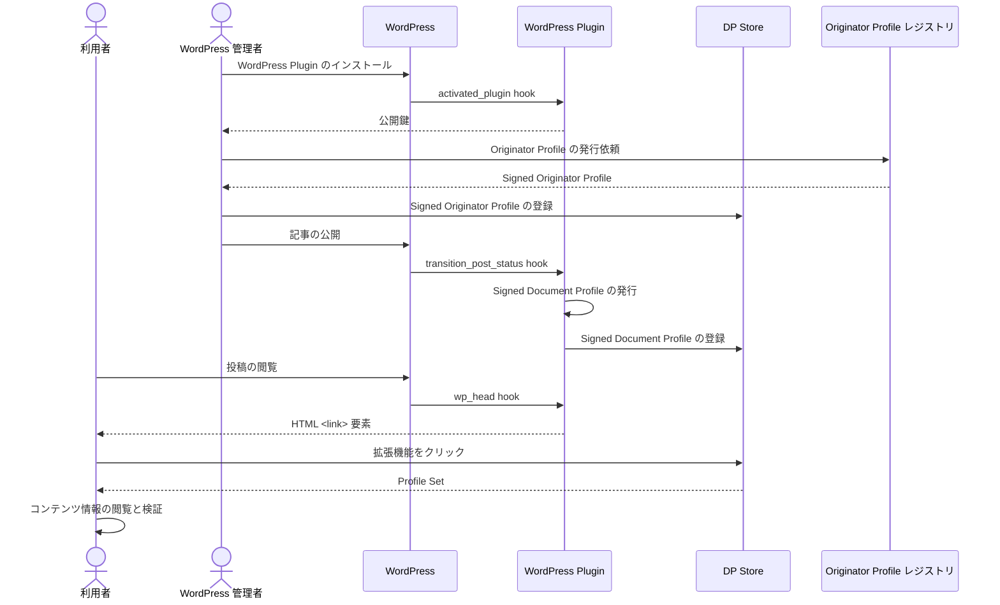

# Originator Profile 技術研究組合 (OP CIP) 実装 Wordpress 連携プラグイン

このページでは、CMS連携プラグインの一例として、 [OP CIP](https://originator-profile.org/) が開発した Wordpress 連携プラグインの実装について解説します。
このプラグインは CIP 提供の DP Store を利用して、サイト管理者が記事を追加・更新した際に SDP を発行、 DP Store に登録します。

## WordPress 連携プラグイン

Wordpress 連携プラグインによる SDP 発行、登録のフローはこのようになっています。



<!-- docs/registry/wordpress-integration.md より -->

Wordpress 連携プラグインは、 [hook](https://developer.wordpress.org/plugins/hooks/) によって、 Wordpress 本体からトリガーされ、そのフックに対応した処理を実行します。

1. `activate_plugin` hook が、プラグインを最初に有効化した際にトリガーされ、公開鍵ペアを生成して、プライベート鍵を Wordpress のサーバー内に保存します。
2. 次に、`transition_post_status` hook が記事の公開や更新のタイミングでトリガーされ、このときに SDP を発行します。
3. (2) で生成した SDP を DP Store に登録します。これは (2) の直後におこなれます。
4. 最後に `wp_head` hook が、ユーザーが記事に訪れて記事を閲覧した際にトリガーされ、これにより、記事の HTML に Profile Set へのリンクが <link\> 要素として追加されます。
5. ユーザーが、OP拡張機能をクリックすると、拡張機能はこの <link\> 要素から、記事に対応する Profile Set を取得・検証し、記事の信頼性や情報を表示します。

以降の説明では、 (2), (3), (4) を実装する際のガイドを提供します。それぞれ、 SDP の生成、 SDP の登録、 Profile Set の配信に対応します。

## SDP の生成

記事に対応する署名付き Document Profile (SDP) を生成します。手順については[SDP生成・署名](./sdp-issuance.mdx)を参照してください。 CIP による実装では主に [class-dp.php](https://github.com/originator-profile/profile/blob/v0.0.9/packages/wordpress/includes/class-dp.php) で実装しています。

SDP を生成したら、次は SDP を DP Store に登録してください。

## SDP の登録

生成した SDP を DP Store に登録します。これには　DP Store (`dprexpt.originator-profile.org`) の [SDP登録用のエンドポイント](pathname:///api/#operation/registerSignedDocumentProfile) を利用します。

CIP による[実装](https://github.com/originator-profile/profile/blob/v0.0.9/packages/wordpress/includes/issue.php#L231-L270)では次のようになっています。

```php
/**
 * Signed Document Profileの発行
 *
 * @param Dp     $dp Dp
 * @param string $endpoint レジストリサーバー DP 更新・登録エンドポイント
 * @param string $admin_secret レジストリサーバー認証情報
 * @param string $pkcs8 PEM base64 でエンコードされた PKCS #8 プライベート鍵またはそのファイルパス
 * @return string|false 成功した場合はSigned Document Profile、失敗した場合はfalse
 */
function issue_dp( Dp $dp, string $endpoint, string $admin_secret, string $pkcs8 ): string|false {
    $jwt = $dp->sign( pkcs8: $pkcs8 );


    if ( ! $jwt ) {
        return false;
    }


    $args = array(
        'method'  => 'POST',
        'headers' => array(
            'authorization' => 'Basic ' . \sodium_bin2base64( $admin_secret, SODIUM_BASE64_VARIANT_ORIGINAL ),
            'content-type'  => 'application/json',
        ),
        'body'    => \wp_json_encode(
            array(
                'jwt' => $jwt,
            )
        ),
    );


    $res = \wp_remote_request( $endpoint, $args );
    if ( \is_wp_error( $res ) ) {
        return false;
    }


    if ( \is_wp_error( $res ) || 200 !== $res['response']['code'] ) {
        return false;
    }


    return $jwt;
```

詳細については [DP Store を使った実装ガイド](./dp-store.mdx#2-save-sdp)を参照してください。

## 記事に対応する Profile Set の配信

SDP を DP Store に登録したら、最後に、記事から SDP を含む Profile Set を配信します。プラグインの実装では DP Store の API を利用しています。CIP による[実装](https://github.com/originator-profile/profile/blob/v0.0.9/packages/wordpress/includes/post.php#L19-L51)では次のようになっています。

```php
/** Link要素 */
function profile_link() {
    if ( ! \is_single() ) {
        return;
    }


    $hostname = \get_option( 'profile_registry_server_hostname', PROFILE_DEFAULT_PROFILE_REGISTRY_SERVER_HOSTNAME );


    if ( empty( $hostname ) ) {
        return;
    }


    if ( ! is_string( $hostname ) ) {
        return;
    }


    $uri  = \get_the_guid();
    $page = \max( 1, \get_query_var( 'page' ) );


    if ( $page > 1 ) {
        $uri = add_page_query( $uri, $page );
    }


    $uuid     = Uuid::uuid5( Uuid::NAMESPACE_URL, $uri );
    $endpoint = "https://{$hostname}/website/{$uuid}/profiles";


    if ( defined( 'WP_DEBUG' ) && WP_DEBUG && 'localhost' === $hostname ) {
        $endpoint = "http://localhost:8080/website/{$uuid}/profiles";
    }


    echo '<link href="' . \esc_html( $endpoint ) . '" rel="alternate" type="application/ld+json">' . PHP_EOL;
}
```

詳細については [DP Store を使った実装ガイド](./dp-store.mdx#3-deliver-ps)を参照してください。

次のような <link\> 要素が記事の HTML の <head\> 要素内に追加されれば完了となります。

```html
<link href="<Profile Set の URL>" rel="alternate" type="application/ld+json" />
```

以上の機能を CMS 連携に実装すれば、実装は完了となります。

## 結果確認

正しく OP 対応できていることを確認しましょう。 SDP を発行した記事のページに、ブラウザでアクセスしてください。確認方法は[拡張機能での検証](/web-ext/verification-result.mdx)を参照してください。
