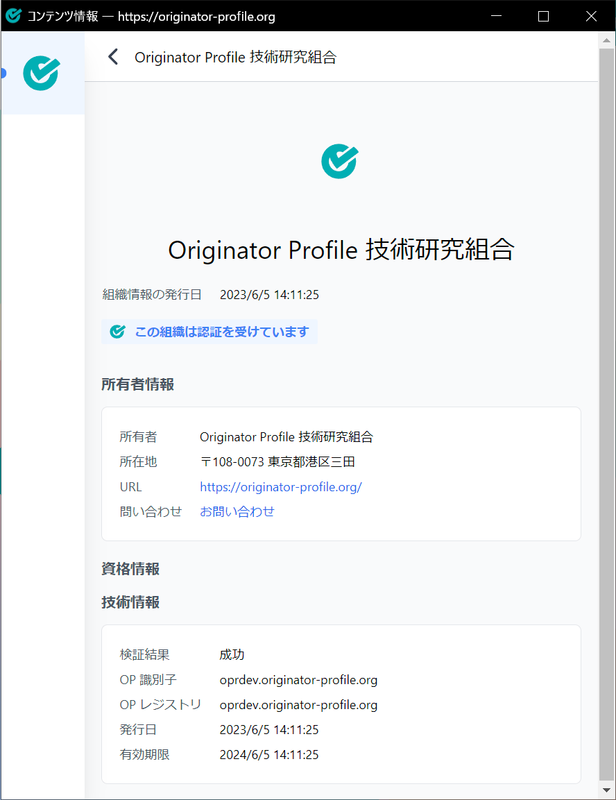
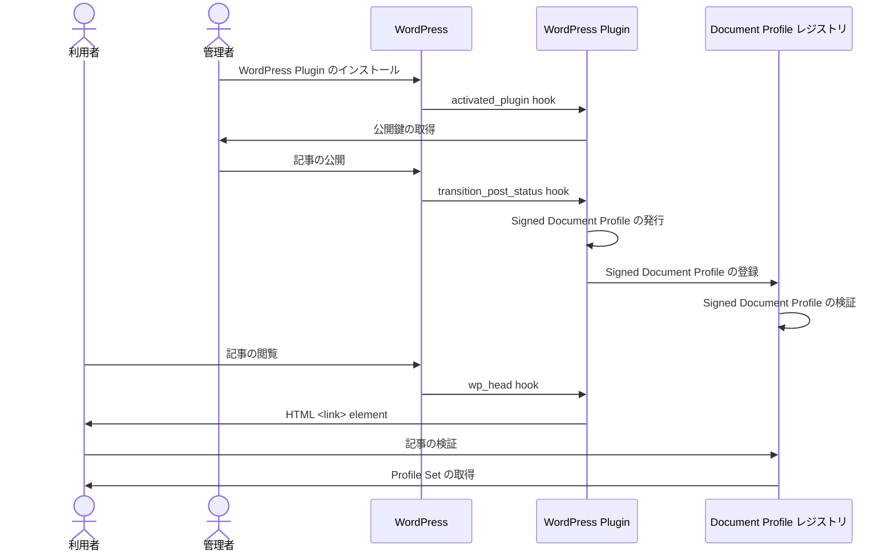
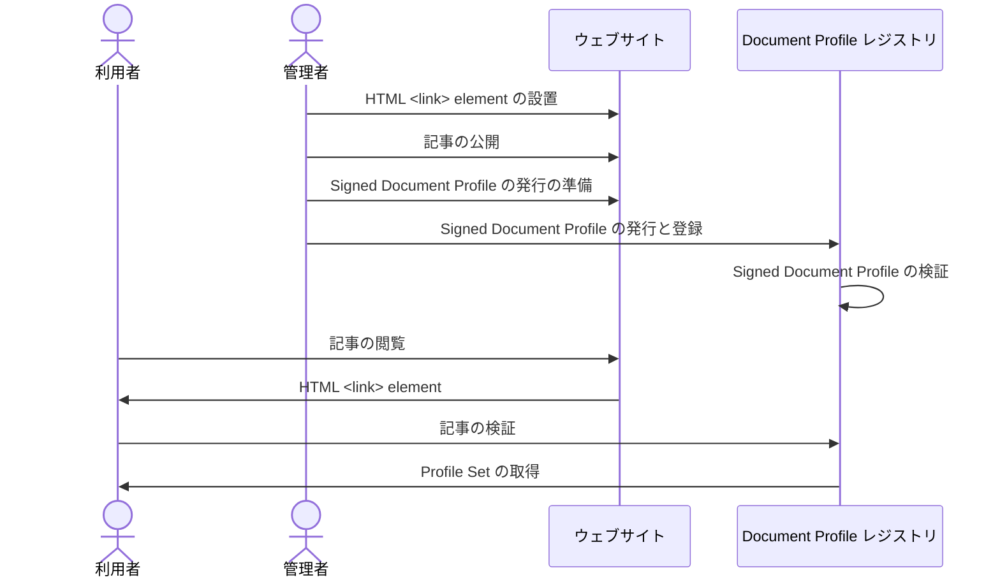

# Originator Profile 技術研究組合 メディア側実証実験 (202307)

note: ある程度書けたら https://profile-docs.pages.dev/docs/media-study-202307 に入れる想定。

本ページでは Originator Profile 技術研究組合において 2023/07 より準備・実施する「メディア側実証実験」の概要および参加に際して必要な準備や手順などについて説明します。

## 目的

### 背景と目的

本組合ではインターネット上のニュース記事や広告などのコンテンツに発信者情報を紐付ける技術を作り、信頼できる情報源をインターネット利用者に表示可能にすることで、デジタル空間の信頼性向上を実現します。

これまで、技術開発 WG において Web 標準技術やブラウザ・プラットフォームの動向を調査し、**ニュースなどの Web コンテンツに対し検証可能で信頼性のある発信者情報の付与方法を検討し、プロトタイプとして実装**してきました。

本実験は Originator Profile 技術を参画企業であるメディア各社で採用されている実際の記事・コンテンツ管理・配信システムでの利活用に向けた最初の実証実験です。まずはこれまで想定・設計してきた OP 技術が**実際のメディア各社の CMS や記事の配信システムにおいて現実的・効率的に適用・対応し得るのか、実装や実運用に際して不都合な点がないか検証頂く事**を第一の目的としております。

併せて、メディア各社のシステム担当者や CMS の開発者などに現在の OP 技術の設計や実装について理解を深めて頂きつつ、技術開発 WG の活動に参画頂く事で、より広い視野と経験を踏まえて技術の改善を進めていくことも目的としています。

### 設計と実装

現プロトタイプでは、OP CIP 加盟組織の情報を OP レジストリに登録し、WordPress で記事ページの HTML を生成する際に、レジストリに登録された組織情報と共に**個別の記事に署名付きで記事の情報もデジタルデータとして付与**し、ブラウザ(拡張機能)で閲覧時に記事と発行元組織の情報を確認できる仕組みを提案・実装しております。

従来の Web においてページやコンテンツの情報をデジタル化する仕組みは [OGP](https://ogp.me/) や [JSON-LD](https://json-ld.org/) [構造化データ](https://developers.google.com/search/docs/appearance/structured-data/intro-structured-data) のようなものがありましたが、記載情報に対して発信者の署名がなされている仕組みではなく、発信者に関する信頼性を機械的に検証可能なデータ及び実装ではありませんでした。

OP においては公開鍵・秘密鍵を用いた署名技術や [Verifiable Credential](https://w3c.github.io/vc-data-model/) のような Web 標準技術を活用し、署名付きの組織情報すなわち Signed Originator Profile (SOP) および署名付きの記事の情報 Signed Document Profile (SDP) という形で付与することにより、検証可能で信頼できる形式でメディアおよびニュースの情報を流通可能にします。

### 検証要素

本設計においては、署名が有効・検証可能であることが必須ですが、Web コンテンツは複雑な CMS、ビルドシステム、流通プラットフォームを通して配信されており、その過程で機械的・人為的な書き換えがされることも少なくありません。その中で SOP/SDP の有効性を維持するためには、署名検証対象の抽出・正規化・差分の扱いなどに関する適切な処理が欠かせません。これらに対応可能で今日の実際の Web で利用可能となるかどうか、課題についてはそれを抽出し具体的な要件を把握し解決策を設計可能にすることが本実験の目的です。

本実験は初回の実験であるため、**ニュースなどのテキスト主体のコンテンツの作者とそれを配信する Web サイトの運営者が一致するケースにおいて実際に各社がご利用の CMS に対して適用・実装が可能かどうか**検証頂きます。

技術開発 WG ではこれまで CMS の参照実装として WordPress 用のプラグインや、Node ベースの JAMStack 構成 (Eleventy) などで記事の HTML に対してその本文の可視テキストを抽出し署名した Signed Document Profile を生成し DP レジストリに登録する仕組みを実装してきました。

今回は実験参画企業またはその CMS の開発を請け負われている企業の皆様に、それら**プロトタイプの実装と設計を参考として自社の CMS 等において同様に自社コンテンツ本文に署名する仕組みの検討・実装・導入をお願い致します**。

### 非検証要素

以下のような点については初回の実験である今回のスコープには含めず、次回以降の継続実験において随時検証範囲の拡大を行っていくことを想定しています。

- メディアコンテンツへの署名検証
  - テキストや HTML ではない画像・動画などのメディアコンテンツに対する署名検証アルゴリズムの選定と実装は現時点では検討段階・未実装であり、テキストを含まない写真や動画など**だけ**を対象とする SDP の発行についてはスコープ外とします。
  - 画像や動画を**含む**ニュース記事においては、テキスト部分だけを抽出して署名するアルゴリズムを利用頂く事で、画像に対しての署名は含まないが当該記事に対しての SDP を発行頂く事は可能です
- 複数組織による共同作成コンテンツ
  - 今回は単一の組織が発行するコンテンツを対象として SOP, SDP を発行・利用するユースケースに限って検証します。
- サイト運営者とコンテンツ作成者が別組織であるケース
  - 今回は各組織が自社コンテンツに対して署名・配信する最も単純なケースを対象としています。別組織が運用するサイトに署名済みの記事を入れて再配信する場合、再配信に伴って記事本文の変換・書き換えが生じる場合がありますが、その場合の対応を検討・検証するのは次回以降の想定です。
  - また、サイト運営者とコンテンツ作成者が別の場合、ユーザにはコンテンツ発信元の組織情報だけではなく、配信者(場合によっては各経路)組織の情報も併せて確認し関係性が分かる形でお見せする必要があると考えます。表示側の仕組みと実装は既にプロトタイプがありますが、複数組織間で連携したシステムと調整が必要であるため初回実験のスコープからは外しております。

これらはあくまでも今回の検証対象外とするのみで、本組合と OP 技術では中長期的に解決・対応する想定であり、参画事業者の皆様と共に議論・設計・社会実装を進めさせて頂きます。該当するケースについて技術詳細を把握されている方には今後の実験に向けて助言や協力を頂きますようお願い致します。

## システム構成概要

本実証実験のシステム構成と全体の処理の流れは事前に配布させて頂きました、次の実験概要図に示すとおりです。


左と中央の WordPress を用いたプロトタイプ実装はあくまでも参照実装です。WordPress をベースとした CMS をご利用の企業様においては参照実装の WordPress プラグインを各社のシステムに合わせてカスタマイズするなどして実験に参加頂く想定です。

WordPress ではないシステムをご利用の方は WordPress の実装を参考として自社のシステム向けに記事に対する署名、Signed Document Profile (SDP) の発行、DP レジストリへの登録、Web ページから SDP へのリンクを行う機能を実装頂く必要があります。

技術開発 WG では汎用性の高い仕組み・実装として、出力 HTML と署名対象となる記事の要素を選択するセレクタを指定することで SDP を発行する CLI ツールの実装も行っています。長期的にはこれを DP レジストリの Web API として提供することで各 CMS 内部への実装を最小化可能とすることも検討はしておりますが、現時点ではあくまでも CLI ツールとして利用や実装の参考にして頂く形になります。

**各社 CMS の個別具体的なシステムにおいて、本設計では実装・運用上の課題となるものがありましたらその旨をフィードバックして頂きますようお願い致します。**

## スケジュール

現時点では以下のスケジュールにて実証実験の進行を想定しております:

- 6 月 30 日
  - 実験参加/参加検討企業の担当者向け説明会
  - 実際の実験参加に際しての確認が出来るよう技術担当者もご参加ください
- 7 月前半
  - 実験参加企業から必要情報の聞き取り
  - OP レジストリへの実験参加企業の登録
  - DP レジストリを利用可能な権限の付与
  - 各社において CMS の改修の実装開始
- 7 月後半〜8 月中頃
  - 記事に SDP を発行可能なシステムの準備が出来たメディアから順次実験開始
  - 実際のシステムへの導入に際しての具体的な課題やデータを収集
  - CMS 改修等の実装がこの期間に間に合わない企業はこの期間は課題の共有などのみを行い、準備が出来次第、9 月中頃までの期間で実験を実施
- 8 月中頃〜8 月末
  - 実験参画企業からの課題抽出結果・フィードバック・データの取り纏め
- 9 月頭頃
  - 実験結果(初期)報告
- 10 頭頃
  - 実験結果(追加)報告
  - 8 月中頃までに実施できなかったが 9 月中頃までに実施できた参加企業分

本初回実験に続く実験や連続的な実験については、実験期間中に得られた課題やフィードバックに応じて随時調整・ご連絡をさせて頂きます。

## 実験参加企業側で必要な準備

**TODO: 長いので多分別ページに分割する**

### Github アカウント

本実験で利用頂く参照実装コードやレジストリ・拡張機能などのコードを収めた [オリジネータープロファイル リポジトリ](https://github.com/webdino/profile/tree/main) は private リポジトリであり、Read 権限を付与する CIP 加盟企業の github アカウントが必要です。

github アカウント作成後、担当者名とアカウント名を事務局にご連絡ください。

:::note
本ページを含む、各種ドキュメントの参照には github アカウントは不要です。実装コードへのアクセスは不要でドキュメントだけで十分なご担当者様についてはアカウントの作成・ご連絡は不要です。
:::

### OP 組織情報登録内容の提出

下記フォームから OP レジストリに登録する組織情報を入力してください

https://forms.gle/udirHux1TFs5ctyu6

**TODO: JICDAQ 認証情報を書けるよう新しいフォームに更新または差し換え**

こちらに入力頂いた情報を元に OP レジストリへの登録を行います。登録された情報は具体的には次のような形でブラウザの拡張機能の UI に表示・確認できるようになります:

**TODO: 拡張機能のスクショを入れる**

### OP 拡張機能の導入と確認

#### インストール

技術開発 WG 側で事前にビルド済みの拡張機能をダウンロード頂くか、ご自身で最新のコードからビルドしてご利用ください。

ビルド済み拡張機能: **用意して TODO URL 入れる**
⇒ github releases にリンクする

参考: [拡張機能の実験的利用](https://profile-docs.pages.dev/docs/web-ext/experimental-use)

##### ビルド

プロジェクトのルートディレクトリで `yarn && yarn build` を実行すると `apps/web-ext/web-ext-artifacts/profile_web_extension-0.0.0.zip` のような ZIP ファイル が生成されます

##### ブラウザへのインストール

想定しているブラウザは Google Chrome です

1. ZIP ファイルを展開します。
2. chrome://extensions にアクセスします。
3. デベロッパーモードを有効にします。
4. 「パッケージ化されていない拡張機能を読み込む」を選択します。
5. ZIP ファイルから展開されたディレクトリを選択します。

#### 利用法の確認

ブラウザで CIP 公式サイトにアクセスします:
https://originator-profile.org/ja-JP/

右上の拡張機能ボタンから Profile web Extention を選択


ウィンドウが開き、認証の有無や各種情報を確認できます



メディアサイトへの埋め込み例としては読売新聞オンラインのスナップショットに OP 埋め込みを行ったサンプルサイトでも同様にご確認頂けます。

**TODO: アクセス情報記載**

:::note
こちらはあくまでもプロトタイプ実装に際して参照用のサンプルとして部分的に DP を埋め込んだ例を用意したものであり、今回の実験でどのような記事・コンテンツに対し SDP を発行するべきかを示すものではありません
:::

### 公開鍵、秘密鍵の作成と公開鍵の共有

Signed Originator Profile あるいは Signed Document Profile 発行作業には鍵ペアが必要です。
今回は Key ファイルと紐づける組織情報の例として下記を使用して、
鍵ペアの作成～公開鍵の共有までの手順例を説明します。
実行するディレクトリは`apps/registry`です

```
Keyファイル名：key.pem
紐づける組織情報のID：daab5a08-d513-400d-aaaa-e1c1493e0421
```

Key ファイルの作成は下記コマンドを実行します。

```
bin/dev key-gen -o key.pem
```

実行結果として得られる、Key ファイル名は下記となります。

```
key.pem （プライベート鍵）
key.pem.pub.json （公開鍵）
```

次に公開鍵の共有手順を説明します。
必要な情報としては下記となるので事前に確認してから実行します。 1.　公開鍵のパス 2.　紐づける組織情報の ID

公開鍵の共有は下記コマンドを実行します。

```
bin/dev account:register-key -k key.pem.pub.json --id daab5a08-d513-400d-aaaa-e1c1493e0421
```

実行結果としてコンソールに下記のように表示されます

```
Done.
```

### 実験対象サイトとコンテンツの選定

TODO: 丁寧に説明する

- 自社コンテンツのみ、他社提供コンテンツは次回以降
- 複数ページ対応などはオプショナル、課題の把握が出来れば今期実装は最小限で可
- 選定ガイド・FAQ 的なものは必要

### CMS への DP 発行機能の実装とデプロイ

- 後述

### DP レジストリ API の確認

今回の実証実験でご利用いただく API エンドポイントは次の 2 つです。

- `/admin/publisher/{アカウントID}` エンドポイント
  - 署名付き DP を DP レジストリに登録するためのエンドポイントです。POST メソッドをサポートします。
- `/website/profiles` エンドポイント
  - プロファイルセットを取得するためのエンドポイントです。GET メソッドをサポートします。今回の実証実験では、 `<link>` 要素の `href` 属性にこのエンドポイントへの URL を記載することになります。

各エンドポイントの使い方を説明します。

#### `/admin/publisher/{アカウントID}` エンドポイント

署名付き DP を DP レジストリに登録するためのエンドポイントです。必要なパラメータをリクエストのボディー部に付与して POST メソッドを送ることで、登録ができます。

このエンドポイントは、呼び出しに Basic 認証による認証が必要です。必要な認証情報は CIP から受け取ってください。受け取った認証情報は、 Basic 認証及び、このエンドポイントの URL の中の `{アカウントID}` で使用します。

今回の実証実験では、いくつかのパラメータには以下に示す固定値を入れてください。パラメータは JSON 形式で与えてください。

リクエスト例:

```shell
curl -X POST https://oprdev.originator-profile.org/admin/publisher/732e0c2d-179e-5190-a7e1-a9c5caa43eca/ \
    -u 732e0c2d-179e-5190-a7e1-a9c5caa43eca:KEg5GvSQLASQphVqARs-xcyyIaKz7f21W2ZySMdlgnU \
    -H 'Content-Type: application/json' \
    -d '{"input":{"id":"403cc6d4-53d6-4286-9f42-930e0bf7bd3f","url":"http://media.example.com/2023/06/hello/","bodyFormat":{"connect":{"value":"text"}},"proofJws":""},"jwt":"eyJhbGciOiJFUzI1NiIsImtpZCI6Im5Senc0VzdFVXJSMmlZdGlMbkFick5QOVVEdFFneE96OGZnX3poRjBmTkEiLCJ0eXAiOiJKV1QifQ.eyJodHRwczovL29yaWdpbmF0b3ItcHJvZmlsZS5vcmcvZHAiOnsiaXRlbSI6W3sidHlwZSI6IndlYnNpdGUiLCJ1cmwiOiJodHRwOi8vbG9jYWxob3N0OjgwODAiLCJ0aXRsZSI6Ik9QIOeiuuiqjeOBj-OCkyIsImNhdGVnb3J5IjpbXX0seyJ0eXBlIjoidmlzaWJsZVRleHQiLCJ1cmwiOiJodHRwOi8vbG9jYWxob3N0OjgwODAiLCJsb2NhdGlvbiI6ImgxIiwicHJvb2YiOnsiandzIjoiZXlKaGJHY2lPaUpGVXpJMU5pSXNJbXRwWkNJNkltNVNlbmMwVnpkRlZYSlNNbWxaZEdsTWJrRmljazVRT1ZWRWRGRm5lRTk2T0dablgzcG9SakJtVGtFaUxDSmlOalFpT21aaGJITmxMQ0pqY21sMElqcGJJbUkyTkNKZGZRLi5tYXI1dUh0T2M5a2FTakJUclI3U016OXFQekJheEhQVjFodzV1NkJLS2ZLZTFEV1M5ajA0WXR6MkNTWTdMbDdEdDMzX0R2bXllbW44WEpGbks1eHBaQSJ9fV19LCJpc3MiOiJrYWtpa3VrZWtvLmRlbW9zaXRlcy5wYWdlcy5kZXYiLCJzdWIiOiJlZjlkNzhlMC1kODFhLTRlMzktYjdhMC0yN2UxNTQwNWVkYzgiLCJpYXQiOjE2ODc4Mjc0NTgsImV4cCI6MTcxOTQ0OTg1OH0.bgIE8VMFit4HOFkBKrU9TwGGQuLHt2ZuOCS2C9MCZ4yAapf-1QupUYb3iYZcd-BjBwtgVupq9xzydC9cO25rQQ"}'
```

上記の例は、 curl コマンドで DP レジストリ (`oprdev.originator-profile.org`) の DP 登録エンドポイントへ HTTP POST リクエストを送っています。

CIP から受け取った認証情報がアカウント ID `732e0c2d-179e-5190-a7e1-a9c5caa43eca:KEg5GvSQLASQphVqARs-xcyyIaKz7f21W2ZySMdlgnU` 、パスワード `KEg5GvSQLASQphVqARs-xcyyIaKz7f21W2ZySMdlgnU` だとしています。

エンドポイントの URL は、アカウント ID を入れて `https://oprdev.originator-profile.org/admin/publisher/732e0c2d-179e-5190-a7e1-a9c5caa43eca/` とし、 `-u` オプションで上記アカウント ID とパスワードを `:` で連結した値を Basic 認証の認証情報として利用するようにしています。

`-d` オプションでパラメータを指定しています。これらのパラメータはリクエストのボディ部に JSON 形式で渡されます。各パラメータについては下記を参照ください。

```json
{
  "input": {
    "id": "403cc6d4-53d6-4286-9f42-930e0bf7bd3f", // 記事の ID を渡してください。必ず UUID 文字列表現 (RFC 4122) でなければなりません。
    "url": "http://media.example.com/2023/06/hello/", // 記事の URL です。
    // bodyFormat 内は、このままの値を入力してください。
    "bodyFormat": {
      "connect": {
        "value": "text"
      }
    },
    "proofJws": "" // 空文字列を入力してください。
  },
  "jwt": "eyJhbGciOiJFUzI1NiIsImtp（略）" // 署名付きDPを渡してください。
}
```

`bodyFormat`, `proofJws` は上記のように固定値を入れてください。これらの値は、今回の実験では使用しないため、実際に渡す DP の情報と一致していなくて構いません。 `jwt` 及び、 `id`, `url` には登録する DP に応じて適切な値を入れてください。

上記のリクエストに対する成功レスポンスは次のようになります。

レスポンス例（見やすく整形しています）:

```json
{
  "id": "403cc6d4-53d6-4286-9f42-930e0bf7bd3f",
  "url": "http://media.example.com/2023/06/hello/",
  "accountId": "732e0c2d-179e-5190-a7e1-a9c5caa43eca",
  "title": null,
  "image": null,
  "description": null,
  "author": null,
  "editor": null,
  "datePublished": null,
  "dateModified": null,
  "location": null,
  "bodyFormatValue": "text",
  "proofJws": "",
  "categories": []
}
```

`id`, `url`, `accountId` 以外のフィールドは無視して構いません。今回の実験では使用しない部分です。

DP の登録に成功すると、登録した DP を記事から参照することができます。これは、後述するもう一方のエンドポイントの URL を、記事ページの HTML 内に `<link>` 要素で指定することで実現します。

API の詳細については、 [CIP 提供 DP レジストリについて](#cip-提供-dp-レジストリについて) も参照ください。

#### `/website/profiles` エンドポイント

プロファイルセットを取得するためのエンドポイントです。クエリパラメータ `url` を付与して、 GET リクエストを送ってください。 `url` には、記事の URL を指定してください。記事に紐づいたプロファイルセットが JSON-LD 形式で返ってきます。`url` は RFC 3986 の形式でエンコーディングしてください（通常のクエリパラメータのエンコーディング方式です）。

このエンドポイントは認証は不要であり、記事を閲覧した全てのユーザーがプロファイルセットを検証することができます。

リクエスト例:

```shell
curl -X GET https://oprdev.originator-profile.org/website/profiles?url=http%3A%2F%2Fmedia.example.com%2F2023%2F06%2Farticles%2Fhello%2F \
-H 'Accept: application/ld+json'
```

上記の例は、curl コマンドで DP レジストリ (`oprdev.originator-profile.org`) のエンドポイントに　 GET リクエストを送っています。
`url` クエリパラメータに `http%3A%2F%2Fmedia.example.com%2F2023%2F06%2Fhello%2F` を付与し、 `http://media.example.com/2023/06/hello/` に紐づくプロファイルセットを取得しようとしています。
プロファイルセットは JSON-LD 形式なため、 `Accept` ヘッダーに `application/ld+json` を渡しています。

:::caution

url パラメータには、 DP 登録時に指定した URL と**完全に一致する**ものを与えてください。例えば、登録時に URL の末尾に `/` を付与しなかった場合には、このエンドポイントにも、末尾に `/` のない URL を与えてください。その他、[URL の仕様](https://url.spec.whatwg.org/#url-serializing)上は無視すべき違いであっても、プロファイルセットが返ってこない原因となります。

例:

登録時に URL `https://example.com/` を与えた場合、

- 正しいリクエスト: `https://oprdev.originator-profile.org/website/profiles?url=https%3A%2F%2Fexample.com%2F`

- 間違ったリクエスト 1（末尾の`/`がない）: `https://oprdev.originator-profile.org/website/profiles?url=http%3A%2F%2Fexample.com`
- 間違ったリクエスト 2（大文字小文字）: `https://oprdev.originator-profile.org/website/profiles?url=https%3A%2F%2FEXAMPLE.COM%2F`

:::

レスポンスの例（見やすく整形しています）:

```json
{
  "@context": {
    "op": "https://originator-profile.org/context#",
    "xsd": "http://www.w3.org/2001/XMLSchema#",
    "main": {
      "@id": "op:main",
      "@type": "xsd:string"
    },
    "profile": {
      "@id": "op:profile",
      "@type": "xsd:string"
    },
    "publisher": {
      "@id": "op:publisher",
      "@type": "xsd:string"
    },
    "advertiser": {
      "@id": "op:advertiser",
      "@type": "xsd:string"
    }
  },
  "profile": [
    "eyJhbGciOiJFUzI1NiIsImtpZCI6ImpKWXM1X0lMZ1VjODE4MEwtcEJQeEJwZ0EzUUM3ZVp1OXdLT2toOW1ZUFUiLCJ0eXAiOiJKV1QifQ.eyJodHRwczovL29yaWdpbmF0b3ItcHJvZmlsZS5vcmcvb3AiOnsiaXRlbSI6W3sidHlwZSI6ImNyZWRlbnRpYWwiLCJuYW1lIjoi44OW44Op44Oz44OJ44K744O844OV44OG44Kj6KqN6Ki8IiwiaXNzdWVkQXQiOiIyMDIzLTA2LTIxVDAyOjEwOjI3Ljk4OVoiLCJleHBpcmVkQXQiOiIyMDI0LTA2LTIxVDAyOjEwOjI3Ljk4OVoiLCJjZXJ0aWZpZXIiOiJsb2NhbGhvc3QiLCJ2ZXJpZmllciI6ImxvY2FsaG9zdCJ9LHsidHlwZSI6ImNyZWRlbnRpYWwiLCJuYW1lIjoidGVzdC1jcmVkZW50aWFsIiwiaW1hZ2UiOiJodHRwczovL2V4YW1wbGUuY29tL2ltYWdlLnBuZyIsImlzc3VlZEF0IjoiMjAyMy0wNi0yMVQwMjoxMDoyNy45ODlaIiwiZXhwaXJlZEF0IjoiMjAyNC0wNi0yMVQwMjoxMDoyNy45ODlaIiwiY2VydGlmaWVyIjoibG9jYWxob3N0IiwidmVyaWZpZXIiOiJsb2NhbGhvc3QifSx7InR5cGUiOiJjcmVkZW50aWFsIiwibmFtZSI6InRlc3QtY3JlZGVudGlhbDIiLCJpbWFnZSI6Imh0dHBzOi8vZXhhbXBsZS5jb20vaW1hZ2UucG5nIiwiaXNzdWVkQXQiOiIyMDIzLTA2LTIxVDAyOjEwOjI3Ljk4OVoiLCJleHBpcmVkQXQiOiIyMDI0LTA2LTIxVDAyOjEwOjI3Ljk4OVoiLCJjZXJ0aWZpZXIiOiJsb2NhbGhvc3QiLCJ2ZXJpZmllciI6ImxvY2FsaG9zdCJ9LHsidHlwZSI6ImNyZWRlbnRpYWwiLCJuYW1lIjoidGVzdC1jcmVkZW50aWFsMiIsImltYWdlIjoiaHR0cHM6Ly9leGFtcGxlLmNvbS9pbWFnZS5wbmciLCJpc3N1ZWRBdCI6IjIwMjMtMDYtMjFUMDI6MTA6MjcuOTg5WiIsImV4cGlyZWRBdCI6IjIwMjQtMDYtMjFUMDI6MTA6MjcuOTg5WiIsImNlcnRpZmllciI6ImxvY2FsaG9zdCIsInZlcmlmaWVyIjoibG9jYWxob3N0In0seyJ0eXBlIjoiY3JlZGVudGlhbCIsIm5hbWUiOiJ0ZXN0LWNyZWRlbnRpYWwyIiwiaW1hZ2UiOiJodHRwczovL2V4YW1wbGUuY29tL2ltYWdlLnBuZyIsImlzc3VlZEF0IjoiMjAyMy0wNi0yMVQwMjoxMDoyNy45ODlaIiwiZXhwaXJlZEF0IjoiMjAyNC0wNi0yMVQwMjoxMDoyNy45ODlaIiwiY2VydGlmaWVyIjoibG9jYWxob3N0IiwidmVyaWZpZXIiOiJ0b3lvdGEuZGVtb3NpdGVzLnBhZ2VzLmRldiJ9LHsidHlwZSI6ImNyZWRlbnRpYWwiLCJuYW1lIjoidGVzdC1jcmVkZW50aWFsMiIsImlzc3VlZEF0IjoiMjAyMy0wNi0yMVQwMjoxMDoyNy45ODlaIiwiZXhwaXJlZEF0IjoiMjAyNC0wNi0yMVQwMjoxMDoyNy45ODlaIiwiY2VydGlmaWVyIjoibG9jYWxob3N0IiwidmVyaWZpZXIiOiJ0b3lvdGEuZGVtb3NpdGVzLnBhZ2VzLmRldiJ9LHsidHlwZSI6ImNyZWRlbnRpYWwiLCJuYW1lIjoidGVzdC1jcmVkZW50aWFsMiIsImlzc3VlZEF0IjoiMjAyMy0wNi0yMVQwMjoxMDoyNy45ODlaIiwiZXhwaXJlZEF0IjoiMjAyNC0wNi0yMVQwMjoxMDoyNy45ODlaIiwiY2VydGlmaWVyIjoibG9jYWxob3N0IiwidmVyaWZpZXIiOiJ0b3lvdGEuZGVtb3NpdGVzLnBhZ2VzLmRldiJ9LHsidHlwZSI6ImNyZWRlbnRpYWwiLCJuYW1lIjoidGVzdC1jcmVkZW50aWFsMiIsImlzc3VlZEF0IjoiMjAyMy0wNi0yMVQwMjoxMDoyNy45ODlaIiwiZXhwaXJlZEF0IjoiMjAyNC0wNi0yMVQwMjoxMDoyNy45ODlaIiwiY2VydGlmaWVyIjoibG9jYWxob3N0IiwidmVyaWZpZXIiOiJ0b3lvdGEuZGVtb3NpdGVzLnBhZ2VzLmRldiJ9LHsidHlwZSI6ImNyZWRlbnRpYWwiLCJuYW1lIjoi44OW44Op44Oz44OJ44K744O844OV44OG44Kj6KqN6Ki8IDIiLCJpc3N1ZWRBdCI6IjIwMjMtMDYtMjFUMDI6MTA6MjcuOTg5WiIsImV4cGlyZWRBdCI6IjIwMjQtMDYtMjFUMDI6MTA6MjcuOTg5WiIsImNlcnRpZmllciI6ImxvY2FsaG9zdCIsInZlcmlmaWVyIjoibG9jYWxob3N0In0seyJ0eXBlIjoiY3JlZGVudGlhbCIsIm5hbWUiOiLjg5bjg6njg7Pjg4njgrvjg7zjg5Xjg4bjgqPoqo3oqLwgMiIsImlzc3VlZEF0IjoiMjAyMy0wNi0yMVQwMjoxMDoyNy45ODlaIiwiZXhwaXJlZEF0IjoiMjAyNC0wNi0yMVQwMjoxMDoyNy45ODlaIiwiY2VydGlmaWVyIjoibG9jYWxob3N0IiwidmVyaWZpZXIiOiJsb2NhbGhvc3QifSx7InR5cGUiOiJjZXJ0aWZpZXIiLCJkb21haW5OYW1lIjoibG9jYWxob3N0IiwidXJsIjoiaHR0cHM6Ly9vcmlnaW5hdG9yLXByb2ZpbGUub3JnLyIsIm5hbWUiOiJPcmlnaW5hdG9yIFByb2ZpbGUg5oqA6KGT56CU56m257WE5ZCIIiwicG9zdGFsQ29kZSI6IjEwOC0wMDczIiwiYWRkcmVzc0NvdW50cnkiOiJKUCIsImFkZHJlc3NSZWdpb24iOiLmnbHkuqzpg70iLCJhZGRyZXNzTG9jYWxpdHkiOiLmuK_ljLoiLCJzdHJlZXRBZGRyZXNzIjoi5LiJ55SwIiwiY29udGFjdFRpdGxlIjoi44GK5ZWP44GE5ZCI44KP44GbIiwiY29udGFjdFVybCI6Imh0dHBzOi8vb3JpZ2luYXRvci1wcm9maWxlLm9yZy9qYS1KUC8iLCJsb2dvcyI6W3sidXJsIjoiaHR0cHM6Ly9vcmlnaW5hdG9yLXByb2ZpbGUub3JnL2ltYWdlL2ljb24uc3ZnIiwiaXNNYWluIjp0cnVlfV0sImJ1c2luZXNzQ2F0ZWdvcnkiOltdfSx7InR5cGUiOiJ2ZXJpZmllciIsImRvbWFpbk5hbWUiOiJsb2NhbGhvc3QiLCJ1cmwiOiJodHRwczovL29yaWdpbmF0b3ItcHJvZmlsZS5vcmcvIiwibmFtZSI6Ik9yaWdpbmF0b3IgUHJvZmlsZSDmioDooZPnoJTnqbbntYTlkIgiLCJwb3N0YWxDb2RlIjoiMTA4LTAwNzMiLCJhZGRyZXNzQ291bnRyeSI6IkpQIiwiYWRkcmVzc1JlZ2lvbiI6IuadseS6rOmDvSIsImFkZHJlc3NMb2NhbGl0eSI6Iua4r-WMuiIsInN0cmVldEFkZHJlc3MiOiLkuInnlLAiLCJjb250YWN0VGl0bGUiOiLjgYrllY_jgYTlkIjjgo_jgZsiLCJjb250YWN0VXJsIjoiaHR0cHM6Ly9vcmlnaW5hdG9yLXByb2ZpbGUub3JnL2phLUpQLyIsImxvZ29zIjpbeyJ1cmwiOiJodHRwczovL29yaWdpbmF0b3ItcHJvZmlsZS5vcmcvaW1hZ2UvaWNvbi5zdmciLCJpc01haW4iOnRydWV9XSwiYnVzaW5lc3NDYXRlZ29yeSI6W119LHsidHlwZSI6InZlcmlmaWVyIiwiZG9tYWluTmFtZSI6InRveW90YS5kZW1vc2l0ZXMucGFnZXMuZGV2IiwidXJsIjoiaHR0cHM6Ly9nbG9iYWwudG95b3RhLyIsIm5hbWUiOiLjg4jjg6jjgr_oh6rli5Xou4rmoKrlvI_kvJrnpL4iLCJkZXNjcmlwdGlvbiI6IuODiOODqOOCv-iHquWLlei7iuagquW8j-S8muekvuips-e0sCIsInBob25lTnVtYmVyIjoiMDU2NS0yOC0yMTIxIiwicG9zdGFsQ29kZSI6IjQ3MS04NTcxIiwiYWRkcmVzc0NvdW50cnkiOiJKUCIsImFkZHJlc3NSZWdpb24iOiLmhJvnn6XnnIwiLCJhZGRyZXNzTG9jYWxpdHkiOiLosYrnlLDluIIiLCJzdHJlZXRBZGRyZXNzIjoi44OI44Oo44K_55S6MeeVquWcsCIsImNvbnRhY3RUaXRsZSI6IkZBUeODu-OBiuWVj-OBhOWQiOOCj-OBmyIsImNvbnRhY3RVcmwiOiJodHRwczovL2dsb2JhbC50b3lvdGEvanAvZmFxIiwicHJpdmFjeVBvbGljeVRpdGxlIjoi44OX44Op44Kk44OQ44K344O8IiwicHJpdmFjeVBvbGljeVVybCI6Imh0dHBzOi8vZ2xvYmFsLnRveW90YS9qcC9zdXN0YWluYWJpbGl0eS9wcml2YWN5IiwibG9nb3MiOlt7InVybCI6Imh0dHBzOi8vdG95b3RhLmRlbW9zaXRlcy5wYWdlcy5kZXYvbG9nb3MvaG9yaXpvbnRhbC10b3lvdGEuc3ZnIiwiaXNNYWluIjp0cnVlfV0sImJ1c2luZXNzQ2F0ZWdvcnkiOltdfSx7InR5cGUiOiJob2xkZXIiLCJkb21haW5OYW1lIjoibG9jYWxob3N0IiwidXJsIjoiaHR0cHM6Ly9vcmlnaW5hdG9yLXByb2ZpbGUub3JnLyIsIm5hbWUiOiJPcmlnaW5hdG9yIFByb2ZpbGUg5oqA6KGT56CU56m257WE5ZCIIiwicG9zdGFsQ29kZSI6IjEwOC0wMDczIiwiYWRkcmVzc0NvdW50cnkiOiJKUCIsImFkZHJlc3NSZWdpb24iOiLmnbHkuqzpg70iLCJhZGRyZXNzTG9jYWxpdHkiOiLmuK_ljLoiLCJzdHJlZXRBZGRyZXNzIjoi5LiJ55SwIiwiY29udGFjdFRpdGxlIjoi44GK5ZWP44GE5ZCI44KP44GbIiwiY29udGFjdFVybCI6Imh0dHBzOi8vb3JpZ2luYXRvci1wcm9maWxlLm9yZy9qYS1KUC8iLCJsb2dvcyI6W3sidXJsIjoiaHR0cHM6Ly9vcmlnaW5hdG9yLXByb2ZpbGUub3JnL2ltYWdlL2ljb24uc3ZnIiwiaXNNYWluIjp0cnVlfV0sImJ1c2luZXNzQ2F0ZWdvcnkiOltdfV0sImp3a3MiOnsia2V5cyI6W3sieCI6InlwQWxVam81TzVzb1VOSGszbWxSeWZ3NnVqeHFqZkRfSE1RdDdYSC1yU2ciLCJ5IjoiMWNtdjlsbVp2TDBYQUVSTnh2clQya1prQzRVd3U1aTFPcjFPLTRpeEp1RSIsImNydiI6IlAtMjU2Iiwia2lkIjoiakpZczVfSUxnVWM4MTgwTC1wQlB4QnBnQTNRQzdlWnU5d0tPa2g5bVlQVSIsImt0eSI6IkVDIn0seyJ4IjoiQTR6YjZVQ0JEcVhrQS00cFp1YmhaMlVnbTFQSWljd3l1aTA5T0NLYnByMCIsInkiOiJYc2tlaVlzWUNITDZvMHkyT0pjSzlxSWkwMTA0c1J1YzZfQnF3NVJCS2t3IiwiY3J2IjoiUC0yNTYiLCJraWQiOiJkdldRSWZjZ1FyYjB5WEhVV0RYV2VPZ1dwTnQ0cjBvb1l2V2t4cnZhZFRRIiwia3R5IjoiRUMifV19fSwiaXNzIjoibG9jYWxob3N0Iiwic3ViIjoibG9jYWxob3N0IiwiaWF0IjoxNjg3MzEzNDI3LCJleHAiOjE3MTg5MzU4Mjd9.Xo3wE4OW6GgGED05TTbxXTgBtYs6ScxOa0u5t8nTREyXxd-1lf_52HcjZAgnabvJnJ_tv5l0gOsZ-N9_gS-PVQ",
    "eyJhbGciOiJFUzI1NiIsImtpZCI6ImpKWXM1X0lMZ1VjODE4MEwtcEJQeEJwZ0EzUUM3ZVp1OXdLT2toOW1ZUFUiLCJ0eXAiOiJKV1QifQ.eyJodHRwczovL29yaWdpbmF0b3ItcHJvZmlsZS5vcmcvZHAiOnsiaXRlbSI6W3sidHlwZSI6IndlYnNpdGUiLCJ1cmwiOiJodHRwOi8vbG9jYWxob3N0OjgwODAiLCJ0aXRsZSI6Ik9QIOeiuuiqjeOBj-OCkyIsImNhdGVnb3J5IjpbXX0seyJ0eXBlIjoidmlzaWJsZVRleHQiLCJ1cmwiOiJodHRwOi8vbG9jYWxob3N0OjgwODAiLCJsb2NhdGlvbiI6ImgxIiwicHJvb2YiOnsiandzIjoiZXlKaGJHY2lPaUpGVXpJMU5pSXNJbXRwWkNJNkltcEtXWE0xWDBsTVoxVmpPREU0TUV3dGNFSlFlRUp3WjBFelVVTTNaVnAxT1hkTFQydG9PVzFaVUZVaUxDSmlOalFpT21aaGJITmxMQ0pqY21sMElqcGJJbUkyTkNKZGZRLi45aE16akNzdXhYdUZFU2NtXzVFR2JGLTNXNlgxbkVvd0NxWWo4VzVlbndZWHZRcmhGT29nVDR5c185QU9rTUVJSlhQZWVyLXJURjFjMzNHczF1YmM3QSJ9fV19LCJpc3MiOiJsb2NhbGhvc3QiLCJzdWIiOiJlZjlkNzhlMC1kODFhLTRlMzktYjdhMC0yN2UxNTQwNWVkYzciLCJpYXQiOjE2ODY4MDc4NTQsImV4cCI6MTcxODQzMDI1NH0.eUiFvVeW2Cc60lm7ZNJQFZ31FtEHVIcgbWuE63N428lvfGh7iBbvo0sg4MB_QQSQgjjqfPATtfr_hwDbhn8PNA",
    "eyJhbGciOiJFUzI1NiIsImtpZCI6ImpKWXM1X0lMZ1VjODE4MEwtcEJQeEJwZ0EzUUM3ZVp1OXdLT2toOW1ZUFUiLCJ0eXAiOiJKV1QifQ.eyJodHRwczovL29yaWdpbmF0b3ItcHJvZmlsZS5vcmcvZHAiOnsiaXRlbSI6W3sidHlwZSI6IndlYnNpdGUiLCJ1cmwiOiJodHRwOi8vbG9jYWxob3N0OjgwODAiLCJ0aXRsZSI6Ik9QIOeiuuiqjeOBj-OCkyIsImltYWdlIjoiaHR0cDovL2xvY2FsaG9zdDo4MDgwL2Fzc2V0cy9sb2dvLTJiMDRlNjM1LnN2ZyIsImNhdGVnb3J5IjpbXX0seyJ0eXBlIjoidmlzaWJsZVRleHQiLCJ1cmwiOiJodHRwOi8vbG9jYWxob3N0OjgwODAiLCJsb2NhdGlvbiI6InNlY3Rpb24iLCJwcm9vZiI6eyJqd3MiOiJleUpoYkdjaU9pSkZVekkxTmlJc0ltdHBaQ0k2SW1wS1dYTTFYMGxNWjFWak9ERTRNRXd0Y0VKUWVFSndaMEV6VVVNM1pWcDFPWGRMVDJ0b09XMVpVRlVpTENKaU5qUWlPbVpoYkhObExDSmpjbWwwSWpwYkltSTJOQ0pkZlEuLldBUTdITHgzZ2JHWDBKdWtUTEFlcUpTYTg5QnBGQTluOTRIQlZfeVlkb1NmbUh4Ym16LWc3N0dtcGpTbk1UWElfRklDdUViV3NGaDU2a1VfOTdqZE93In19XX0sImlzcyI6ImxvY2FsaG9zdCIsInN1YiI6ImMxNmNjOTFjLWNkMDYtNDNiYS05OTExLTA2OGM3MTU2NWUxMyIsImlhdCI6MTY4NjcyNjM0MCwiZXhwIjoxNzE4MzQ4NzQwfQ.3Bxx1fJbefywzln-nWdZYhFvetytcd2yaLvUE__BHUz9vZP2I3ZtlJ01Yq9KGj1eR3sP7po-yKs2yedA2DTngQ",
    "eyJhbGciOiJFUzI1NiIsImtpZCI6ImpKWXM1X0lMZ1VjODE4MEwtcEJQeEJwZ0EzUUM3ZVp1OXdLT2toOW1ZUFUiLCJ0eXAiOiJKV1QifQ.eyJodHRwczovL29yaWdpbmF0b3ItcHJvZmlsZS5vcmcvZHAiOnsiaXRlbSI6W3sidHlwZSI6IndlYnNpdGUiLCJ1cmwiOiJodHRwOi8vbG9jYWxob3N0OjgwODAiLCJ0aXRsZSI6Ik9QIOeiuuiqjeOBj-OCkyIsImltYWdlIjoiaHR0cDovL2xvY2FsaG9zdDo4MDgwL2Fzc2V0cy9sb2dvLTJiMDRlNjM1LnN2ZyIsImNhdGVnb3J5IjpbXX0seyJ0eXBlIjoidmlzaWJsZVRleHQiLCJ1cmwiOiJodHRwOi8vbG9jYWxob3N0OjgwODAiLCJsb2NhdGlvbiI6ImgxIiwicHJvb2YiOnsiandzIjoiZXlKaGJHY2lPaUpGVXpJMU5pSXNJbXRwWkNJNkltcEtXWE0xWDBsTVoxVmpPREU0TUV3dGNFSlFlRUp3WjBFelVVTTNaVnAxT1hkTFQydG9PVzFaVUZVaUxDSmlOalFpT21aaGJITmxMQ0pqY21sMElqcGJJbUkyTkNKZGZRLi5tQXNlWjdHNTdwcEhoVUVMZFZDS3g1UWpVQ1ZPenJuLXFRQzhsY2h4VnluQVc3YVBQek1FNTN0Wi1FbU4ta21ScUFDd2ZZaURHU1VJTXBoSGJVYWNQdyJ9fV19LCJpc3MiOiJsb2NhbGhvc3QiLCJzdWIiOiI3ZjdmOTFiOC02ZWNhLTQ5NzYtODZkMi1lNDg4NjE5ZjQ3YzMiLCJpYXQiOjE2ODczMTU4NjAsImV4cCI6MTcxODkzODI2MH0.2Rm_wuAHLIG56A1gUAzpd00VHwqMVPsUA3nFt6bLhRTKNiXnybSU8lRcNUBYpWOKwiZc-3c4YGnOvwydYY3yOg"
  ]
}
```

API の詳細については、 [CIP 提供 DP レジストリについて](#cip-提供-dp-レジストリについて) も参照ください。

### DP の作成と DP レジストリへの登録

#### DP の作成

DP の作成のため、Signed Document Profile を作成する必要があります。
前提条件として組織情報の登録、公開鍵の登録、Signed Originator Profile 発行を行う必要があります。
今回は下記を使用して実行します。

```
公開鍵のパス：key.pem
登録する組織情報のID：daab5a08-d513-400d-aaaa-e1c1493e0421
```

また、Web ページの情報も必要になるため`website.json`というファイルを用意します。
雛形は[website.example.json](https://github.com/webdino/profile/blob/main/apps/registry/website.example.json)というファイルを編集して下記のような内容を使用します。

```json
{
  "id": "ef9d78e0-d81a-4e39-b7a0-27e15405edc8",
  "url": "http://localhost:8080",
  "location": "h1",
  "bodyFormat": { "connect": { "value": "visibleText" } },
  "body": "OP 確認くん",
  "title": "OP 確認くん"
}
```

「読売新聞社」は、株式会社読売新聞東京本社の登録商標です。

公開鍵のパス、登録する組織情報の ID、web ページの情報を引数として使用して下記のように実行します。

```shell
bin/dev publisher:website \
  -i key.pem \
  --id daab5a08-d513-400d-aaaa-e1c1493e0421 \
  --input website.json \
  -o create
```

実行結果として下記のようにコンソールに表示されます。

```
{
  "id": "ef9d78e0-d81a-4e39-b7a0-27e15405edc8",
  "url": "http://localhost:8080",
  "accountId": "e1c6e970-0739-5227-a429-ae0dfa897398",
  "title": "OP 確認くん",
  "image": null,
  "description": null,
  "author": null,
  "editor": null,
  "datePublished": null,
  "dateModified": null,
  "location": "h1",
  "bodyFormatValue": "visibleText",
  "proofJws": "eyJhbGciOiJFUzI1NiIsImtpZCI6Im5Senc0VzdFVXJSMmlZdGlMbkFick5QOVVEdFFneE96OGZnX3poRjBmTkEiLCJiNjQiOmZhbHNlLCJjcml0IjpbImI2NCJdfQ..Y_IlLjScpDwO3cfBPLSgh0mPVAw8xgU00DcPmL-e2ZD8Mpf6QkzH6raX_Anh0YWJRLWaS3US80MRHZmxfcmPpw"
}
```

オプションは[README.md](https://github.com/webdino/profile/tree/main/apps/registry#profile-registry-publisherwebsite)を参照ください。

#### DP レジストリへの登録

Originator Profile レジストリ運用者から受け取った Signed Originator Profile を Document Profile レジストリに登録します。

```
bin/dev account:register-op --id <ドメイン名> --op <Signed Originator Profileファイル>
```

DP の作成が可能になったら、DP 発行処理を CMS 側に組み込み、記事の編集後に自動で DP の発行と link タグの埋め込みがされるようにします。

## CMS の実装ガイド

### 全体の流れ (HTML の一部を CSS Selector で選択、署名、SDP 生成、DP レジストリ登録、Link 付与)

CMS への実装として WordPress での手順を例に説明します。

#### 事前準備

Document Profile レジストリ へのアクセス情報は事前にお渡しします
その情報を WordPress での実装に使用いたします

:::danger
DP レジストリは各社共同使用となっています
案内に記載された方法以外での使用は避けてください
:::

#### WordPress 　連携

##### プラグインのインストール

- WordPress サイトに WordPress Profile Plugin をインストールします
- Document Profile レジストリのドメイン名は WordPress 管理者画面 > Settings > Profile > [レジストリドメイン名] に設定してください。
- Document Profile レジストリの認証情報は WordPress 管理者画面 > Settings > Profile > [認証情報] に設定してください。

### 署名付与の WP,一般 web 実装のプロトの説明

#### WordPress



管理者がプラグインのインストール、登録したレジストリの管理者情報を記載することで
記事の公開時に Signed Document Profile の発行～検証を自動で行い、Profile set を取得できる。

#### 他の Web サイト



WordPress 以外の Web サイトで実装する場合、手順が異なり下記のような内容の実施が必要となります。

- `HTML <link> element` の設置
- Signed Document Profile の発行準備
- Signed Document Profile の発行と登録

Document Profile レジストリのドメイン名、対象とするウェブサイトについて以下を例として説明します

```
Document Profile レジストリのドメイン名："oprdev.originator-profile.org"
対象とするウェブサイト："https://originator-profile.org"
```

#### `HTML <link> element` の設置

設置する HTML は下記になります

```
<link
  href="https://oprdev.originator-profile.org/website/profiles?url=https%3A%2F%2Foriginator-profile.org"
  rel="alternate"
  type="application/ld+json"
/>
```

#### Signed Document Profile の発行準備

記事の URL、検証対象となるテキストの範囲、抽出結果の保存先を表明する .extract.json を作成します。

```
[
  {
    "url": "https://originator-profile.org/ja-JP/",
    "bodyFormat": "visibleText",
    "location": "[itemprop=articleBody]",
    "output": "src/ja-JP/.website.json"
  },
  {
    "url": "https://originator-profile.org/ja-JP/about/",
    "bodyFormat": "visibleText",
    "location": "[itemprop=articleBody]",
    "output": "src/ja-JP/about/.website.json"
  },
  {
    "url": "https://originator-profile.org/ja-JP/for-viewer/",
    "bodyFormat": "visibleText",
    "location": "[itemprop=articleBody]",
    "output": "src/ja-JP/for-viewer/.website.json"
  },
  {
    "url": "https://originator-profile.org/ja-JP/future/",
    "bodyFormat": "visibleText",
    "location": "[itemprop=articleBody]",
    "output": "src/ja-JP/future/.website.json"
  },
  {
    "url": "https://originator-profile.org/ja-JP/structure/",
    "bodyFormat": "visibleText",
    "location": "[itemprop=articleBody]",
    "output": "src/ja-JP/structure/.website.json"
  }
]
```

作成した.extract.json から OGP 等メタデータ、検証対象となるテキストの抽出するため、
下記コマンドを実行します。

```
$ bin/dev publisher:extract-website --input .extract.json
```

出力結果が下記です

```
{
  "url": "https://originator-profile.org/ja-JP/",
  "location": "[itemprop=articleBody]",
  "bodyFormat": {
    "connect": {
      "value": "visibleText"
    }
  },
  "body": "一般的なネットユーザーの課題\nちゃんと事実を伝えているウェブ上の記事とか広告とかって、信頼できる情報だけ見る方法はないのかしら...？\nフェイクニュースや有害サイトってどうやってもなくならないの...？\n\nアテンションエコノミー（関心を引くことの価値化）を背景に、事実を伝える記事より例えフェイクニュースであっても目立つ記事の方が利益が上がる構造ができています。これはコンテンツ発信者とその信頼性を確認する一般的な手段が無いことが大きな原因の一つです。閲覧者や広告配信システムが良質な記事やメディアを識別可能にすれば、インターネットの情報流通はより健全化できます。\n\nウェブコンテンツを閲覧される方へ\n\n広告・メディア関係者の課題\nえええー！？ こんな危険なサイトにウチの広告が！！\nあれ、この記事の内容にウチの広告は合わないのでは！？\n\n不適切なサイト (メディア) に広告が掲載されたり、逆に、表示して欲しくない広告が掲載されることがあります。検索結果に偽サイトなどが表示されたり、SNS でもフェイクニュースが目立った形で拡散されたりしています。適切なサイトや広告主を識別し、適切なサイトと広告のマッチングをしたり、その配信記録を残すことでブランド毀損を防げます。\n\n一方で...\nでも、情報の規制は良くないよね、言論の自由も認められなければいけない。\n\nそのとおりです。ただし、Originator Profile技術はメディアや広告主の峻別しゅんべつをおこなうものではありません。現存する認証機関などに活用してもらうことを考えています。\n\n課題を解決するために\nコンテンツの発信元や流通経路を透明化する手段を提供します\n\nウェブ上の記事や広告といったコンテンツの発信者や掲載サイトの運営者の情報を付与し、公正な基準で第三者認証された発信者や運営者を確認出来るようにします。現在、これを実現するための技術と仕組みの開発と運用試験を、広告やメディアの関係企業や大学の研究機関と共に行っています。\n\n「Originator Profile 技術とは」についてもご覧ください。\n\nウェブ標準化に向けて\n\n情報の発信者や流通経路、広告主を透明化することで、様々な問題を解決できます。\n\nコンテンツ発信元や第三者認証情報をウェブブラウザで簡単に確認できます\nなりすましや改変を防ぎ安心してコンテンツを閲覧できます\n不適切な広告の掲載や、不適切なサイトへの広告掲載を防げます\n目をひくだけでなく、適切な記事の配信者の収益性を高めることができます\n\n次代のウェブをより健全で公益性の高いものとするべく、これらの問題を解決するため Originator Profile 技術を標準規格として Web 技術の標準化団体（W3C）に提案し、世界標準化と普及を目指した取り組みを行っています。",
  "datePublished": null,
  "author": null,
  "description": "Originator Profileの紹介ページ",
  "image": "https://originator-profile.org/image/ogp.png",
  "title": "Originator Profile"
}
```

#### Signed Document Profile の発行と登録

.website.json から Signed Document Profile を発行し Document Profile レジストリに登録します。
この際、--identity で指定するプライベート鍵は Originator Profile レジストリに登録した公開鍵を使用してください。

```
$ bin/dev publisher:website --identity <プライベート鍵> --id <管理者の UUID> --operation create
```

#### ブラウザでの表示結果確認

CMS (WordPress または他の CMS) 側の実装が終わったら出力 HTML に SDP への link タグが含まれていることを確認


拡張機能を起動して読み込まれることを確認


完了！

## CIP 提供 DP レジストリについて

今回の実証実験では、 DP レジストリとして、 CIP が提供したものを使用してください。
DP レジストリが提供する API のうち、次の 2 つのエンドポイントが今回の実験に関係します。

- `/admin/publisher/{アカウントID}` エンドポイント
  - 署名付き DP を DP レジストリに登録するためのエンドポイントです。POST メソッドをサポートします。
- `/website/profiles` エンドポイント
  - プロファイルセットを取得するためのエンドポイントです。GET メソッドをサポートします。今回の実証実験では、 `<link>` 要素の `href` 属性にこのエンドポイントへの URL を記載することになります。

各エンドポイントのおおまかな使い方については [DP レジストリ API の確認](#dp-レジストリ-api-の確認) を参照ください。

### `admin/publisher/{アカウントID}` エンドポイント詳細

#### パラメータ　（`/admin/publisher/{アカウントID}` エンドポイント）

パラメータの一覧は以下になります。これらを POST リクエストのボディーに JSON 形式で与えてください。全て必須パラメータになります。

| パラメータ名 | 型               | 説明                       |
| ------------ | ---------------- | -------------------------- |
| jwt          | 文字列           | DP を与えてください        |
| input        | 下記テーブル参照 | 記事の情報を与えてください |

`input` パラメータの内部には、以下のパラメータを入れてください。

| パラメータ名 | 型                | 説明                                                                                      |
| ------------ | ----------------- | ----------------------------------------------------------------------------------------- |
| id           | 文字列            | 記事の ID を与えてください。必ず UUID 文字列表現 (RFC 4122) でなければなりません (MUST)。 |
| url          | 文字列            | 記事の URL を与えてください                                                               |
| bodyFormat   | JSON オブジェクト | `{"connect":{"value":"text"}}` を入れてください。                                         |
| proofJws     | 文字列            | 空文字列 `""` を入れてください。                                                          |

#### レスポンス例（`/admin/publisher/{アカウントID}` エンドポイント）

DP の登録に成功した場合、次のようなレスポンスが返ってきます。

レスポンス例（見やすく整形しています）:

```json
{
  "id": "403cc6d4-53d6-4286-9f42-930e0bf7bd3f",
  "url": "http://media.example.com/2023/06/hello/",
  "accountId": "732e0c2d-179e-5190-a7e1-a9c5caa43eca",
  "title": null,
  "image": null,
  "description": null,
  "author": null,
  "editor": null,
  "datePublished": null,
  "dateModified": null,
  "location": null,
  "bodyFormatValue": "text",
  "proofJws": "",
  "categories": []
}
```

DP の登録に失敗した場合、以下のようなレスポンスが返ってきます。

失敗レスポンス（リクエストのパラメータが間違っていた場合）:

```json
{
  "statusCode": 400,
  "error": "Bad Request",
  "message": "invalid request"
}
```

失敗レスポンス（`jwt` パラメータに渡した DP が間違っていた場合）:

```json
{
  "statusCode": 400,
  "error": "Bad Request",
  "message": "Invalid issue request: It is not Document Profile."
}
```

上のエラーメッセージの場合、具体的には `jwt` の中に [dp クレーム](/docs/spec#dp-document-profile-クレーム) が含まれていないためエラーになっています。

失敗レスポンス（認証情報が間違っていた場合）:

```json
{
  "statusCode": 401,
  "code": "HTTP_ERROR_UNAUTHORIZED",
  "error": "Unauthorized",
  "message": "Invalid password"
}
```

失敗レスポンスが返ってきた場合、 DP の登録ができていません。成功レスポンスが返ってくるように、リクエストを修正してください。

### `/website/profiles` エンドポイント詳細

#### パラメータ　（`/website/profiles` エンドポイント）

パラメータの一覧は以下になります。これらを GET リクエストのクエリパラメータに与えてください。全て必須パラメータとなります。

| パラメータ名 | 型     | 説明                                                                                                     |
| ------------ | ------ | -------------------------------------------------------------------------------------------------------- |
| url          | 文字列 | 記事の URL を与えてください。記事登録時に指定した URL を RFC 3986 の形式でエンコーディングしてください。 |

#### レスポンス例（`/website/profiles` エンドポイント）

成功レスポンスの例（見やすく整形しています）:

```json
{
  "@context": "https://originator-profile.org/context.jsonld",
  "profile": [
    "eyJhbGciOiJFUzI1NiIsImtpZCI6ImpKWXM1X0lMZ1VjODE4MEwtcEJQeEJwZ0EzUUM3ZVp1OXdLT2toOW1ZUFUiLCJ0eXAiOiJKV1QifQ.eyJodHRwczovL29yaWdpbmF0b3ItcHJvZmlsZS5vcmcvb3AiOnsiaXRlbSI6W3sidHlwZSI6ImNyZWRlbnRpYWwiLCJuYW1lIjoi44OW44Op44Oz44OJ44K744O844OV44OG44Kj6KqN6Ki8IiwiaXNzdWVkQXQiOiIyMDIzLTA2LTIxVDAyOjEwOjI3Ljk4OVoiLCJleHBpcmVkQXQiOiIyMDI0LTA2LTIxVDAyOjEwOjI3Ljk4OVoiLCJjZXJ0aWZpZXIiOiJsb2NhbGhvc3QiLCJ2ZXJpZmllciI6ImxvY2FsaG9zdCJ9LHsidHlwZSI6ImNyZWRlbnRpYWwiLCJuYW1lIjoidGVzdC1jcmVkZW50aWFsIiwiaW1hZ2UiOiJodHRwczovL2V4YW1wbGUuY29tL2ltYWdlLnBuZyIsImlzc3VlZEF0IjoiMjAyMy0wNi0yMVQwMjoxMDoyNy45ODlaIiwiZXhwaXJlZEF0IjoiMjAyNC0wNi0yMVQwMjoxMDoyNy45ODlaIiwiY2VydGlmaWVyIjoibG9jYWxob3N0IiwidmVyaWZpZXIiOiJsb2NhbGhvc3QifSx7InR5cGUiOiJjcmVkZW50aWFsIiwibmFtZSI6InRlc3QtY3JlZGVudGlhbDIiLCJpbWFnZSI6Imh0dHBzOi8vZXhhbXBsZS5jb20vaW1hZ2UucG5nIiwiaXNzdWVkQXQiOiIyMDIzLTA2LTIxVDAyOjEwOjI3Ljk4OVoiLCJleHBpcmVkQXQiOiIyMDI0LTA2LTIxVDAyOjEwOjI3Ljk4OVoiLCJjZXJ0aWZpZXIiOiJsb2NhbGhvc3QiLCJ2ZXJpZmllciI6ImxvY2FsaG9zdCJ9LHsidHlwZSI6ImNyZWRlbnRpYWwiLCJuYW1lIjoidGVzdC1jcmVkZW50aWFsMiIsImltYWdlIjoiaHR0cHM6Ly9leGFtcGxlLmNvbS9pbWFnZS5wbmciLCJpc3N1ZWRBdCI6IjIwMjMtMDYtMjFUMDI6MTA6MjcuOTg5WiIsImV4cGlyZWRBdCI6IjIwMjQtMDYtMjFUMDI6MTA6MjcuOTg5WiIsImNlcnRpZmllciI6ImxvY2FsaG9zdCIsInZlcmlmaWVyIjoibG9jYWxob3N0In0seyJ0eXBlIjoiY3JlZGVudGlhbCIsIm5hbWUiOiJ0ZXN0LWNyZWRlbnRpYWwyIiwiaW1hZ2UiOiJodHRwczovL2V4YW1wbGUuY29tL2ltYWdlLnBuZyIsImlzc3VlZEF0IjoiMjAyMy0wNi0yMVQwMjoxMDoyNy45ODlaIiwiZXhwaXJlZEF0IjoiMjAyNC0wNi0yMVQwMjoxMDoyNy45ODlaIiwiY2VydGlmaWVyIjoibG9jYWxob3N0IiwidmVyaWZpZXIiOiJ0b3lvdGEuZGVtb3NpdGVzLnBhZ2VzLmRldiJ9LHsidHlwZSI6ImNyZWRlbnRpYWwiLCJuYW1lIjoidGVzdC1jcmVkZW50aWFsMiIsImlzc3VlZEF0IjoiMjAyMy0wNi0yMVQwMjoxMDoyNy45ODlaIiwiZXhwaXJlZEF0IjoiMjAyNC0wNi0yMVQwMjoxMDoyNy45ODlaIiwiY2VydGlmaWVyIjoibG9jYWxob3N0IiwidmVyaWZpZXIiOiJ0b3lvdGEuZGVtb3NpdGVzLnBhZ2VzLmRldiJ9LHsidHlwZSI6ImNyZWRlbnRpYWwiLCJuYW1lIjoidGVzdC1jcmVkZW50aWFsMiIsImlzc3VlZEF0IjoiMjAyMy0wNi0yMVQwMjoxMDoyNy45ODlaIiwiZXhwaXJlZEF0IjoiMjAyNC0wNi0yMVQwMjoxMDoyNy45ODlaIiwiY2VydGlmaWVyIjoibG9jYWxob3N0IiwidmVyaWZpZXIiOiJ0b3lvdGEuZGVtb3NpdGVzLnBhZ2VzLmRldiJ9LHsidHlwZSI6ImNyZWRlbnRpYWwiLCJuYW1lIjoidGVzdC1jcmVkZW50aWFsMiIsImlzc3VlZEF0IjoiMjAyMy0wNi0yMVQwMjoxMDoyNy45ODlaIiwiZXhwaXJlZEF0IjoiMjAyNC0wNi0yMVQwMjoxMDoyNy45ODlaIiwiY2VydGlmaWVyIjoibG9jYWxob3N0IiwidmVyaWZpZXIiOiJ0b3lvdGEuZGVtb3NpdGVzLnBhZ2VzLmRldiJ9LHsidHlwZSI6ImNyZWRlbnRpYWwiLCJuYW1lIjoi44OW44Op44Oz44OJ44K744O844OV44OG44Kj6KqN6Ki8IDIiLCJpc3N1ZWRBdCI6IjIwMjMtMDYtMjFUMDI6MTA6MjcuOTg5WiIsImV4cGlyZWRBdCI6IjIwMjQtMDYtMjFUMDI6MTA6MjcuOTg5WiIsImNlcnRpZmllciI6ImxvY2FsaG9zdCIsInZlcmlmaWVyIjoibG9jYWxob3N0In0seyJ0eXBlIjoiY3JlZGVudGlhbCIsIm5hbWUiOiLjg5bjg6njg7Pjg4njgrvjg7zjg5Xjg4bjgqPoqo3oqLwgMiIsImlzc3VlZEF0IjoiMjAyMy0wNi0yMVQwMjoxMDoyNy45ODlaIiwiZXhwaXJlZEF0IjoiMjAyNC0wNi0yMVQwMjoxMDoyNy45ODlaIiwiY2VydGlmaWVyIjoibG9jYWxob3N0IiwidmVyaWZpZXIiOiJsb2NhbGhvc3QifSx7InR5cGUiOiJjZXJ0aWZpZXIiLCJkb21haW5OYW1lIjoibG9jYWxob3N0IiwidXJsIjoiaHR0cHM6Ly9vcmlnaW5hdG9yLXByb2ZpbGUub3JnLyIsIm5hbWUiOiJPcmlnaW5hdG9yIFByb2ZpbGUg5oqA6KGT56CU56m257WE5ZCIIiwicG9zdGFsQ29kZSI6IjEwOC0wMDczIiwiYWRkcmVzc0NvdW50cnkiOiJKUCIsImFkZHJlc3NSZWdpb24iOiLmnbHkuqzpg70iLCJhZGRyZXNzTG9jYWxpdHkiOiLmuK_ljLoiLCJzdHJlZXRBZGRyZXNzIjoi5LiJ55SwIiwiY29udGFjdFRpdGxlIjoi44GK5ZWP44GE5ZCI44KP44GbIiwiY29udGFjdFVybCI6Imh0dHBzOi8vb3JpZ2luYXRvci1wcm9maWxlLm9yZy9qYS1KUC8iLCJsb2dvcyI6W3sidXJsIjoiaHR0cHM6Ly9vcmlnaW5hdG9yLXByb2ZpbGUub3JnL2ltYWdlL2ljb24uc3ZnIiwiaXNNYWluIjp0cnVlfV0sImJ1c2luZXNzQ2F0ZWdvcnkiOltdfSx7InR5cGUiOiJ2ZXJpZmllciIsImRvbWFpbk5hbWUiOiJsb2NhbGhvc3QiLCJ1cmwiOiJodHRwczovL29yaWdpbmF0b3ItcHJvZmlsZS5vcmcvIiwibmFtZSI6Ik9yaWdpbmF0b3IgUHJvZmlsZSDmioDooZPnoJTnqbbntYTlkIgiLCJwb3N0YWxDb2RlIjoiMTA4LTAwNzMiLCJhZGRyZXNzQ291bnRyeSI6IkpQIiwiYWRkcmVzc1JlZ2lvbiI6IuadseS6rOmDvSIsImFkZHJlc3NMb2NhbGl0eSI6Iua4r-WMuiIsInN0cmVldEFkZHJlc3MiOiLkuInnlLAiLCJjb250YWN0VGl0bGUiOiLjgYrllY_jgYTlkIjjgo_jgZsiLCJjb250YWN0VXJsIjoiaHR0cHM6Ly9vcmlnaW5hdG9yLXByb2ZpbGUub3JnL2phLUpQLyIsImxvZ29zIjpbeyJ1cmwiOiJodHRwczovL29yaWdpbmF0b3ItcHJvZmlsZS5vcmcvaW1hZ2UvaWNvbi5zdmciLCJpc01haW4iOnRydWV9XSwiYnVzaW5lc3NDYXRlZ29yeSI6W119LHsidHlwZSI6InZlcmlmaWVyIiwiZG9tYWluTmFtZSI6InRveW90YS5kZW1vc2l0ZXMucGFnZXMuZGV2IiwidXJsIjoiaHR0cHM6Ly9nbG9iYWwudG95b3RhLyIsIm5hbWUiOiLjg4jjg6jjgr_oh6rli5Xou4rmoKrlvI_kvJrnpL4iLCJkZXNjcmlwdGlvbiI6IuODiOODqOOCv-iHquWLlei7iuagquW8j-S8muekvuips-e0sCIsInBob25lTnVtYmVyIjoiMDU2NS0yOC0yMTIxIiwicG9zdGFsQ29kZSI6IjQ3MS04NTcxIiwiYWRkcmVzc0NvdW50cnkiOiJKUCIsImFkZHJlc3NSZWdpb24iOiLmhJvnn6XnnIwiLCJhZGRyZXNzTG9jYWxpdHkiOiLosYrnlLDluIIiLCJzdHJlZXRBZGRyZXNzIjoi44OI44Oo44K_55S6MeeVquWcsCIsImNvbnRhY3RUaXRsZSI6IkZBUeODu-OBiuWVj-OBhOWQiOOCj-OBmyIsImNvbnRhY3RVcmwiOiJodHRwczovL2dsb2JhbC50b3lvdGEvanAvZmFxIiwicHJpdmFjeVBvbGljeVRpdGxlIjoi44OX44Op44Kk44OQ44K344O8IiwicHJpdmFjeVBvbGljeVVybCI6Imh0dHBzOi8vZ2xvYmFsLnRveW90YS9qcC9zdXN0YWluYWJpbGl0eS9wcml2YWN5IiwibG9nb3MiOlt7InVybCI6Imh0dHBzOi8vdG95b3RhLmRlbW9zaXRlcy5wYWdlcy5kZXYvbG9nb3MvaG9yaXpvbnRhbC10b3lvdGEuc3ZnIiwiaXNNYWluIjp0cnVlfV0sImJ1c2luZXNzQ2F0ZWdvcnkiOltdfSx7InR5cGUiOiJob2xkZXIiLCJkb21haW5OYW1lIjoibG9jYWxob3N0IiwidXJsIjoiaHR0cHM6Ly9vcmlnaW5hdG9yLXByb2ZpbGUub3JnLyIsIm5hbWUiOiJPcmlnaW5hdG9yIFByb2ZpbGUg5oqA6KGT56CU56m257WE5ZCIIiwicG9zdGFsQ29kZSI6IjEwOC0wMDczIiwiYWRkcmVzc0NvdW50cnkiOiJKUCIsImFkZHJlc3NSZWdpb24iOiLmnbHkuqzpg70iLCJhZGRyZXNzTG9jYWxpdHkiOiLmuK_ljLoiLCJzdHJlZXRBZGRyZXNzIjoi5LiJ55SwIiwiY29udGFjdFRpdGxlIjoi44GK5ZWP44GE5ZCI44KP44GbIiwiY29udGFjdFVybCI6Imh0dHBzOi8vb3JpZ2luYXRvci1wcm9maWxlLm9yZy9qYS1KUC8iLCJsb2dvcyI6W3sidXJsIjoiaHR0cHM6Ly9vcmlnaW5hdG9yLXByb2ZpbGUub3JnL2ltYWdlL2ljb24uc3ZnIiwiaXNNYWluIjp0cnVlfV0sImJ1c2luZXNzQ2F0ZWdvcnkiOltdfV0sImp3a3MiOnsia2V5cyI6W3sieCI6InlwQWxVam81TzVzb1VOSGszbWxSeWZ3NnVqeHFqZkRfSE1RdDdYSC1yU2ciLCJ5IjoiMWNtdjlsbVp2TDBYQUVSTnh2clQya1prQzRVd3U1aTFPcjFPLTRpeEp1RSIsImNydiI6IlAtMjU2Iiwia2lkIjoiakpZczVfSUxnVWM4MTgwTC1wQlB4QnBnQTNRQzdlWnU5d0tPa2g5bVlQVSIsImt0eSI6IkVDIn0seyJ4IjoiQTR6YjZVQ0JEcVhrQS00cFp1YmhaMlVnbTFQSWljd3l1aTA5T0NLYnByMCIsInkiOiJYc2tlaVlzWUNITDZvMHkyT0pjSzlxSWkwMTA0c1J1YzZfQnF3NVJCS2t3IiwiY3J2IjoiUC0yNTYiLCJraWQiOiJkdldRSWZjZ1FyYjB5WEhVV0RYV2VPZ1dwTnQ0cjBvb1l2V2t4cnZhZFRRIiwia3R5IjoiRUMifV19fSwiaXNzIjoibG9jYWxob3N0Iiwic3ViIjoibG9jYWxob3N0IiwiaWF0IjoxNjg3MzEzNDI3LCJleHAiOjE3MTg5MzU4Mjd9.Xo3wE4OW6GgGED05TTbxXTgBtYs6ScxOa0u5t8nTREyXxd-1lf_52HcjZAgnabvJnJ_tv5l0gOsZ-N9_gS-PVQ",
    "eyJhbGciOiJFUzI1NiIsImtpZCI6ImpKWXM1X0lMZ1VjODE4MEwtcEJQeEJwZ0EzUUM3ZVp1OXdLT2toOW1ZUFUiLCJ0eXAiOiJKV1QifQ.eyJodHRwczovL29yaWdpbmF0b3ItcHJvZmlsZS5vcmcvZHAiOnsiaXRlbSI6W3sidHlwZSI6IndlYnNpdGUiLCJ1cmwiOiJodHRwOi8vbG9jYWxob3N0OjgwODAiLCJ0aXRsZSI6Ik9QIOeiuuiqjeOBj-OCkyIsImNhdGVnb3J5IjpbXX0seyJ0eXBlIjoidmlzaWJsZVRleHQiLCJ1cmwiOiJodHRwOi8vbG9jYWxob3N0OjgwODAiLCJsb2NhdGlvbiI6ImgxIiwicHJvb2YiOnsiandzIjoiZXlKaGJHY2lPaUpGVXpJMU5pSXNJbXRwWkNJNkltcEtXWE0xWDBsTVoxVmpPREU0TUV3dGNFSlFlRUp3WjBFelVVTTNaVnAxT1hkTFQydG9PVzFaVUZVaUxDSmlOalFpT21aaGJITmxMQ0pqY21sMElqcGJJbUkyTkNKZGZRLi45aE16akNzdXhYdUZFU2NtXzVFR2JGLTNXNlgxbkVvd0NxWWo4VzVlbndZWHZRcmhGT29nVDR5c185QU9rTUVJSlhQZWVyLXJURjFjMzNHczF1YmM3QSJ9fV19LCJpc3MiOiJsb2NhbGhvc3QiLCJzdWIiOiJlZjlkNzhlMC1kODFhLTRlMzktYjdhMC0yN2UxNTQwNWVkYzciLCJpYXQiOjE2ODY4MDc4NTQsImV4cCI6MTcxODQzMDI1NH0.eUiFvVeW2Cc60lm7ZNJQFZ31FtEHVIcgbWuE63N428lvfGh7iBbvo0sg4MB_QQSQgjjqfPATtfr_hwDbhn8PNA",
    "eyJhbGciOiJFUzI1NiIsImtpZCI6ImpKWXM1X0lMZ1VjODE4MEwtcEJQeEJwZ0EzUUM3ZVp1OXdLT2toOW1ZUFUiLCJ0eXAiOiJKV1QifQ.eyJodHRwczovL29yaWdpbmF0b3ItcHJvZmlsZS5vcmcvZHAiOnsiaXRlbSI6W3sidHlwZSI6IndlYnNpdGUiLCJ1cmwiOiJodHRwOi8vbG9jYWxob3N0OjgwODAiLCJ0aXRsZSI6Ik9QIOeiuuiqjeOBj-OCkyIsImltYWdlIjoiaHR0cDovL2xvY2FsaG9zdDo4MDgwL2Fzc2V0cy9sb2dvLTJiMDRlNjM1LnN2ZyIsImNhdGVnb3J5IjpbXX0seyJ0eXBlIjoidmlzaWJsZVRleHQiLCJ1cmwiOiJodHRwOi8vbG9jYWxob3N0OjgwODAiLCJsb2NhdGlvbiI6InNlY3Rpb24iLCJwcm9vZiI6eyJqd3MiOiJleUpoYkdjaU9pSkZVekkxTmlJc0ltdHBaQ0k2SW1wS1dYTTFYMGxNWjFWak9ERTRNRXd0Y0VKUWVFSndaMEV6VVVNM1pWcDFPWGRMVDJ0b09XMVpVRlVpTENKaU5qUWlPbVpoYkhObExDSmpjbWwwSWpwYkltSTJOQ0pkZlEuLldBUTdITHgzZ2JHWDBKdWtUTEFlcUpTYTg5QnBGQTluOTRIQlZfeVlkb1NmbUh4Ym16LWc3N0dtcGpTbk1UWElfRklDdUViV3NGaDU2a1VfOTdqZE93In19XX0sImlzcyI6ImxvY2FsaG9zdCIsInN1YiI6ImMxNmNjOTFjLWNkMDYtNDNiYS05OTExLTA2OGM3MTU2NWUxMyIsImlhdCI6MTY4NjcyNjM0MCwiZXhwIjoxNzE4MzQ4NzQwfQ.3Bxx1fJbefywzln-nWdZYhFvetytcd2yaLvUE__BHUz9vZP2I3ZtlJ01Yq9KGj1eR3sP7po-yKs2yedA2DTngQ",
    "eyJhbGciOiJFUzI1NiIsImtpZCI6ImpKWXM1X0lMZ1VjODE4MEwtcEJQeEJwZ0EzUUM3ZVp1OXdLT2toOW1ZUFUiLCJ0eXAiOiJKV1QifQ.eyJodHRwczovL29yaWdpbmF0b3ItcHJvZmlsZS5vcmcvZHAiOnsiaXRlbSI6W3sidHlwZSI6IndlYnNpdGUiLCJ1cmwiOiJodHRwOi8vbG9jYWxob3N0OjgwODAiLCJ0aXRsZSI6Ik9QIOeiuuiqjeOBj-OCkyIsImltYWdlIjoiaHR0cDovL2xvY2FsaG9zdDo4MDgwL2Fzc2V0cy9sb2dvLTJiMDRlNjM1LnN2ZyIsImNhdGVnb3J5IjpbXX0seyJ0eXBlIjoidmlzaWJsZVRleHQiLCJ1cmwiOiJodHRwOi8vbG9jYWxob3N0OjgwODAiLCJsb2NhdGlvbiI6ImgxIiwicHJvb2YiOnsiandzIjoiZXlKaGJHY2lPaUpGVXpJMU5pSXNJbXRwWkNJNkltcEtXWE0xWDBsTVoxVmpPREU0TUV3dGNFSlFlRUp3WjBFelVVTTNaVnAxT1hkTFQydG9PVzFaVUZVaUxDSmlOalFpT21aaGJITmxMQ0pqY21sMElqcGJJbUkyTkNKZGZRLi5tQXNlWjdHNTdwcEhoVUVMZFZDS3g1UWpVQ1ZPenJuLXFRQzhsY2h4VnluQVc3YVBQek1FNTN0Wi1FbU4ta21ScUFDd2ZZaURHU1VJTXBoSGJVYWNQdyJ9fV19LCJpc3MiOiJsb2NhbGhvc3QiLCJzdWIiOiI3ZjdmOTFiOC02ZWNhLTQ5NzYtODZkMi1lNDg4NjE5ZjQ3YzMiLCJpYXQiOjE2ODczMTU4NjAsImV4cCI6MTcxODkzODI2MH0.2Rm_wuAHLIG56A1gUAzpd00VHwqMVPsUA3nFt6bLhRTKNiXnybSU8lRcNUBYpWOKwiZc-3c4YGnOvwydYY3yOg"
  ]
}
```

失敗レスポンスの例（ url に対応するプロファイルセットがなかった場合）:

```json
{
  "statusCode": 404,
  "error": "Not Found",
  "message": ""
}
```

失敗レスポンスが返ってきた場合、求めるプロファイルセットが返ってくるようにリクエストを修正してください。

## プロトタイプの詳細

本実験に参加する上で必ずしも必要な情報ではありませんが、各社 CMS の対応をしたり動作を確認する上で仕様や実装の詳細を確認する必要があれば

プロトタイプ実装の仕様と実装の詳細は以下をご覧ください:

TODO: リポジトリや開発ドキュメントのリンク集

### 全般

- [全体サマリ](https://profile-docs.pages.dev/docs)
- [オリジネータープロファイル リポジトリ](https://github.com/webdino/profile/tree/main)
- [仕様](https://profile-docs.pages.dev/docs/spec)
  - リポジトリ全体での仕様
- [環境構築手順書](https://profile-docs.pages.dev/docs/development)
  - Linux, macOS または Windows (WSL2)で開発環境を構築するための手順

### Profile Registry

- [サマリ](https://profile-docs.pages.dev/docs/registry/)
- [仕様](https://profile-docs.pages.dev/docs/registry/spec)
  - Profile Registry に関する仕様
- [操作説明書](https://profile-docs.pages.dev/docs/registry/operation)
  - Originator Profile、Document Profile の発行手順と Web サイトへの紐づけ方法
- [Document Profile レジストリ構築](https://profile-docs.pages.dev/docs/registry/document-profile-registry-creation)
  - Document Profile 　レジストリの構築手順
- [WordPress 連携](https://profile-docs.pages.dev/docs/registry/wordpress-integration)
  - WordPress サイト と Document Profile 　レジストリとの連携方法
  - 前提として Document Profile 　レジストリの構築が完了していること
- [ウェブサイト　連携](https://profile-docs.pages.dev/docs/registry/website-integration)
  - ウェブサイト　と　 Document Profile レジストリとの連携方法
  - 前提として Document Profile 　レジストリの構築が完了していること
- [API](https://profile-docs.pages.dev/docs/registry/assets/api)
  - Profile Registry で使用されている API 一覧
- [ER 図](https://profile-docs.pages.dev/docs/registry/assets/erd)
  - データベーススキーマの ER 図

### Profile Web Extension

- [サマリ](https://profile-docs.pages.dev/docs/web-ext/)
- [拡張機能の実験的利用](https://profile-docs.pages.dev/docs/web-ext/experimental-use)

### Profile Model

- [サマリ](https://profile-docs.pages.dev/docs/model/)
- [スキーマ](https://profile-docs.pages.dev/docs/model/assets/)

## 用語集

**TODO: 独自定義している用語の説明を書く**

- OP レジストリ
- DP レジストリ
  - Signed Profile Set を保存、ブラウザのリクエストに応じて返す
  - OP レジストリから Signed Originator Profile を受け取り(更新などもしつつ) DP (SPS) 発行時に使う
- Signed Originator Profile
- Signed Document Profile
- Profile Set

...and more...

## 良くある質問

TODO: 事前に質問を頂いたものから抜粋・回答する

以下、頂いた質問メモ

- １）サイト生成システムへの組み込みについて、もう少し詳細に教えていただけますでしょうか。当社の場合、CMS はアウトワード社開発のものを使用しており、組み込みに OW 社の開発が必要か、社内エンジニアの対応のみで可能かを判断するためです。
- ２）当社のサイトでは、中日新聞 WEB は有料域・ページ送りの対応が必要ですが、東京新聞 WEB では有料域がなく、ページ送りのみの対応となります。どちらか一方でテストしたほうがいいでしょうか、または両方の環境でテストしたほうがいいでしょうか。
