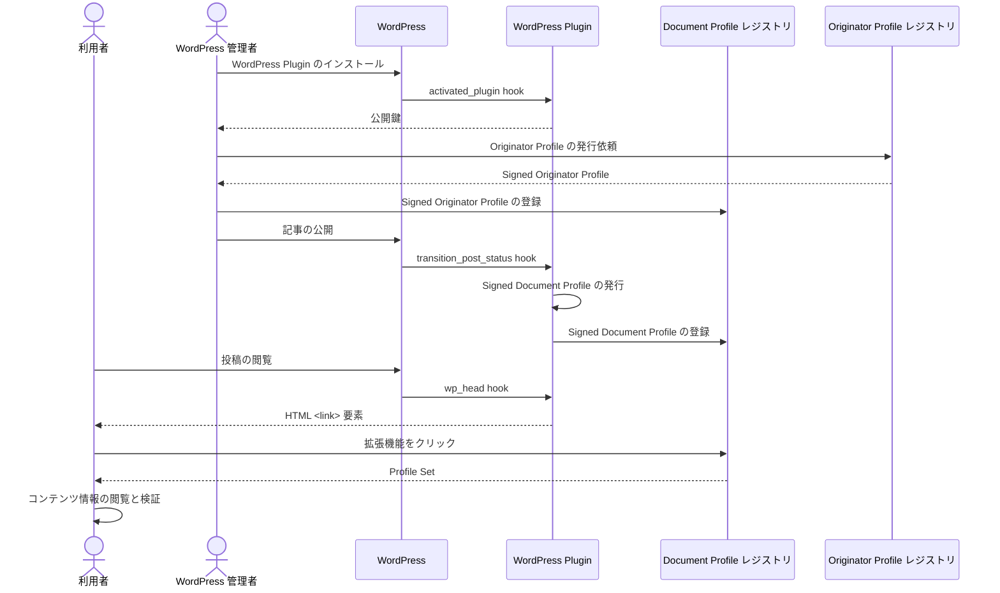
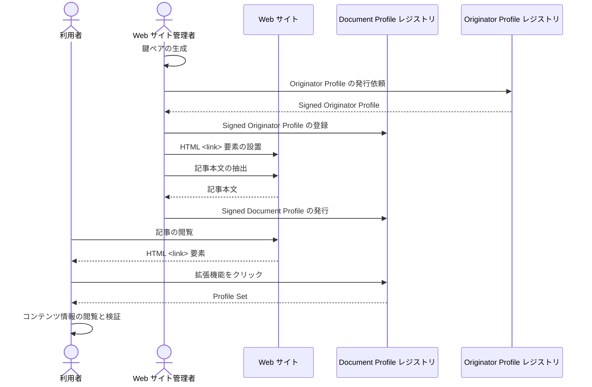

# 実装の確認と CMS の対応

## はじめに

全体の構成はこちらの図にまとめていますが、セットアップ作業として組織情報を用意、OP レジストリに登録、公開鍵・秘密鍵のペアを生成して公開鍵を登録をした上で、各 CMS でコンテンツ・記事に対して署名をした DP すなわち Signed Document Profile (SDP) を発行・登録・リンクすることで利用者のブラウザから Profile Set (SOP と SDP 一式) を記事と共に表示可能になります。


まずは実装済みの環境で拡張機能を使って見ながら仕組みを把握してから、各社の CMS での対応の検討・実装を進めていってください。仕様や実装の詳細は本サイトの他のページやリポジトリにありますが、本実験に際して必要な情報はこのページにまとめています。

## OP 拡張機能を試す

自社サイトの OP 対応を検討する前に、まずは OP の拡張機能を手元の Chrome ブラウザ (または Edge, Brave や Arc などの Chrome 互換で拡張機能が利用可能なブラウザ) にインストールし、OP 対応済みのデモサイトで使ってみてください。

### OP 拡張機能の導入と動作確認

Step 1
: ダウンロード

[GitHub Releases](https://github.com/webdino/profile/releases/latest) から OP 拡張機能の最新版をダウンロードします。

Step 2
: インストール

1. ZIP ファイルを展開します。
2. chrome://extensions にアクセスします。
3. 「デベロッパーモード」を有効にします。
4. 「パッケージ化されていない拡張機能を読み込む」を選択します。
5. ZIP ファイルを展開されたディレクトリ (manifest.json を含む) を選択します。

Step 3
: Web ページにアクセス

例えば、[本組合の公式サイト](https://originator-profile.org/ja-JP/)など、OP 対応済みの Web ページにアクセスします。

Step 4
: コンテンツ情報の閲覧と検証

拡張機能をクリックすることで、現在閲覧中の Web ページに関するコンテンツ情報の閲覧と検証することができます。

右上の拡張機能ボタンから Profile Web Extention を選択します。


ウィンドウが開き、認証の有無や各種情報を確認できます。


:::note
制限事項: OP 拡張機能はインストール前に読み込み済みのタブで拡張機能ウィンドウを開いても動作しません。インストール後に開いたタブか、再読込したタブでお試しください。
:::

### サンプルサイト

本組合の公式サイトの他に、確認用にいくつかのサンプルサイトを用意しています。本組合の公式サイト同様の手順でご確認いただけます。

- 読売新聞オンラインのスナップショット: https://yomiuri.demosites.pages.dev/
  - 認証情報:
    - ユーザー名: `yomiuri`
    - パスワード: `HzGIyYkTKEM9`
  - [試験ページ一覧と説明](https://yomiuri.demosites.pages.dev/readme)
- サントリーホームページのスナップショット: https://suntory.demosites.pages.dev/
  - 認証情報:
    - ユーザー名: `suntory`
    - パスワード: `edBHyP4slkTp`
  - [試験ページ一覧と説明](https://suntory.demosites.pages.dev/readme)

:::note
こちらは最初期プロトタイプ実装に際して参照用サンプルとして部分的に SDP を埋め込む試験用に作成したものであり、本実験または最終的にどのような記事を対象にどのように埋め込むかの見本ではありません。
:::

## 実験の準備

ここでは実験に必要な準備手順と全体を理解・把握頂くための確認操作について説明します。全体としては次の流れになります。

- 各社: 対象サイトコンテンツの選定、GitHub アカウントの連絡、OP 組織情報登録内容の提出
- 事務局: OP レジストリへの登録、OP ID の発行・連絡、DP レジストリアクセス情報の連絡
- 各社: 実際に DP を生成・登録してブラウザで表示を確認
  - CLI などを用いて手作業で SDP を生成して DP レジストリに登録、HTML にリンクを埋め込み
  - CMS の OP 対応をして記事作成・更新時に自動的に SDP を生成・登録させる
  - ブラウザで正しく検証が通り表示されることを確認

### 実験対象サイトとコンテンツの選定

本実験では、**自社のコンテンツを掲載されている任意のサイトの任意のコンテンツを対象として実験をして頂けます**。コンテンツの種別もニュースは勿論それに限らずコラムや社説、ブログ記事などであっても構いません。

コンテンツによっては単一記事が複数ページに分割表示される場合、ログインや課金などの状態に応じて出力が変わる場合など様々な場合がありますが、いずれを対象として頂いても構いません。

実装コストが高い部分は今回は扱わず、どのように実装するべきか、実装や記事執筆側のフローなどに悪影響がないかなどを検討して課題があれば報告頂くだけという取り組みでも問題ありません。

本実証実験での対象サイトおよびコンテンツは自社提供のもととしており、他社提供コンテンツは次回以降を想定しております。今回は各社で個別に OP の対応を検討・実装頂く最初のステップであり、複数社のシステムを横断し OP 対応コンテンツの流通を試験するのは今後段階的に進行していく予定です。

### GitHub アカウント

本実験で利用頂く参照実装コードやレジストリ・拡張機能などのコードを収めた [オリジネータープロファイル リポジトリ](https://github.com/webdino/profile/tree/main) は private リポジトリであり、Read 権限を付与する CIP 加盟企業の github アカウントが必要です。

**github アカウント作成後、担当者名とアカウント名を事務局までメールでご連絡ください。**ご連絡いただいた github アカウントに関連リポジトリのアクセス権を付与する invite をお送りさせて頂きます。

:::note
本ページを含む、各種ドキュメントの参照には github アカウントは不要です。実装コードへのアクセスは不要でドキュメントだけで十分なご担当者様についてはアカウントの作成・ご連絡は不要です。
:::

### OP 組織情報登録内容の提出

下記フォームから **OP レジストリに登録する組織情報を入力**してください

https://forms.gle/udirHux1TFs5ctyu6

こちらに入力頂いた情報を元に OP レジストリへの登録を行います。登録された情報は例えば次のような形でブラウザの拡張機能の UI に表示・確認できるようになります。


:::note
現在の拡張機能の UI はあくまで検討段階のものです。今後も変更が予定されていますが、お気づきの点がありましたら遠慮なくフィードバックをお願い致します。
:::

### 公開鍵、秘密鍵の作成と公開鍵の登録

フォーム入力後に事務局側で OP レジストリに組織の登録が完了したら、OP ID などの連絡が届きます。手元で**公開鍵署名に用いる鍵ペアを生成し、事務局 OP レジストリに公開鍵の登録を依頼**してください。

ここで生成した秘密鍵でコンテンツに対して Signed Document Profile (SDP) を生成しコンテンツと共に配信すると、ブラウザは公開鍵を用いて署名を検証した上で SOP/SDP に記載された情報を表示します。

公開鍵は下記のいずれかの方法で用意します。

<!-- 下記は docs/registry/document-profile-registry-creation.md を改変して利用 -->

### WordPress プラグインを使用する方法

WordPress の参照実装のプラグインをインストールし、有効化したあと、WordPress 管理者画面 > Settings > Profile 設定画面にアクセスすると公開鍵を確認できます。

JWK の例:

```json
{
  "crv": "P-256",
  "kty": "EC",
  "x": "6OBp79JZKOaSFbjGaUrlcv17FdyGz-bUUYdW2xPgRBE",
  "y": "TeTGAWf_OrdUmC9UUYn7x6aZx39g-Qk98XmMpwXW_ew",
  "kid": "j9L_Qji2BC4vj1AaDCdzpurXSpM7cKBbtWO-W5a0SK4",
  "alg": "ES256",
  "use": "sig"
}
```

公開鍵は、事務局 OP レジストリに登録する必要があります。
事務局に公開鍵の登録を依頼してください。

### profile-registry CLI を使用する方法

profile-registry CLI を使用して、鍵ペアを生成することが可能です。

:::note
あらかじめ profile-registry CLI をインストールする必要があります。

開発ガイド: https://profile-docs.pages.dev/development
:::

:::warning
秘密鍵は適切に管理してください。秘密鍵が漏洩するとあなたの組織を詐称してコンテンツに署名をされる恐れがあります
:::

例:

```
$ profile-registry key-gen -o key.pem
$ cat key.pem.pub.json | jq
{
  "kty": "EC",
  "kid": "x6pZlFXlKvbV69GZf8xW-lqb6tg0_ERuNHHgTTvmQ70",
  "x": "cnbjjr-SEPqyh2bMzqSPE2DdrEMFzDygPmCwkSkqnmk",
  "y": "LV4Xc5HilgrTNxSGMXUBgSmVvQgUB-bxP79LaoXOfFA",
  "crv": "P-256"
}
```

実行結果として得られる、鍵ファイルは下記となります。

- key.pem (秘密鍵)
- key.pem.pub.json (公開鍵)

公開鍵は事務局 OP レジストリに登録する必要があります。
事務局に公開鍵の登録を依頼してください。

### CMS の OP 対応と SDP の発行・登録

これについては後述します。この後の手順を進めるには実際にコンテンツに対して SDP を生成する必要がありますが、CMS の対応を行う前に、まずは後述の CLI を用いて SDP を生成し、それを使って DP レジストリへの登録処理などを試しておくと理解が深まるかも知れません。

### DP レジストリ API の確認

今回の実証実験でご利用いただく API エンドポイントは次の 2 つです。

- `/admin/publisher/{アカウントID}` エンドポイント
  - 署名付き DP を DP レジストリに登録するためのエンドポイントです。POST メソッドをサポートします。
- `/website/profiles` エンドポイント
  - プロファイルセットを取得するためのエンドポイントです。GET メソッドをサポートします。今回の実証実験では、 <link\> 要素の `href` 属性にこのエンドポイントへの URL を記載することになります。

各エンドポイントの使い方を説明します。

#### `/admin/publisher/{アカウントID}` エンドポイント

コンテンツに対する署名付き DP (SDP) を DP レジストリに登録するためのエンドポイントです。必要なパラメータをリクエストのボディー部に付与して POST メソッドを送ることで、登録ができます。

このエンドポイントは、呼び出しに Basic 認証による認証が必要です。必要な認証情報は CIP から受け取ってください。受け取った認証情報は、Basic 認証及び、このエンドポイントの URL の中の `{アカウントID}` で使用します。

今回の実証実験では、いくつかのパラメータには以下に示す固定値を入れてください。パラメータは JSON 形式で与えてください。

リクエスト例:

```shell
curl -X POST https://dprexpt.originator-profile.org/admin/publisher/732e0c2d-179e-5190-a7e1-a9c5caa43eca/ \
    -u 732e0c2d-179e-5190-a7e1-a9c5caa43eca:KEg5GvSQLASQphVqARs-xcyyIaKz7f21W2ZySMdlgnU \
    -H 'Content-Type: application/json' \
    -d '{"input":{"id":"403cc6d4-53d6-4286-9f42-930e0bf7bd3f","url":"http://media.example.com/2023/06/hello/","bodyFormat":{"connect":{"value":"text"}},"proofJws":""},"jwt":"eyJhbGciOiJFUzI1NiIsImtpZCI6Im5Senc0VzdFVXJSMmlZdGlMbkFick5QOVVEdFFneE96OGZnX3poRjBmTkEiLCJ0eXAiOiJKV1QifQ.eyJodHRwczovL29yaWdpbmF0b3ItcHJvZmlsZS5vcmcvZHAiOnsiaXRlbSI6W3sidHlwZSI6IndlYnNpdGUiLCJ1cmwiOiJodHRwOi8vbG9jYWxob3N0OjgwODAiLCJ0aXRsZSI6Ik9QIOeiuuiqjeOBj-OCkyIsImNhdGVnb3J5IjpbXX0seyJ0eXBlIjoidmlzaWJsZVRleHQiLCJ1cmwiOiJodHRwOi8vbG9jYWxob3N0OjgwODAiLCJsb2NhdGlvbiI6ImgxIiwicHJvb2YiOnsiandzIjoiZXlKaGJHY2lPaUpGVXpJMU5pSXNJbXRwWkNJNkltNVNlbmMwVnpkRlZYSlNNbWxaZEdsTWJrRmljazVRT1ZWRWRGRm5lRTk2T0dablgzcG9SakJtVGtFaUxDSmlOalFpT21aaGJITmxMQ0pqY21sMElqcGJJbUkyTkNKZGZRLi5tYXI1dUh0T2M5a2FTakJUclI3U016OXFQekJheEhQVjFodzV1NkJLS2ZLZTFEV1M5ajA0WXR6MkNTWTdMbDdEdDMzX0R2bXllbW44WEpGbks1eHBaQSJ9fV19LCJpc3MiOiJrYWtpa3VrZWtvLmRlbW9zaXRlcy5wYWdlcy5kZXYiLCJzdWIiOiJlZjlkNzhlMC1kODFhLTRlMzktYjdhMC0yN2UxNTQwNWVkYzgiLCJpYXQiOjE2ODc4Mjc0NTgsImV4cCI6MTcxOTQ0OTg1OH0.bgIE8VMFit4HOFkBKrU9TwGGQuLHt2ZuOCS2C9MCZ4yAapf-1QupUYb3iYZcd-BjBwtgVupq9xzydC9cO25rQQ"}'
```

上記の例は、 curl コマンドで DP レジストリ (`dprexpt.originator-profile.org`) の DP 登録エンドポイントへ POST リクエストを送っています。

CIP から受け取った認証情報がアカウント ID `732e0c2d-179e-5190-a7e1-a9c5caa43eca:KEg5GvSQLASQphVqARs-xcyyIaKz7f21W2ZySMdlgnU` 、パスワード `KEg5GvSQLASQphVqARs-xcyyIaKz7f21W2ZySMdlgnU` だとしています。

エンドポイントの URL は、アカウント ID を入れて `https://dprexpt.originator-profile.org/admin/publisher/732e0c2d-179e-5190-a7e1-a9c5caa43eca/` とし、 `-u` オプションで上記アカウント ID とパスワードを `:` で連結した値を Basic 認証の認証情報として利用するようにしています。

`-d` オプションでパラメータを指定しています。これらのパラメータはリクエストのボディ部に JSON 形式で渡されます。各パラメータについては下記を参照ください。

```json
{
  "input": {
    "id": "403cc6d4-53d6-4286-9f42-930e0bf7bd3f", // 記事の ID を渡してください。必ず UUID 文字列表現 (RFC 4122) でなければなりません。
    "url": "http://media.example.com/2023/06/hello/", // 記事の URL です。
    // bodyFormat 内は、このままの値を入力してください。
    "bodyFormat": {
      "connect": {
        "value": "text"
      }
    },
    "proofJws": "" // 空文字列を入力してください。
  },
  "jwt": "eyJhbGciOiJFUzI1NiIsImtp（略）" // 署名付きDPを渡してください。
}
```

`bodyFormat`, `proofJws` は上記のように固定値を入れてください。これらの値は、今回の実験では使用しないため、実際に渡す DP の情報と一致していなくて構いません。 `jwt` 及び、 `id`, `url` には登録する DP に応じて適切な値を入れてください。

上記のリクエストに対する成功レスポンスは次のようになります。

レスポンス例（見やすく整形しています）:

```json
{
  "id": "403cc6d4-53d6-4286-9f42-930e0bf7bd3f",
  "url": "http://media.example.com/2023/06/hello/",
  "accountId": "732e0c2d-179e-5190-a7e1-a9c5caa43eca",
  "title": null,
  "image": null,
  "description": null,
  "author": null,
  "editor": null,
  "datePublished": null,
  "dateModified": null,
  "location": null,
  "bodyFormatValue": "text",
  "proofJws": "",
  "categories": []
}
```

`id`, `url`, `accountId` 以外のフィールドは無視して構いません。今回の実験では使用しない部分です。

SDP の登録が出来たら、ページからその SDP を参照させましょう。これは、次に説明するエンドポイントの URL を、記事ページの HTML 内に <link\> 要素で指定することで実現します。

API の詳細については、[CIP 提供 DP レジストリについて](#cip-提供-dp-レジストリについて) も参照ください。

#### `/website/profiles` エンドポイント

DP レジストリに登録済みのプロファイルセットを取得するためのエンドポイントです。クエリパラメータ `url` を付与して、 GET リクエストを送ってください。 `url` には、記事の URL を指定してください。記事に紐づいたプロファイルセットが JSON-LD 形式で返ってきます。`url` は RFC 3986 の形式でエンコーディングしてください（通常のクエリパラメータのエンコーディング方式です）。

このエンドポイントは認証不要であり、記事を閲覧した全てのユーザーがプロファイルセットを取得・検証することができます。

リクエスト例:

```shell
curl -X GET https://dprexpt.originator-profile.org/website/profiles?url=http%3A%2F%2Fmedia.example.com%2F2023%2F06%2Farticles%2Fhello%2F \
-H 'Accept: application/ld+json'
```

上記の例は、curl コマンドで DP レジストリ (`dprexpt.originator-profile.org`) のエンドポイントに　 GET リクエストを送っています。
`url` クエリパラメータに `http%3A%2F%2Fmedia.example.com%2F2023%2F06%2Fhello%2F` を付与し、 `http://media.example.com/2023/06/hello/` に紐づくプロファイルセットを取得しようとしています。
プロファイルセットは JSON-LD 形式なため、 `Accept` ヘッダーに `application/ld+json` を渡しています。

:::caution

url パラメータには、 DP 登録時に指定した URL と**文字列として完全に一致する**ものを与えてください。例えば、登録時に URL の末尾に `/` を付与しなかった場合には、このエンドポイントにも、末尾に `/` のない URL を与えてください。その他、[URL の仕様](https://url.spec.whatwg.org/#url-serializing)上は無視すべき違いであっても、プロファイルセットが返ってこない原因となります。これは現時点の実装上の制約です

例:

登録時に URL `https://example.com/` を与えた場合、

- 正しいリクエスト: `https://dprexpt.originator-profile.org/website/profiles?url=https%3A%2F%2Fexample.com%2F`

- 間違ったリクエスト 1（末尾の`/`がない）: `https://dprexpt.originator-profile.org/website/profiles?url=http%3A%2F%2Fexample.com`
- 間違ったリクエスト 2（大文字小文字）: `https://dprexpt.originator-profile.org/website/profiles?url=https%3A%2F%2FEXAMPLE.COM%2F`

:::

レスポンスの例（見やすく整形しています）:

```json
{
  "@context": "https://originator-profile.org/context.jsonld",
  "profile": [
    "eyJhbGciOiJFUzI1NiIsImtpZCI6ImpKWXM1X0lMZ1VjODE4MEwtcEJQeEJwZ0EzUUM3ZVp1OXdLT2toOW1ZUFUiLCJ0eXAiOiJKV1QifQ.eyJodHRwczovL29yaWdpbmF0b3ItcHJvZmlsZS5vcmcvb3AiOnsiaXRlbSI6W3sidHlwZSI6ImNyZWRlbnRpYWwiLCJuYW1lIjoi44OW44Op44Oz44OJ44K744O844OV44OG44Kj6KqN6Ki8IiwiaXNzdWVkQXQiOiIyMDIzLTA2LTIxVDAyOjEwOjI3Ljk4OVoiLCJleHBpcmVkQXQiOiIyMDI0LTA2LTIxVDAyOjEwOjI3Ljk4OVoiLCJjZXJ0aWZpZXIiOiJsb2NhbGhvc3QiLCJ2ZXJpZmllciI6ImxvY2FsaG9zdCJ9LHsidHlwZSI6ImNyZWRlbnRpYWwiLCJuYW1lIjoidGVzdC1jcmVkZW50aWFsIiwiaW1hZ2UiOiJodHRwczovL2V4YW1wbGUuY29tL2ltYWdlLnBuZyIsImlzc3VlZEF0IjoiMjAyMy0wNi0yMVQwMjoxMDoyNy45ODlaIiwiZXhwaXJlZEF0IjoiMjAyNC0wNi0yMVQwMjoxMDoyNy45ODlaIiwiY2VydGlmaWVyIjoibG9jYWxob3N0IiwidmVyaWZpZXIiOiJsb2NhbGhvc3QifSx7InR5cGUiOiJjcmVkZW50aWFsIiwibmFtZSI6InRlc3QtY3JlZGVudGlhbDIiLCJpbWFnZSI6Imh0dHBzOi8vZXhhbXBsZS5jb20vaW1hZ2UucG5nIiwiaXNzdWVkQXQiOiIyMDIzLTA2LTIxVDAyOjEwOjI3Ljk4OVoiLCJleHBpcmVkQXQiOiIyMDI0LTA2LTIxVDAyOjEwOjI3Ljk4OVoiLCJjZXJ0aWZpZXIiOiJsb2NhbGhvc3QiLCJ2ZXJpZmllciI6ImxvY2FsaG9zdCJ9LHsidHlwZSI6ImNyZWRlbnRpYWwiLCJuYW1lIjoidGVzdC1jcmVkZW50aWFsMiIsImltYWdlIjoiaHR0cHM6Ly9leGFtcGxlLmNvbS9pbWFnZS5wbmciLCJpc3N1ZWRBdCI6IjIwMjMtMDYtMjFUMDI6MTA6MjcuOTg5WiIsImV4cGlyZWRBdCI6IjIwMjQtMDYtMjFUMDI6MTA6MjcuOTg5WiIsImNlcnRpZmllciI6ImxvY2FsaG9zdCIsInZlcmlmaWVyIjoibG9jYWxob3N0In0seyJ0eXBlIjoiY3JlZGVudGlhbCIsIm5hbWUiOiJ0ZXN0LWNyZWRlbnRpYWwyIiwiaW1hZ2UiOiJodHRwczovL2V4YW1wbGUuY29tL2ltYWdlLnBuZyIsImlzc3VlZEF0IjoiMjAyMy0wNi0yMVQwMjoxMDoyNy45ODlaIiwiZXhwaXJlZEF0IjoiMjAyNC0wNi0yMVQwMjoxMDoyNy45ODlaIiwiY2VydGlmaWVyIjoibG9jYWxob3N0IiwidmVyaWZpZXIiOiJ0b3lvdGEuZGVtb3NpdGVzLnBhZ2VzLmRldiJ9LHsidHlwZSI6ImNyZWRlbnRpYWwiLCJuYW1lIjoidGVzdC1jcmVkZW50aWFsMiIsImlzc3VlZEF0IjoiMjAyMy0wNi0yMVQwMjoxMDoyNy45ODlaIiwiZXhwaXJlZEF0IjoiMjAyNC0wNi0yMVQwMjoxMDoyNy45ODlaIiwiY2VydGlmaWVyIjoibG9jYWxob3N0IiwidmVyaWZpZXIiOiJ0b3lvdGEuZGVtb3NpdGVzLnBhZ2VzLmRldiJ9LHsidHlwZSI6ImNyZWRlbnRpYWwiLCJuYW1lIjoidGVzdC1jcmVkZW50aWFsMiIsImlzc3VlZEF0IjoiMjAyMy0wNi0yMVQwMjoxMDoyNy45ODlaIiwiZXhwaXJlZEF0IjoiMjAyNC0wNi0yMVQwMjoxMDoyNy45ODlaIiwiY2VydGlmaWVyIjoibG9jYWxob3N0IiwidmVyaWZpZXIiOiJ0b3lvdGEuZGVtb3NpdGVzLnBhZ2VzLmRldiJ9LHsidHlwZSI6ImNyZWRlbnRpYWwiLCJuYW1lIjoidGVzdC1jcmVkZW50aWFsMiIsImlzc3VlZEF0IjoiMjAyMy0wNi0yMVQwMjoxMDoyNy45ODlaIiwiZXhwaXJlZEF0IjoiMjAyNC0wNi0yMVQwMjoxMDoyNy45ODlaIiwiY2VydGlmaWVyIjoibG9jYWxob3N0IiwidmVyaWZpZXIiOiJ0b3lvdGEuZGVtb3NpdGVzLnBhZ2VzLmRldiJ9LHsidHlwZSI6ImNyZWRlbnRpYWwiLCJuYW1lIjoi44OW44Op44Oz44OJ44K744O844OV44OG44Kj6KqN6Ki8IDIiLCJpc3N1ZWRBdCI6IjIwMjMtMDYtMjFUMDI6MTA6MjcuOTg5WiIsImV4cGlyZWRBdCI6IjIwMjQtMDYtMjFUMDI6MTA6MjcuOTg5WiIsImNlcnRpZmllciI6ImxvY2FsaG9zdCIsInZlcmlmaWVyIjoibG9jYWxob3N0In0seyJ0eXBlIjoiY3JlZGVudGlhbCIsIm5hbWUiOiLjg5bjg6njg7Pjg4njgrvjg7zjg5Xjg4bjgqPoqo3oqLwgMiIsImlzc3VlZEF0IjoiMjAyMy0wNi0yMVQwMjoxMDoyNy45ODlaIiwiZXhwaXJlZEF0IjoiMjAyNC0wNi0yMVQwMjoxMDoyNy45ODlaIiwiY2VydGlmaWVyIjoibG9jYWxob3N0IiwidmVyaWZpZXIiOiJsb2NhbGhvc3QifSx7InR5cGUiOiJjZXJ0aWZpZXIiLCJkb21haW5OYW1lIjoibG9jYWxob3N0IiwidXJsIjoiaHR0cHM6Ly9vcmlnaW5hdG9yLXByb2ZpbGUub3JnLyIsIm5hbWUiOiJPcmlnaW5hdG9yIFByb2ZpbGUg5oqA6KGT56CU56m257WE5ZCIIiwicG9zdGFsQ29kZSI6IjEwOC0wMDczIiwiYWRkcmVzc0NvdW50cnkiOiJKUCIsImFkZHJlc3NSZWdpb24iOiLmnbHkuqzpg70iLCJhZGRyZXNzTG9jYWxpdHkiOiLmuK_ljLoiLCJzdHJlZXRBZGRyZXNzIjoi5LiJ55SwIiwiY29udGFjdFRpdGxlIjoi44GK5ZWP44GE5ZCI44KP44GbIiwiY29udGFjdFVybCI6Imh0dHBzOi8vb3JpZ2luYXRvci1wcm9maWxlLm9yZy9qYS1KUC8iLCJsb2dvcyI6W3sidXJsIjoiaHR0cHM6Ly9vcmlnaW5hdG9yLXByb2ZpbGUub3JnL2ltYWdlL2ljb24uc3ZnIiwiaXNNYWluIjp0cnVlfV0sImJ1c2luZXNzQ2F0ZWdvcnkiOltdfSx7InR5cGUiOiJ2ZXJpZmllciIsImRvbWFpbk5hbWUiOiJsb2NhbGhvc3QiLCJ1cmwiOiJodHRwczovL29yaWdpbmF0b3ItcHJvZmlsZS5vcmcvIiwibmFtZSI6Ik9yaWdpbmF0b3IgUHJvZmlsZSDmioDooZPnoJTnqbbntYTlkIgiLCJwb3N0YWxDb2RlIjoiMTA4LTAwNzMiLCJhZGRyZXNzQ291bnRyeSI6IkpQIiwiYWRkcmVzc1JlZ2lvbiI6IuadseS6rOmDvSIsImFkZHJlc3NMb2NhbGl0eSI6Iua4r-WMuiIsInN0cmVldEFkZHJlc3MiOiLkuInnlLAiLCJjb250YWN0VGl0bGUiOiLjgYrllY_jgYTlkIjjgo_jgZsiLCJjb250YWN0VXJsIjoiaHR0cHM6Ly9vcmlnaW5hdG9yLXByb2ZpbGUub3JnL2phLUpQLyIsImxvZ29zIjpbeyJ1cmwiOiJodHRwczovL29yaWdpbmF0b3ItcHJvZmlsZS5vcmcvaW1hZ2UvaWNvbi5zdmciLCJpc01haW4iOnRydWV9XSwiYnVzaW5lc3NDYXRlZ29yeSI6W119LHsidHlwZSI6InZlcmlmaWVyIiwiZG9tYWluTmFtZSI6InRveW90YS5kZW1vc2l0ZXMucGFnZXMuZGV2IiwidXJsIjoiaHR0cHM6Ly9nbG9iYWwudG95b3RhLyIsIm5hbWUiOiLjg4jjg6jjgr_oh6rli5Xou4rmoKrlvI_kvJrnpL4iLCJkZXNjcmlwdGlvbiI6IuODiOODqOOCv-iHquWLlei7iuagquW8j-S8muekvuips-e0sCIsInBob25lTnVtYmVyIjoiMDU2NS0yOC0yMTIxIiwicG9zdGFsQ29kZSI6IjQ3MS04NTcxIiwiYWRkcmVzc0NvdW50cnkiOiJKUCIsImFkZHJlc3NSZWdpb24iOiLmhJvnn6XnnIwiLCJhZGRyZXNzTG9jYWxpdHkiOiLosYrnlLDluIIiLCJzdHJlZXRBZGRyZXNzIjoi44OI44Oo44K_55S6MeeVquWcsCIsImNvbnRhY3RUaXRsZSI6IkZBUeODu-OBiuWVj-OBhOWQiOOCj-OBmyIsImNvbnRhY3RVcmwiOiJodHRwczovL2dsb2JhbC50b3lvdGEvanAvZmFxIiwicHJpdmFjeVBvbGljeVRpdGxlIjoi44OX44Op44Kk44OQ44K344O8IiwicHJpdmFjeVBvbGljeVVybCI6Imh0dHBzOi8vZ2xvYmFsLnRveW90YS9qcC9zdXN0YWluYWJpbGl0eS9wcml2YWN5IiwibG9nb3MiOlt7InVybCI6Imh0dHBzOi8vdG95b3RhLmRlbW9zaXRlcy5wYWdlcy5kZXYvbG9nb3MvaG9yaXpvbnRhbC10b3lvdGEuc3ZnIiwiaXNNYWluIjp0cnVlfV0sImJ1c2luZXNzQ2F0ZWdvcnkiOltdfSx7InR5cGUiOiJob2xkZXIiLCJkb21haW5OYW1lIjoibG9jYWxob3N0IiwidXJsIjoiaHR0cHM6Ly9vcmlnaW5hdG9yLXByb2ZpbGUub3JnLyIsIm5hbWUiOiJPcmlnaW5hdG9yIFByb2ZpbGUg5oqA6KGT56CU56m257WE5ZCIIiwicG9zdGFsQ29kZSI6IjEwOC0wMDczIiwiYWRkcmVzc0NvdW50cnkiOiJKUCIsImFkZHJlc3NSZWdpb24iOiLmnbHkuqzpg70iLCJhZGRyZXNzTG9jYWxpdHkiOiLmuK_ljLoiLCJzdHJlZXRBZGRyZXNzIjoi5LiJ55SwIiwiY29udGFjdFRpdGxlIjoi44GK5ZWP44GE5ZCI44KP44GbIiwiY29udGFjdFVybCI6Imh0dHBzOi8vb3JpZ2luYXRvci1wcm9maWxlLm9yZy9qYS1KUC8iLCJsb2dvcyI6W3sidXJsIjoiaHR0cHM6Ly9vcmlnaW5hdG9yLXByb2ZpbGUub3JnL2ltYWdlL2ljb24uc3ZnIiwiaXNNYWluIjp0cnVlfV0sImJ1c2luZXNzQ2F0ZWdvcnkiOltdfV0sImp3a3MiOnsia2V5cyI6W3sieCI6InlwQWxVam81TzVzb1VOSGszbWxSeWZ3NnVqeHFqZkRfSE1RdDdYSC1yU2ciLCJ5IjoiMWNtdjlsbVp2TDBYQUVSTnh2clQya1prQzRVd3U1aTFPcjFPLTRpeEp1RSIsImNydiI6IlAtMjU2Iiwia2lkIjoiakpZczVfSUxnVWM4MTgwTC1wQlB4QnBnQTNRQzdlWnU5d0tPa2g5bVlQVSIsImt0eSI6IkVDIn0seyJ4IjoiQTR6YjZVQ0JEcVhrQS00cFp1YmhaMlVnbTFQSWljd3l1aTA5T0NLYnByMCIsInkiOiJYc2tlaVlzWUNITDZvMHkyT0pjSzlxSWkwMTA0c1J1YzZfQnF3NVJCS2t3IiwiY3J2IjoiUC0yNTYiLCJraWQiOiJkdldRSWZjZ1FyYjB5WEhVV0RYV2VPZ1dwTnQ0cjBvb1l2V2t4cnZhZFRRIiwia3R5IjoiRUMifV19fSwiaXNzIjoibG9jYWxob3N0Iiwic3ViIjoibG9jYWxob3N0IiwiaWF0IjoxNjg3MzEzNDI3LCJleHAiOjE3MTg5MzU4Mjd9.Xo3wE4OW6GgGED05TTbxXTgBtYs6ScxOa0u5t8nTREyXxd-1lf_52HcjZAgnabvJnJ_tv5l0gOsZ-N9_gS-PVQ",
    "eyJhbGciOiJFUzI1NiIsImtpZCI6ImpKWXM1X0lMZ1VjODE4MEwtcEJQeEJwZ0EzUUM3ZVp1OXdLT2toOW1ZUFUiLCJ0eXAiOiJKV1QifQ.eyJodHRwczovL29yaWdpbmF0b3ItcHJvZmlsZS5vcmcvZHAiOnsiaXRlbSI6W3sidHlwZSI6IndlYnNpdGUiLCJ1cmwiOiJodHRwOi8vbG9jYWxob3N0OjgwODAiLCJ0aXRsZSI6Ik9QIOeiuuiqjeOBj-OCkyIsImNhdGVnb3J5IjpbXX0seyJ0eXBlIjoidmlzaWJsZVRleHQiLCJ1cmwiOiJodHRwOi8vbG9jYWxob3N0OjgwODAiLCJsb2NhdGlvbiI6ImgxIiwicHJvb2YiOnsiandzIjoiZXlKaGJHY2lPaUpGVXpJMU5pSXNJbXRwWkNJNkltcEtXWE0xWDBsTVoxVmpPREU0TUV3dGNFSlFlRUp3WjBFelVVTTNaVnAxT1hkTFQydG9PVzFaVUZVaUxDSmlOalFpT21aaGJITmxMQ0pqY21sMElqcGJJbUkyTkNKZGZRLi45aE16akNzdXhYdUZFU2NtXzVFR2JGLTNXNlgxbkVvd0NxWWo4VzVlbndZWHZRcmhGT29nVDR5c185QU9rTUVJSlhQZWVyLXJURjFjMzNHczF1YmM3QSJ9fV19LCJpc3MiOiJsb2NhbGhvc3QiLCJzdWIiOiJlZjlkNzhlMC1kODFhLTRlMzktYjdhMC0yN2UxNTQwNWVkYzciLCJpYXQiOjE2ODY4MDc4NTQsImV4cCI6MTcxODQzMDI1NH0.eUiFvVeW2Cc60lm7ZNJQFZ31FtEHVIcgbWuE63N428lvfGh7iBbvo0sg4MB_QQSQgjjqfPATtfr_hwDbhn8PNA",
    "eyJhbGciOiJFUzI1NiIsImtpZCI6ImpKWXM1X0lMZ1VjODE4MEwtcEJQeEJwZ0EzUUM3ZVp1OXdLT2toOW1ZUFUiLCJ0eXAiOiJKV1QifQ.eyJodHRwczovL29yaWdpbmF0b3ItcHJvZmlsZS5vcmcvZHAiOnsiaXRlbSI6W3sidHlwZSI6IndlYnNpdGUiLCJ1cmwiOiJodHRwOi8vbG9jYWxob3N0OjgwODAiLCJ0aXRsZSI6Ik9QIOeiuuiqjeOBj-OCkyIsImltYWdlIjoiaHR0cDovL2xvY2FsaG9zdDo4MDgwL2Fzc2V0cy9sb2dvLTJiMDRlNjM1LnN2ZyIsImNhdGVnb3J5IjpbXX0seyJ0eXBlIjoidmlzaWJsZVRleHQiLCJ1cmwiOiJodHRwOi8vbG9jYWxob3N0OjgwODAiLCJsb2NhdGlvbiI6InNlY3Rpb24iLCJwcm9vZiI6eyJqd3MiOiJleUpoYkdjaU9pSkZVekkxTmlJc0ltdHBaQ0k2SW1wS1dYTTFYMGxNWjFWak9ERTRNRXd0Y0VKUWVFSndaMEV6VVVNM1pWcDFPWGRMVDJ0b09XMVpVRlVpTENKaU5qUWlPbVpoYkhObExDSmpjbWwwSWpwYkltSTJOQ0pkZlEuLldBUTdITHgzZ2JHWDBKdWtUTEFlcUpTYTg5QnBGQTluOTRIQlZfeVlkb1NmbUh4Ym16LWc3N0dtcGpTbk1UWElfRklDdUViV3NGaDU2a1VfOTdqZE93In19XX0sImlzcyI6ImxvY2FsaG9zdCIsInN1YiI6ImMxNmNjOTFjLWNkMDYtNDNiYS05OTExLTA2OGM3MTU2NWUxMyIsImlhdCI6MTY4NjcyNjM0MCwiZXhwIjoxNzE4MzQ4NzQwfQ.3Bxx1fJbefywzln-nWdZYhFvetytcd2yaLvUE__BHUz9vZP2I3ZtlJ01Yq9KGj1eR3sP7po-yKs2yedA2DTngQ",
    "eyJhbGciOiJFUzI1NiIsImtpZCI6ImpKWXM1X0lMZ1VjODE4MEwtcEJQeEJwZ0EzUUM3ZVp1OXdLT2toOW1ZUFUiLCJ0eXAiOiJKV1QifQ.eyJodHRwczovL29yaWdpbmF0b3ItcHJvZmlsZS5vcmcvZHAiOnsiaXRlbSI6W3sidHlwZSI6IndlYnNpdGUiLCJ1cmwiOiJodHRwOi8vbG9jYWxob3N0OjgwODAiLCJ0aXRsZSI6Ik9QIOeiuuiqjeOBj-OCkyIsImltYWdlIjoiaHR0cDovL2xvY2FsaG9zdDo4MDgwL2Fzc2V0cy9sb2dvLTJiMDRlNjM1LnN2ZyIsImNhdGVnb3J5IjpbXX0seyJ0eXBlIjoidmlzaWJsZVRleHQiLCJ1cmwiOiJodHRwOi8vbG9jYWxob3N0OjgwODAiLCJsb2NhdGlvbiI6ImgxIiwicHJvb2YiOnsiandzIjoiZXlKaGJHY2lPaUpGVXpJMU5pSXNJbXRwWkNJNkltcEtXWE0xWDBsTVoxVmpPREU0TUV3dGNFSlFlRUp3WjBFelVVTTNaVnAxT1hkTFQydG9PVzFaVUZVaUxDSmlOalFpT21aaGJITmxMQ0pqY21sMElqcGJJbUkyTkNKZGZRLi5tQXNlWjdHNTdwcEhoVUVMZFZDS3g1UWpVQ1ZPenJuLXFRQzhsY2h4VnluQVc3YVBQek1FNTN0Wi1FbU4ta21ScUFDd2ZZaURHU1VJTXBoSGJVYWNQdyJ9fV19LCJpc3MiOiJsb2NhbGhvc3QiLCJzdWIiOiI3ZjdmOTFiOC02ZWNhLTQ5NzYtODZkMi1lNDg4NjE5ZjQ3YzMiLCJpYXQiOjE2ODczMTU4NjAsImV4cCI6MTcxODkzODI2MH0.2Rm_wuAHLIG56A1gUAzpd00VHwqMVPsUA3nFt6bLhRTKNiXnybSU8lRcNUBYpWOKwiZc-3c4YGnOvwydYY3yOg"
  ]
}
```

API の詳細については、 [CIP 提供 DP レジストリについて](#cip-提供-dp-レジストリについて) も参照ください。

このファイルには指定された記事の URL に対して登録した SDP およびその SDP の発行元組織の SOP (後述の操作で登録) が含まれます。ブラウザではそれらの署名を検証し、閲覧中の URL と一致することを確認の上で画面に表示します。

### SDP の作成と DP レジストリへの登録

#### SDP の作成

DP レジストリに登録するにはまず、Signed Document Profile (SDP) を作成する必要があります。
前提条件として組織情報の登録、公開鍵の登録、Signed Originator Profile 発行を行う必要があります。
今回は下記を使用して実行します。

- 公開鍵のパス：key.pem
- 登録する組織情報の ID：daab5a08-d513-400d-aaaa-e1c1493e0421

SDP の生成は Web ページの HTML からテキストを抜き出し連結し署名する実装が必要ですが、これについては処理対象を定義したファイル `website.json` を用意し、コマンドラインで読み込むだけで SDP を生成する CLI を用意しています。

SDP 生成対象を定義する `website.json` ファイルは[website.example.json](https://github.com/webdino/profile/blob/main/apps/registry/website.example.json) などをひな形として作成してください。例えば下記のような内容を使用します。

```json
{
  "id": "ef9d78e0-d81a-4e39-b7a0-27e15405edc8",
  "url": "http://localhost:8080",
  "location": "h1",
  "bodyFormat": { "connect": { "value": "visibleText" } },
  "body": "OP 確認くん",
  "title": "OP 確認くん"
}
```

公開鍵のパス、登録する組織情報の ID、web ページの情報を引数として使用して下記のように実行します。

```
$ profile-registry publisher:website \
  -i key.pem \
  --id daab5a08-d513-400d-aaaa-e1c1493e0421 \
  --input website.json \
  -o create
```

実行結果として下記のようにコンソールに表示されます。

```
{
  "id": "ef9d78e0-d81a-4e39-b7a0-27e15405edc8",
  "url": "http://localhost:8080",
  "accountId": "e1c6e970-0739-5227-a429-ae0dfa897398",
  "title": "OP 確認くん",
  "image": null,
  "description": null,
  "author": null,
  "editor": null,
  "datePublished": null,
  "dateModified": null,
  "location": "h1",
  "bodyFormatValue": "visibleText",
  "proofJws": "eyJhbGciOiJFUzI1NiIsImtpZCI6Im5Senc0VzdFVXJSMmlZdGlMbkFick5QOVVEdFFneE96OGZnX3poRjBmTkEiLCJiNjQiOmZhbHNlLCJjcml0IjpbImI2NCJdfQ..Y_IlLjScpDwO3cfBPLSgh0mPVAw8xgU00DcPmL-e2ZD8Mpf6QkzH6raX_Anh0YWJRLWaS3US80MRHZmxfcmPpw"
}
```

#### SOP を DP レジストリに登録

Originator Profile レジストリ運用者から受け取った Signed Originator Profile (SOP) を Document Profile レジストリに登録します。

```
$ profile-registry account:register-op --id <ドメイン名> --op <Signed Originator Profileファイル>
```

これにより DP レジストリは `/website/profiles` エンドポイントで SOP と SDP をまとめて返せるようになります。

DP の作成が可能になったら、DP 発行処理を CMS 側に組み込み、記事の編集後に自動で DP の発行と <link\> 要素の埋め込みがされるようにします。

## CMS の実装ガイド

### 全体の流れ (HTML の一部を CSS Selector で選択、署名、SDP 生成、DP レジストリ登録、Link 付与)

CMS への実装として WordPress での手順を例に説明します。

#### 事前準備

Document Profile レジストリ へのアクセス情報は事前にお渡しします
その情報を WordPress での実装に使用いたします

:::danger
DP レジストリは各社共同使用となっています
案内に記載された方法以外での使用は避けてください
:::

#### WordPress 連携

##### プラグインのインストール

WordPress サイトに WordPress Profile Plugin をインストールします。
詳細は [WordPress 参照実装のソースコード](https://github.com/webdino/profile/tree/main/packages/wordpress#readme)をご確認ください。

Document Profile レジストリのドメイン名を、WordPress 管理者画面 > Settings > Profile > [レジストリドメイン名] に入力します。

例:

```
dprexpt.originator-profile.org
```

[レジストリの管理者を作成](/registry/document-profile-registry-creation#レジストリの管理者の作成)した際の認証情報、WordPress 管理者画面 > Settings > Profile > [認証情報] に入力します。

例:

```
cfbff0d1-9375-5685-968c-48ce8b15ae17:GVWoXikZIqzdxzB3CieDHL-FefBT31IfpjdbtAJtBcU
```

それぞれ適切な値を入力したら、保存を選択し、設定を反映します。
設定が反映されれば、それ以降公開される投稿で Profile Set が配信されるようになります。

<!-- docs/registry/wordpress-integration.md より -->

### 署名付与の WordPress,それ以外の Web サイトのプロトタイプに関する説明

#### WordPress



<!-- docs/registry/wordpress-integration.md より -->

#### 他の Web サイト



<!-- docs/registry/website-integration.md より -->

WordPress 以外の Web サイトで実装する場合、手順が異なり下記のような内容の実施が必要となります。

1. HTML <link\> 要素の設置
2. 記事本文の抽出
3. Signed Document Profile の発行

以降では、Document Profile レジストリとウェブサイトそれぞれ下記の場合を例として説明します。

- Document Profile レジストリのドメイン名: dprexpt.originator-profile.org
- 対象のウェブサイト: https://originator-profile.org/

#### HTML <link\> 要素の設置

設置する <link\> 要素は下記のように書き表します。

```html
<link
  href="https://dprexpt.originator-profile.org/website/profiles?url=https%3A%2F%2Foriginator-profile.org%2F"
  rel="alternate"
  type="application/ld+json"
/>
```

#### 記事本文の抽出

:::note
profile-registry CLI によって署名対象の記事の本文を抽出します。
あらかじめ profile-registry CLI をインストールする必要があります。

開発ガイド: https://profile-docs.pages.dev/development
:::

記事の URL、検証対象となるテキストの範囲、抽出結果の保存先を表明する .extract.json を作成します。

```
[
  {
    "url": "https://originator-profile.org/ja-JP/",
    "bodyFormat": "visibleText",
    "location": "[itemprop=articleBody]",
    "output": "src/ja-JP/.website.json"
  },
  {
    "url": "https://originator-profile.org/ja-JP/about/",
    "bodyFormat": "visibleText",
    "location": "[itemprop=articleBody]",
    "output": "src/ja-JP/about/.website.json"
  },
  {
    "url": "https://originator-profile.org/ja-JP/for-viewer/",
    "bodyFormat": "visibleText",
    "location": "[itemprop=articleBody]",
    "output": "src/ja-JP/for-viewer/.website.json"
  },
  {
    "url": "https://originator-profile.org/ja-JP/future/",
    "bodyFormat": "visibleText",
    "location": "[itemprop=articleBody]",
    "output": "src/ja-JP/future/.website.json"
  },
  {
    "url": "https://originator-profile.org/ja-JP/structure/",
    "bodyFormat": "visibleText",
    "location": "[itemprop=articleBody]",
    "output": "src/ja-JP/structure/.website.json"
  }
]
```

作成した.extract.json から OGP 等メタデータ、検証対象となるテキストの抽出するため、
下記コマンドを実行します。

```
$ profile-registry publisher:extract-website --input .extract.json
```

出力結果が下記です

```
{
  "url": "https://originator-profile.org/ja-JP/",
  "location": "[itemprop=articleBody]",
  "bodyFormat": {
    "connect": {
      "value": "visibleText"
    }
  },
  "body": "一般的なネットユーザーの課題\nちゃんと事実を伝えているウェブ上の記事とか広告とかって、信頼できる情報だけ見る方法はないのかしら...？\nフェイクニュースや有害サイトってどうやってもなくならないの...？\n\nアテンションエコノミー（関心を引くことの価値化）を背景に、事実を伝える記事より例えフェイクニュースであっても目立つ記事の方が利益が上がる構造ができています。これはコンテンツ発信者とその信頼性を確認する一般的な手段が無いことが大きな原因の一つです。閲覧者や広告配信システムが良質な記事やメディアを識別可能にすれば、インターネットの情報流通はより健全化できます。\n\nウェブコンテンツを閲覧される方へ\n\n広告・メディア関係者の課題\nえええー！？ こんな危険なサイトにウチの広告が！！\nあれ、この記事の内容にウチの広告は合わないのでは！？\n\n不適切なサイト (メディア) に広告が掲載されたり、逆に、表示して欲しくない広告が掲載されることがあります。検索結果に偽サイトなどが表示されたり、SNS でもフェイクニュースが目立った形で拡散されたりしています。適切なサイトや広告主を識別し、適切なサイトと広告のマッチングをしたり、その配信記録を残すことでブランド毀損を防げます。\n\n一方で...\nでも、情報の規制は良くないよね、言論の自由も認められなければいけない。\n\nそのとおりです。ただし、Originator Profile技術はメディアや広告主の峻別しゅんべつをおこなうものではありません。現存する認証機関などに活用してもらうことを考えています。\n\n課題を解決するために\nコンテンツの発信元や流通経路を透明化する手段を提供します\n\nウェブ上の記事や広告といったコンテンツの発信者や掲載サイトの運営者の情報を付与し、公正な基準で第三者認証された発信者や運営者を確認出来るようにします。現在、これを実現するための技術と仕組みの開発と運用試験を、広告やメディアの関係企業や大学の研究機関と共に行っています。\n\n「Originator Profile 技術とは」についてもご覧ください。\n\nウェブ標準化に向けて\n\n情報の発信者や流通経路、広告主を透明化することで、様々な問題を解決できます。\n\nコンテンツ発信元や第三者認証情報をウェブブラウザで簡単に確認できます\nなりすましや改変を防ぎ安心してコンテンツを閲覧できます\n不適切な広告の掲載や、不適切なサイトへの広告掲載を防げます\n目をひくだけでなく、適切な記事の配信者の収益性を高めることができます\n\n次代のウェブをより健全で公益性の高いものとするべく、これらの問題を解決するため Originator Profile 技術を標準規格として Web 技術の標準化団体（W3C）に提案し、世界標準化と普及を目指した取り組みを行っています。",
  "datePublished": null,
  "author": null,
  "description": "Originator Profileの紹介ページ",
  "image": "https://originator-profile.org/image/ogp.png",
  "title": "Originator Profile"
}
```

#### Signed Document Profile の発行

.website.json から Signed Document Profile を発行し Document Profile レジストリに登録します。
あらかじめ Document Profile レジストリのデータベースの接続情報が必要です。
この際、--identity で指定する秘密鍵は Originator Profile レジストリに登録した公開鍵とペアでなければなりません。

```
$ profile-registry publisher:website --identity <秘密鍵> --id <管理者の UUID> --operation create
```

#### ブラウザでの表示結果確認

CMS (WordPress または他の CMS) 側の実装が終わったら出力 HTML に SDP への <link\> 要素が含まれていることを確認します。


拡張機能を起動して読み込まれることを確認します。


## CIP 提供 DP レジストリについて

今回の実証実験では、 DP レジストリとして、 CIP が提供したものを使用してください。
DP レジストリが提供する API のうち、次の 2 つのエンドポイントが今回の実験に関係します。

- `/admin/publisher/{アカウントID}` エンドポイント
  - 署名付き DP を DP レジストリに登録するためのエンドポイントです。POST メソッドをサポートします。
- `/website/profiles` エンドポイント
  - プロファイルセットを取得するためのエンドポイントです。GET メソッドをサポートします。今回の実証実験では、 <link\> 要素の `href` 属性にこのエンドポイントへの URL を記載することになります。

各エンドポイントのおおまかな使い方については [DP レジストリ API の確認](#dp-レジストリ-api-の確認) を参照ください。

### `admin/publisher/{アカウントID}` エンドポイント詳細

#### パラメータ　（`/admin/publisher/{アカウントID}` エンドポイント）

パラメータの一覧は以下になります。これらを POST リクエストのボディーに JSON 形式で与えてください。全て必須パラメータになります。

| パラメータ名 | 型               | 説明                       |
| ------------ | ---------------- | -------------------------- |
| jwt          | 文字列           | DP を与えてください        |
| input        | 下記テーブル参照 | 記事の情報を与えてください |

`input` パラメータの内部には、以下のパラメータを入れてください。

| パラメータ名 | 型                | 説明                                                                                      |
| ------------ | ----------------- | ----------------------------------------------------------------------------------------- |
| id           | 文字列            | 記事の ID を与えてください。必ず UUID 文字列表現 (RFC 4122) でなければなりません (MUST)。 |
| url          | 文字列            | 記事の URL を与えてください                                                               |
| bodyFormat   | JSON オブジェクト | `{"connect":{"value":"text"}}` を入れてください。                                         |
| proofJws     | 文字列            | 空文字列 `""` を入れてください。                                                          |

#### レスポンス例（`/admin/publisher/{アカウントID}` エンドポイント）

DP の登録に成功した場合、次のようなレスポンスが返ってきます。

レスポンス例（見やすく整形しています）:

```json
{
  "id": "403cc6d4-53d6-4286-9f42-930e0bf7bd3f",
  "url": "http://media.example.com/2023/06/hello/",
  "accountId": "732e0c2d-179e-5190-a7e1-a9c5caa43eca",
  "title": null,
  "image": null,
  "description": null,
  "author": null,
  "editor": null,
  "datePublished": null,
  "dateModified": null,
  "location": null,
  "bodyFormatValue": "text",
  "proofJws": "",
  "categories": []
}
```

DP の登録に失敗した場合、以下のようなレスポンスが返ってきます。

失敗レスポンス（リクエストのパラメータが間違っていた場合）:

```json
{
  "statusCode": 400,
  "error": "Bad Request",
  "message": "invalid request"
}
```

失敗レスポンス（`jwt` パラメータに渡した DP が間違っていた場合）:

```json
{
  "statusCode": 400,
  "error": "Bad Request",
  "message": "Invalid issue request: It is not Document Profile."
}
```

上のエラーメッセージの場合、具体的には `jwt` の中に [dp クレーム](/spec#dp-document-profile-クレーム) が含まれていないためエラーになっています。

失敗レスポンス（認証情報が間違っていた場合）:

```json
{
  "statusCode": 401,
  "code": "HTTP_ERROR_UNAUTHORIZED",
  "error": "Unauthorized",
  "message": "Invalid password"
}
```

失敗レスポンスが返ってきた場合、 DP の登録ができていません。成功レスポンスが返ってくるように、リクエストを修正してください。

### `/website/profiles` エンドポイント詳細

#### パラメータ　（`/website/profiles` エンドポイント）

パラメータの一覧は以下になります。これらを GET リクエストのクエリパラメータに与えてください。全て必須パラメータとなります。

| パラメータ名 | 型     | 説明                                                                                                     |
| ------------ | ------ | -------------------------------------------------------------------------------------------------------- |
| url          | 文字列 | 記事の URL を与えてください。記事登録時に指定した URL を RFC 3986 の形式でエンコーディングしてください。 |

#### レスポンス例（`/website/profiles` エンドポイント）

成功レスポンスの例（見やすく整形しています）:

```json
{
  "@context": "https://originator-profile.org/context.jsonld",
  "profile": [
    "eyJhbGciOiJFUzI1NiIsImtpZCI6ImpKWXM1X0lMZ1VjODE4MEwtcEJQeEJwZ0EzUUM3ZVp1OXdLT2toOW1ZUFUiLCJ0eXAiOiJKV1QifQ.eyJodHRwczovL29yaWdpbmF0b3ItcHJvZmlsZS5vcmcvb3AiOnsiaXRlbSI6W3sidHlwZSI6ImNyZWRlbnRpYWwiLCJuYW1lIjoi44OW44Op44Oz44OJ44K744O844OV44OG44Kj6KqN6Ki8IiwiaXNzdWVkQXQiOiIyMDIzLTA2LTIxVDAyOjEwOjI3Ljk4OVoiLCJleHBpcmVkQXQiOiIyMDI0LTA2LTIxVDAyOjEwOjI3Ljk4OVoiLCJjZXJ0aWZpZXIiOiJsb2NhbGhvc3QiLCJ2ZXJpZmllciI6ImxvY2FsaG9zdCJ9LHsidHlwZSI6ImNyZWRlbnRpYWwiLCJuYW1lIjoidGVzdC1jcmVkZW50aWFsIiwiaW1hZ2UiOiJodHRwczovL2V4YW1wbGUuY29tL2ltYWdlLnBuZyIsImlzc3VlZEF0IjoiMjAyMy0wNi0yMVQwMjoxMDoyNy45ODlaIiwiZXhwaXJlZEF0IjoiMjAyNC0wNi0yMVQwMjoxMDoyNy45ODlaIiwiY2VydGlmaWVyIjoibG9jYWxob3N0IiwidmVyaWZpZXIiOiJsb2NhbGhvc3QifSx7InR5cGUiOiJjcmVkZW50aWFsIiwibmFtZSI6InRlc3QtY3JlZGVudGlhbDIiLCJpbWFnZSI6Imh0dHBzOi8vZXhhbXBsZS5jb20vaW1hZ2UucG5nIiwiaXNzdWVkQXQiOiIyMDIzLTA2LTIxVDAyOjEwOjI3Ljk4OVoiLCJleHBpcmVkQXQiOiIyMDI0LTA2LTIxVDAyOjEwOjI3Ljk4OVoiLCJjZXJ0aWZpZXIiOiJsb2NhbGhvc3QiLCJ2ZXJpZmllciI6ImxvY2FsaG9zdCJ9LHsidHlwZSI6ImNyZWRlbnRpYWwiLCJuYW1lIjoidGVzdC1jcmVkZW50aWFsMiIsImltYWdlIjoiaHR0cHM6Ly9leGFtcGxlLmNvbS9pbWFnZS5wbmciLCJpc3N1ZWRBdCI6IjIwMjMtMDYtMjFUMDI6MTA6MjcuOTg5WiIsImV4cGlyZWRBdCI6IjIwMjQtMDYtMjFUMDI6MTA6MjcuOTg5WiIsImNlcnRpZmllciI6ImxvY2FsaG9zdCIsInZlcmlmaWVyIjoibG9jYWxob3N0In0seyJ0eXBlIjoiY3JlZGVudGlhbCIsIm5hbWUiOiJ0ZXN0LWNyZWRlbnRpYWwyIiwiaW1hZ2UiOiJodHRwczovL2V4YW1wbGUuY29tL2ltYWdlLnBuZyIsImlzc3VlZEF0IjoiMjAyMy0wNi0yMVQwMjoxMDoyNy45ODlaIiwiZXhwaXJlZEF0IjoiMjAyNC0wNi0yMVQwMjoxMDoyNy45ODlaIiwiY2VydGlmaWVyIjoibG9jYWxob3N0IiwidmVyaWZpZXIiOiJ0b3lvdGEuZGVtb3NpdGVzLnBhZ2VzLmRldiJ9LHsidHlwZSI6ImNyZWRlbnRpYWwiLCJuYW1lIjoidGVzdC1jcmVkZW50aWFsMiIsImlzc3VlZEF0IjoiMjAyMy0wNi0yMVQwMjoxMDoyNy45ODlaIiwiZXhwaXJlZEF0IjoiMjAyNC0wNi0yMVQwMjoxMDoyNy45ODlaIiwiY2VydGlmaWVyIjoibG9jYWxob3N0IiwidmVyaWZpZXIiOiJ0b3lvdGEuZGVtb3NpdGVzLnBhZ2VzLmRldiJ9LHsidHlwZSI6ImNyZWRlbnRpYWwiLCJuYW1lIjoidGVzdC1jcmVkZW50aWFsMiIsImlzc3VlZEF0IjoiMjAyMy0wNi0yMVQwMjoxMDoyNy45ODlaIiwiZXhwaXJlZEF0IjoiMjAyNC0wNi0yMVQwMjoxMDoyNy45ODlaIiwiY2VydGlmaWVyIjoibG9jYWxob3N0IiwidmVyaWZpZXIiOiJ0b3lvdGEuZGVtb3NpdGVzLnBhZ2VzLmRldiJ9LHsidHlwZSI6ImNyZWRlbnRpYWwiLCJuYW1lIjoidGVzdC1jcmVkZW50aWFsMiIsImlzc3VlZEF0IjoiMjAyMy0wNi0yMVQwMjoxMDoyNy45ODlaIiwiZXhwaXJlZEF0IjoiMjAyNC0wNi0yMVQwMjoxMDoyNy45ODlaIiwiY2VydGlmaWVyIjoibG9jYWxob3N0IiwidmVyaWZpZXIiOiJ0b3lvdGEuZGVtb3NpdGVzLnBhZ2VzLmRldiJ9LHsidHlwZSI6ImNyZWRlbnRpYWwiLCJuYW1lIjoi44OW44Op44Oz44OJ44K744O844OV44OG44Kj6KqN6Ki8IDIiLCJpc3N1ZWRBdCI6IjIwMjMtMDYtMjFUMDI6MTA6MjcuOTg5WiIsImV4cGlyZWRBdCI6IjIwMjQtMDYtMjFUMDI6MTA6MjcuOTg5WiIsImNlcnRpZmllciI6ImxvY2FsaG9zdCIsInZlcmlmaWVyIjoibG9jYWxob3N0In0seyJ0eXBlIjoiY3JlZGVudGlhbCIsIm5hbWUiOiLjg5bjg6njg7Pjg4njgrvjg7zjg5Xjg4bjgqPoqo3oqLwgMiIsImlzc3VlZEF0IjoiMjAyMy0wNi0yMVQwMjoxMDoyNy45ODlaIiwiZXhwaXJlZEF0IjoiMjAyNC0wNi0yMVQwMjoxMDoyNy45ODlaIiwiY2VydGlmaWVyIjoibG9jYWxob3N0IiwidmVyaWZpZXIiOiJsb2NhbGhvc3QifSx7InR5cGUiOiJjZXJ0aWZpZXIiLCJkb21haW5OYW1lIjoibG9jYWxob3N0IiwidXJsIjoiaHR0cHM6Ly9vcmlnaW5hdG9yLXByb2ZpbGUub3JnLyIsIm5hbWUiOiJPcmlnaW5hdG9yIFByb2ZpbGUg5oqA6KGT56CU56m257WE5ZCIIiwicG9zdGFsQ29kZSI6IjEwOC0wMDczIiwiYWRkcmVzc0NvdW50cnkiOiJKUCIsImFkZHJlc3NSZWdpb24iOiLmnbHkuqzpg70iLCJhZGRyZXNzTG9jYWxpdHkiOiLmuK_ljLoiLCJzdHJlZXRBZGRyZXNzIjoi5LiJ55SwIiwiY29udGFjdFRpdGxlIjoi44GK5ZWP44GE5ZCI44KP44GbIiwiY29udGFjdFVybCI6Imh0dHBzOi8vb3JpZ2luYXRvci1wcm9maWxlLm9yZy9qYS1KUC8iLCJsb2dvcyI6W3sidXJsIjoiaHR0cHM6Ly9vcmlnaW5hdG9yLXByb2ZpbGUub3JnL2ltYWdlL2ljb24uc3ZnIiwiaXNNYWluIjp0cnVlfV0sImJ1c2luZXNzQ2F0ZWdvcnkiOltdfSx7InR5cGUiOiJ2ZXJpZmllciIsImRvbWFpbk5hbWUiOiJsb2NhbGhvc3QiLCJ1cmwiOiJodHRwczovL29yaWdpbmF0b3ItcHJvZmlsZS5vcmcvIiwibmFtZSI6Ik9yaWdpbmF0b3IgUHJvZmlsZSDmioDooZPnoJTnqbbntYTlkIgiLCJwb3N0YWxDb2RlIjoiMTA4LTAwNzMiLCJhZGRyZXNzQ291bnRyeSI6IkpQIiwiYWRkcmVzc1JlZ2lvbiI6IuadseS6rOmDvSIsImFkZHJlc3NMb2NhbGl0eSI6Iua4r-WMuiIsInN0cmVldEFkZHJlc3MiOiLkuInnlLAiLCJjb250YWN0VGl0bGUiOiLjgYrllY_jgYTlkIjjgo_jgZsiLCJjb250YWN0VXJsIjoiaHR0cHM6Ly9vcmlnaW5hdG9yLXByb2ZpbGUub3JnL2phLUpQLyIsImxvZ29zIjpbeyJ1cmwiOiJodHRwczovL29yaWdpbmF0b3ItcHJvZmlsZS5vcmcvaW1hZ2UvaWNvbi5zdmciLCJpc01haW4iOnRydWV9XSwiYnVzaW5lc3NDYXRlZ29yeSI6W119LHsidHlwZSI6InZlcmlmaWVyIiwiZG9tYWluTmFtZSI6InRveW90YS5kZW1vc2l0ZXMucGFnZXMuZGV2IiwidXJsIjoiaHR0cHM6Ly9nbG9iYWwudG95b3RhLyIsIm5hbWUiOiLjg4jjg6jjgr_oh6rli5Xou4rmoKrlvI_kvJrnpL4iLCJkZXNjcmlwdGlvbiI6IuODiOODqOOCv-iHquWLlei7iuagquW8j-S8muekvuips-e0sCIsInBob25lTnVtYmVyIjoiMDU2NS0yOC0yMTIxIiwicG9zdGFsQ29kZSI6IjQ3MS04NTcxIiwiYWRkcmVzc0NvdW50cnkiOiJKUCIsImFkZHJlc3NSZWdpb24iOiLmhJvnn6XnnIwiLCJhZGRyZXNzTG9jYWxpdHkiOiLosYrnlLDluIIiLCJzdHJlZXRBZGRyZXNzIjoi44OI44Oo44K_55S6MeeVquWcsCIsImNvbnRhY3RUaXRsZSI6IkZBUeODu-OBiuWVj-OBhOWQiOOCj-OBmyIsImNvbnRhY3RVcmwiOiJodHRwczovL2dsb2JhbC50b3lvdGEvanAvZmFxIiwicHJpdmFjeVBvbGljeVRpdGxlIjoi44OX44Op44Kk44OQ44K344O8IiwicHJpdmFjeVBvbGljeVVybCI6Imh0dHBzOi8vZ2xvYmFsLnRveW90YS9qcC9zdXN0YWluYWJpbGl0eS9wcml2YWN5IiwibG9nb3MiOlt7InVybCI6Imh0dHBzOi8vdG95b3RhLmRlbW9zaXRlcy5wYWdlcy5kZXYvbG9nb3MvaG9yaXpvbnRhbC10b3lvdGEuc3ZnIiwiaXNNYWluIjp0cnVlfV0sImJ1c2luZXNzQ2F0ZWdvcnkiOltdfSx7InR5cGUiOiJob2xkZXIiLCJkb21haW5OYW1lIjoibG9jYWxob3N0IiwidXJsIjoiaHR0cHM6Ly9vcmlnaW5hdG9yLXByb2ZpbGUub3JnLyIsIm5hbWUiOiJPcmlnaW5hdG9yIFByb2ZpbGUg5oqA6KGT56CU56m257WE5ZCIIiwicG9zdGFsQ29kZSI6IjEwOC0wMDczIiwiYWRkcmVzc0NvdW50cnkiOiJKUCIsImFkZHJlc3NSZWdpb24iOiLmnbHkuqzpg70iLCJhZGRyZXNzTG9jYWxpdHkiOiLmuK_ljLoiLCJzdHJlZXRBZGRyZXNzIjoi5LiJ55SwIiwiY29udGFjdFRpdGxlIjoi44GK5ZWP44GE5ZCI44KP44GbIiwiY29udGFjdFVybCI6Imh0dHBzOi8vb3JpZ2luYXRvci1wcm9maWxlLm9yZy9qYS1KUC8iLCJsb2dvcyI6W3sidXJsIjoiaHR0cHM6Ly9vcmlnaW5hdG9yLXByb2ZpbGUub3JnL2ltYWdlL2ljb24uc3ZnIiwiaXNNYWluIjp0cnVlfV0sImJ1c2luZXNzQ2F0ZWdvcnkiOltdfV0sImp3a3MiOnsia2V5cyI6W3sieCI6InlwQWxVam81TzVzb1VOSGszbWxSeWZ3NnVqeHFqZkRfSE1RdDdYSC1yU2ciLCJ5IjoiMWNtdjlsbVp2TDBYQUVSTnh2clQya1prQzRVd3U1aTFPcjFPLTRpeEp1RSIsImNydiI6IlAtMjU2Iiwia2lkIjoiakpZczVfSUxnVWM4MTgwTC1wQlB4QnBnQTNRQzdlWnU5d0tPa2g5bVlQVSIsImt0eSI6IkVDIn0seyJ4IjoiQTR6YjZVQ0JEcVhrQS00cFp1YmhaMlVnbTFQSWljd3l1aTA5T0NLYnByMCIsInkiOiJYc2tlaVlzWUNITDZvMHkyT0pjSzlxSWkwMTA0c1J1YzZfQnF3NVJCS2t3IiwiY3J2IjoiUC0yNTYiLCJraWQiOiJkdldRSWZjZ1FyYjB5WEhVV0RYV2VPZ1dwTnQ0cjBvb1l2V2t4cnZhZFRRIiwia3R5IjoiRUMifV19fSwiaXNzIjoibG9jYWxob3N0Iiwic3ViIjoibG9jYWxob3N0IiwiaWF0IjoxNjg3MzEzNDI3LCJleHAiOjE3MTg5MzU4Mjd9.Xo3wE4OW6GgGED05TTbxXTgBtYs6ScxOa0u5t8nTREyXxd-1lf_52HcjZAgnabvJnJ_tv5l0gOsZ-N9_gS-PVQ",
    "eyJhbGciOiJFUzI1NiIsImtpZCI6ImpKWXM1X0lMZ1VjODE4MEwtcEJQeEJwZ0EzUUM3ZVp1OXdLT2toOW1ZUFUiLCJ0eXAiOiJKV1QifQ.eyJodHRwczovL29yaWdpbmF0b3ItcHJvZmlsZS5vcmcvZHAiOnsiaXRlbSI6W3sidHlwZSI6IndlYnNpdGUiLCJ1cmwiOiJodHRwOi8vbG9jYWxob3N0OjgwODAiLCJ0aXRsZSI6Ik9QIOeiuuiqjeOBj-OCkyIsImNhdGVnb3J5IjpbXX0seyJ0eXBlIjoidmlzaWJsZVRleHQiLCJ1cmwiOiJodHRwOi8vbG9jYWxob3N0OjgwODAiLCJsb2NhdGlvbiI6ImgxIiwicHJvb2YiOnsiandzIjoiZXlKaGJHY2lPaUpGVXpJMU5pSXNJbXRwWkNJNkltcEtXWE0xWDBsTVoxVmpPREU0TUV3dGNFSlFlRUp3WjBFelVVTTNaVnAxT1hkTFQydG9PVzFaVUZVaUxDSmlOalFpT21aaGJITmxMQ0pqY21sMElqcGJJbUkyTkNKZGZRLi45aE16akNzdXhYdUZFU2NtXzVFR2JGLTNXNlgxbkVvd0NxWWo4VzVlbndZWHZRcmhGT29nVDR5c185QU9rTUVJSlhQZWVyLXJURjFjMzNHczF1YmM3QSJ9fV19LCJpc3MiOiJsb2NhbGhvc3QiLCJzdWIiOiJlZjlkNzhlMC1kODFhLTRlMzktYjdhMC0yN2UxNTQwNWVkYzciLCJpYXQiOjE2ODY4MDc4NTQsImV4cCI6MTcxODQzMDI1NH0.eUiFvVeW2Cc60lm7ZNJQFZ31FtEHVIcgbWuE63N428lvfGh7iBbvo0sg4MB_QQSQgjjqfPATtfr_hwDbhn8PNA",
    "eyJhbGciOiJFUzI1NiIsImtpZCI6ImpKWXM1X0lMZ1VjODE4MEwtcEJQeEJwZ0EzUUM3ZVp1OXdLT2toOW1ZUFUiLCJ0eXAiOiJKV1QifQ.eyJodHRwczovL29yaWdpbmF0b3ItcHJvZmlsZS5vcmcvZHAiOnsiaXRlbSI6W3sidHlwZSI6IndlYnNpdGUiLCJ1cmwiOiJodHRwOi8vbG9jYWxob3N0OjgwODAiLCJ0aXRsZSI6Ik9QIOeiuuiqjeOBj-OCkyIsImltYWdlIjoiaHR0cDovL2xvY2FsaG9zdDo4MDgwL2Fzc2V0cy9sb2dvLTJiMDRlNjM1LnN2ZyIsImNhdGVnb3J5IjpbXX0seyJ0eXBlIjoidmlzaWJsZVRleHQiLCJ1cmwiOiJodHRwOi8vbG9jYWxob3N0OjgwODAiLCJsb2NhdGlvbiI6InNlY3Rpb24iLCJwcm9vZiI6eyJqd3MiOiJleUpoYkdjaU9pSkZVekkxTmlJc0ltdHBaQ0k2SW1wS1dYTTFYMGxNWjFWak9ERTRNRXd0Y0VKUWVFSndaMEV6VVVNM1pWcDFPWGRMVDJ0b09XMVpVRlVpTENKaU5qUWlPbVpoYkhObExDSmpjbWwwSWpwYkltSTJOQ0pkZlEuLldBUTdITHgzZ2JHWDBKdWtUTEFlcUpTYTg5QnBGQTluOTRIQlZfeVlkb1NmbUh4Ym16LWc3N0dtcGpTbk1UWElfRklDdUViV3NGaDU2a1VfOTdqZE93In19XX0sImlzcyI6ImxvY2FsaG9zdCIsInN1YiI6ImMxNmNjOTFjLWNkMDYtNDNiYS05OTExLTA2OGM3MTU2NWUxMyIsImlhdCI6MTY4NjcyNjM0MCwiZXhwIjoxNzE4MzQ4NzQwfQ.3Bxx1fJbefywzln-nWdZYhFvetytcd2yaLvUE__BHUz9vZP2I3ZtlJ01Yq9KGj1eR3sP7po-yKs2yedA2DTngQ",
    "eyJhbGciOiJFUzI1NiIsImtpZCI6ImpKWXM1X0lMZ1VjODE4MEwtcEJQeEJwZ0EzUUM3ZVp1OXdLT2toOW1ZUFUiLCJ0eXAiOiJKV1QifQ.eyJodHRwczovL29yaWdpbmF0b3ItcHJvZmlsZS5vcmcvZHAiOnsiaXRlbSI6W3sidHlwZSI6IndlYnNpdGUiLCJ1cmwiOiJodHRwOi8vbG9jYWxob3N0OjgwODAiLCJ0aXRsZSI6Ik9QIOeiuuiqjeOBj-OCkyIsImltYWdlIjoiaHR0cDovL2xvY2FsaG9zdDo4MDgwL2Fzc2V0cy9sb2dvLTJiMDRlNjM1LnN2ZyIsImNhdGVnb3J5IjpbXX0seyJ0eXBlIjoidmlzaWJsZVRleHQiLCJ1cmwiOiJodHRwOi8vbG9jYWxob3N0OjgwODAiLCJsb2NhdGlvbiI6ImgxIiwicHJvb2YiOnsiandzIjoiZXlKaGJHY2lPaUpGVXpJMU5pSXNJbXRwWkNJNkltcEtXWE0xWDBsTVoxVmpPREU0TUV3dGNFSlFlRUp3WjBFelVVTTNaVnAxT1hkTFQydG9PVzFaVUZVaUxDSmlOalFpT21aaGJITmxMQ0pqY21sMElqcGJJbUkyTkNKZGZRLi5tQXNlWjdHNTdwcEhoVUVMZFZDS3g1UWpVQ1ZPenJuLXFRQzhsY2h4VnluQVc3YVBQek1FNTN0Wi1FbU4ta21ScUFDd2ZZaURHU1VJTXBoSGJVYWNQdyJ9fV19LCJpc3MiOiJsb2NhbGhvc3QiLCJzdWIiOiI3ZjdmOTFiOC02ZWNhLTQ5NzYtODZkMi1lNDg4NjE5ZjQ3YzMiLCJpYXQiOjE2ODczMTU4NjAsImV4cCI6MTcxODkzODI2MH0.2Rm_wuAHLIG56A1gUAzpd00VHwqMVPsUA3nFt6bLhRTKNiXnybSU8lRcNUBYpWOKwiZc-3c4YGnOvwydYY3yOg"
  ]
}
```

失敗レスポンスの例（ url に対応するプロファイルセットがなかった場合）:

```json
{
  "statusCode": 404,
  "error": "Not Found",
  "message": ""
}
```

失敗レスポンスが返ってきた場合、求めるプロファイルセットが返ってくるようにリクエストを修正してください。
