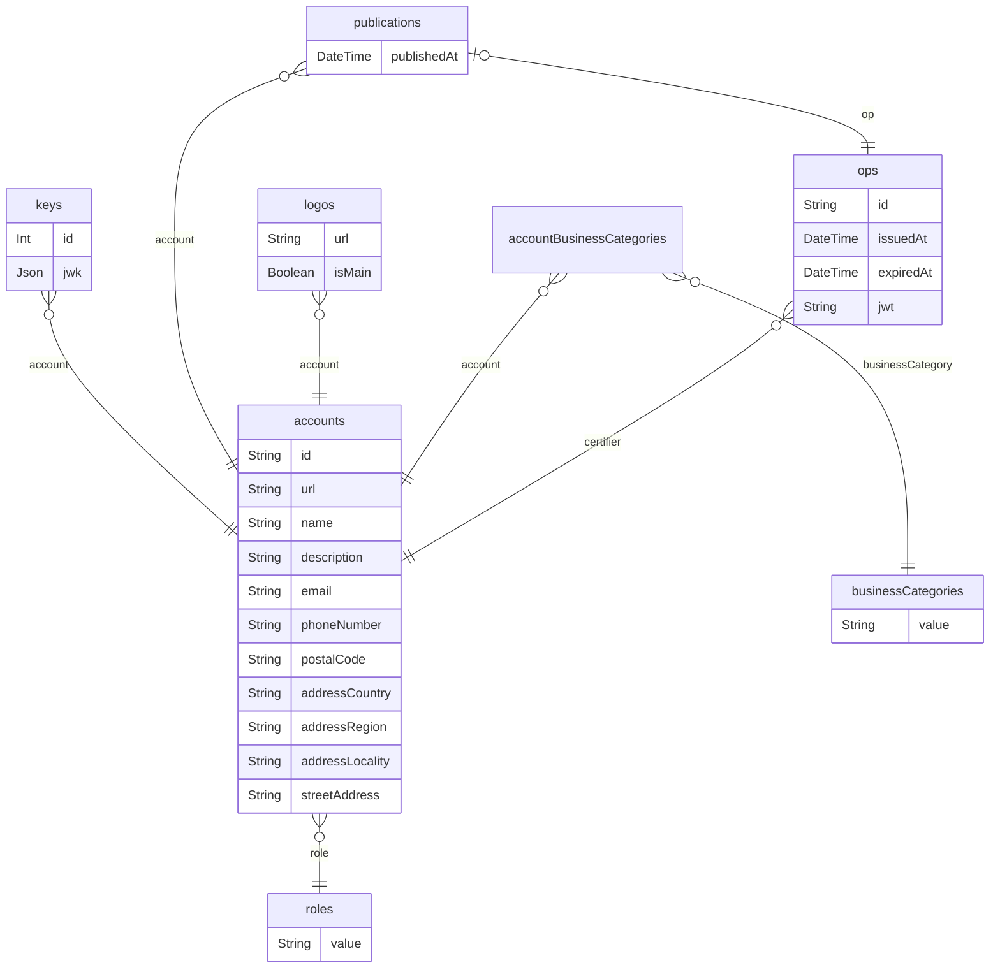

```mermaid
erDiagram

  ops {
      String id
    DateTime issuedAt
    DateTime expiredAt
    String jwt
    }
  

  accounts {
      String id
    String url
    String name
    String description
    String email
    String phoneNumber
    String postalCode
    String addressCountry
    String addressRegion
    String addressLocality
    String streetAddress
    }
  

  roles {
      String value
    }
  

  businessCategories {
      String value
    }
  

  accountBusinessCategories {
  
    }
  

  logos {
      String url
    Boolean isMain
    }
  

  publications {
      DateTime publishedAt
    }
  

  keys {
      Int id
    Json jwk
    }
  
    ops o{--|| accounts : "certifier"
    accounts o{--|| roles : "role"
    accountBusinessCategories o{--|| accounts : "account"
    accountBusinessCategories o{--|| businessCategories : "businessCategory"
    logos o{--|| accounts : "account"
    publications o|--|| ops : "op"
    publications o{--|| accounts : "account"
    keys o{--|| accounts : "account"
```
