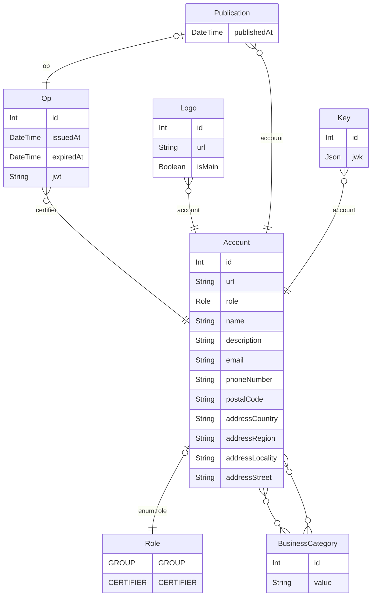

```mermaid
erDiagram

        Role {
            GROUP GROUP
CERTIFIER CERTIFIER
        }
    
  Op {
      Int id
    DateTime issuedAt
    DateTime expiredAt
    String jwt
    }
  

  Account {
      Int id
    String url
    Role role
    String name
    String description
    String email
    String phoneNumber
    String postalCode
    String addressCountry
    String addressRegion
    String addressLocality
    String addressStreet
    }
  

  BusinessCategory {
      Int id
    String value
    }
  

  Logo {
      Int id
    String url
    Boolean isMain
    }
  

  Publication {
      DateTime publishedAt
    }
  

  Key {
      Int id
    Json jwk
    }
  
    Op o{--|| Account : "certifier"
    Account o|--|| Role : "enum:role"
    Account o{--}o BusinessCategory : ""
    BusinessCategory o{--}o Account : ""
    Logo o{--|| Account : "account"
    Publication o|--|| Op : "op"
    Publication o{--|| Account : "account"
    Key o{--|| Account : "account"
```
