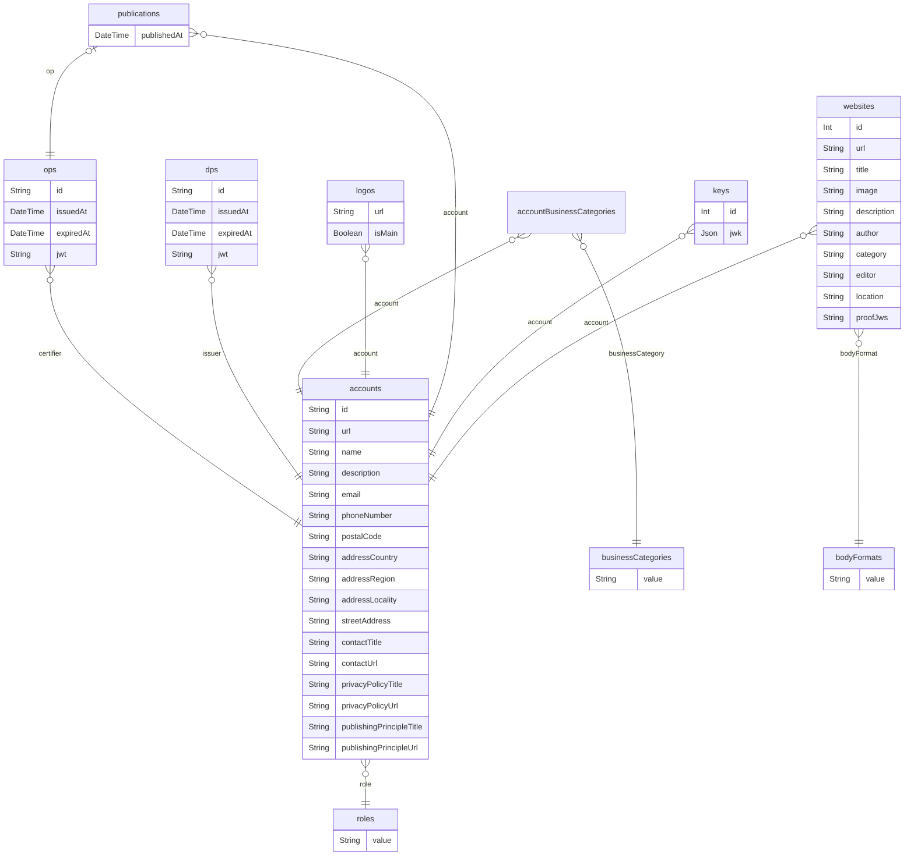

```mermaid
erDiagram

  ops {
      String id
    DateTime issuedAt
    DateTime expiredAt
    String jwt
    }
  

  dps {
      String id
    DateTime issuedAt
    DateTime expiredAt
    String jwt
    }
  

  accounts {
      String id
    String url
    String name
    String description
    String email
    String phoneNumber
    String postalCode
    String addressCountry
    String addressRegion
    String addressLocality
    String streetAddress
    String contactTitle
    String contactUrl
    String privacyPolicyTitle
    String privacyPolicyUrl
    String publishingPrincipleTitle
    String publishingPrincipleUrl
    }
  

  roles {
      String value
    }
  

  businessCategories {
      String value
    }
  

  accountBusinessCategories {
  
    }
  

  logos {
      String url
    Boolean isMain
    }
  

  publications {
      DateTime publishedAt
    }
  

  keys {
      Int id
    Json jwk
    }
  

  websites {
      Int id
    String url
    String title
    String image
    String description
    String author
    String category
    String editor
    String location
    String proofJws
    }
  

  bodyFormats {
      String value
    }
  
    ops o{--|| accounts : "certifier"
    dps o{--|| accounts : "issuer"
    accounts o{--|| roles : "role"
    accountBusinessCategories o{--|| accounts : "account"
    accountBusinessCategories o{--|| businessCategories : "businessCategory"
    logos o{--|| accounts : "account"
    publications o|--|| ops : "op"
    publications o{--|| accounts : "account"
    keys o{--|| accounts : "account"
    websites o{--|| accounts : "account"
    websites o{--|| bodyFormats : "bodyFormat"
```
