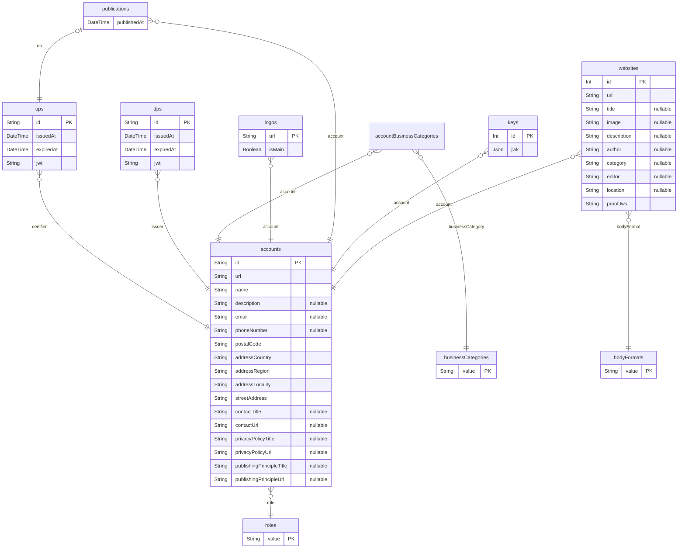

```mermaid
erDiagram

  ops {
    String id PK 
    DateTime issuedAt  
    DateTime expiredAt  
    String jwt  
    }
  

  dps {
    String id PK 
    DateTime issuedAt  
    DateTime expiredAt  
    String jwt  
    }
  

  accounts {
    String id PK 
    String url  
    String name  
    String description  "nullable"
    String email  "nullable"
    String phoneNumber  "nullable"
    String postalCode  
    String addressCountry  
    String addressRegion  
    String addressLocality  
    String streetAddress  
    String contactTitle  "nullable"
    String contactUrl  "nullable"
    String privacyPolicyTitle  "nullable"
    String privacyPolicyUrl  "nullable"
    String publishingPrincipleTitle  "nullable"
    String publishingPrincipleUrl  "nullable"
    }
  

  roles {
    String value PK 
    }
  

  businessCategories {
    String value PK 
    }
  

  accountBusinessCategories {

    }
  

  logos {
    String url PK 
    Boolean isMain  
    }
  

  publications {
    DateTime publishedAt  
    }
  

  keys {
    Int id PK 
    Json jwk  
    }
  

  websites {
    Int id PK 
    String url  
    String title  "nullable"
    String image  "nullable"
    String description  "nullable"
    String author  "nullable"
    String category  "nullable"
    String editor  "nullable"
    String location  "nullable"
    String proofJws  
    }
  

  bodyFormats {
    String value PK 
    }
  
    ops o{--|| accounts : "certifier"
    dps o{--|| accounts : "issuer"
    accounts o{--|| roles : "role"
    accountBusinessCategories o{--|| accounts : "account"
    accountBusinessCategories o{--|| businessCategories : "businessCategory"
    logos o{--|| accounts : "account"
    publications o|--|| ops : "op"
    publications o{--|| accounts : "account"
    keys o{--|| accounts : "account"
    websites o{--|| accounts : "account"
    websites o{--|| bodyFormats : "bodyFormat"
```
