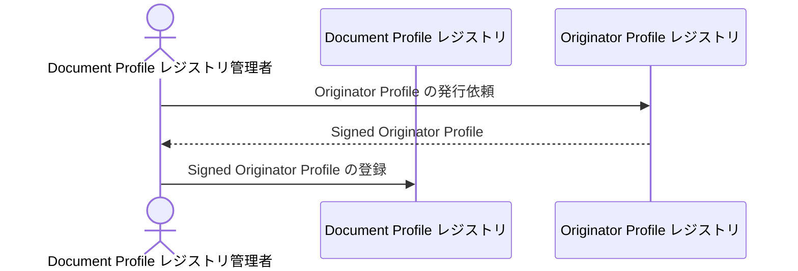

# Document Profile レジストリ構築

Document Profile レジストリを構築する方法を説明します。

以下の図は Document Profile レジストリ構築に関するプロセスの概要を示しています。



## 構築ガイド

1. Document Profile レジストリのデプロイ
2. Originator Profile の発行依頼
3. Document Profile レジストリへの Signed Originator Profile の登録

## Document Profile レジストリのデプロイ

Heroku などを利用して Profile Registry のデプロイを行います。

このリポジトリを clone してコマンドラインで作業を行うことになります。
[開発ガイド](/development/)を参照してください。

### レジストリの管理者の作成 {#admin-create}

PostgreSQL 接続 URL など `profile-registry` コマンドの実行に必要な情報を .env ファイルに指定します。
[Profile Registry ソースコード](https://github.com/originator-profile/profile-share/blob/main/apps/registry#環境変数)を参照してください。

```
$ cd apps/registry
$ touch .env
$ chmod 600 .env
$ editor .env
```

レジストリの管理者の作成を行います。

```
$ profile-registry admin:create --id <レジストリドメイン名>
```

例

```
$ profile-registry admin:create --id example.com
Secret: cfbff0d1-9375-5685-968c-48ce8b15ae17:GVWoXikZIqzdxzB3CieDHL-FefBT31IfpjdbtAJtBcU
```

この認証情報はメモしておいてください。[WordPress 連携](./wordpress-integration.md)などで必要になります。

<!-- NOTE: ローカルの開発環境では `--id=localhost` を使用できます。 -->

## Originator Profile の発行依頼 {#op-signing-request}

Originator Profile レジストリ運用者に依頼して行います。

## 公開鍵の準備

まず公開鍵を用意してください。[鍵ペアの生成](../operation/key-pair-generation.md)を参照してください。

## Document Profile レジストリへの Signed Originator Profile の登録

Originator Profile レジストリ運用者から受け取った Signed Originator Profile を Document Profile レジストリに登録します。

```
$ profile-registry account:register-op --id <ドメイン名> --op <Signed Originator Profileファイル>
```

例:

```
$ profile-registry account:register-op --id example.com --op sop.jwt
```

詳細は [Profile Registry ソースコード](https://github.com/originator-profile/profile-share/blob/main/apps/registry#readme)を参照してください。

<!-- NOTE: ローカル環境の開発用サーバーの Signed Originator Profile の例

```
eyJhbGciOiJFUzI1NiIsImtpZCI6IkdQLXV5QThvYlBrclU2S3Nhdl8wOVZCclZFOHVjWFdPdFc0OGR3NlY0clkiLCJ0eXAiOiJKV1QifQ.eyJodHRwczovL29wci53ZWJkaW5vLm9yZy9qd3QvY2xhaW1zL29wIjp7Iml0ZW0iOlt7InR5cGUiOiJjcmVkZW50aWFsIn0seyJ0eXBlIjoiY2VydGlmaWVyIiwidXJsIjoiaHR0cHM6Ly9vcmlnaW5hdG9yLXByb2ZpbGUucGFnZXMuZGV2LyIsIm5hbWUiOiJPcmlnaW5hdG9yIFByb2ZpbGUg5oqA6KGT56CU56m257WE5ZCIIiwicG9zdGFsQ29kZSI6IjEwOC0wMDczIiwiYWRkcmVzc0NvdW50cnkiOiJKUCIsImFkZHJlc3NSZWdpb24iOiLmnbHkuqzpg70iLCJhZGRyZXNzTG9jYWxpdHkiOiLmuK_ljLoiLCJzdHJlZXRBZGRyZXNzIjoi5LiJ55SwIiwiY29udGFjdFRpdGxlIjoi44GK5ZWordPress44GE5ZCI44KP44GbIiwiY29udGFjdFVybCI6Imh0dHBzOi8vb3JpZ2luYXRvci1wcm9maWxlLnBhZ2VzLmRldi9qYS1KUC8iLCJsb2dvcyI6W3sidXJsIjoiaHR0cHM6Ly9vcmlnaW5hdG9yLXByb2ZpbGUucGFnZXMuZGV2L2ltYWdlL2ljb24uc3ZnIiwiaXNNYWluIjp0cnVlfV19LHsidHlwZSI6ImhvbGRlciIsInVybCI6Imh0dHA6Ly9sb2NhbGhvc3Q6ODA4MC8iLCJuYW1lIjoi44Ot44O844Kr44Or55Kw5aKD44Gu6ZaL55m655So44K144O844OQ44O8IiwicG9zdGFsQ29kZSI6IjAxMi0zNDU2IiwiYWRkcmVzc0NvdW50cnkiOiJKUCIsImFkZHJlc3NSZWdpb24iOiLmlrDmtZznnIwiLCJhZGRyZXNzTG9jYWxpdHkiOiLmlrDmtZzluIIiLCJzdHJlZXRBZGRyZXNzIjoiOSIsImxvZ29zIjpbXX1dLCJqd2tzIjp7ImtleXMiOlt7IngiOiI2T0JwNzlKWktPYVNGYmpHYVVybGN2MTdGZHlHei1iVVVZZFcyeFBnUkJFIiwieSI6IlRlVEdBV2ZfT3JkVW1DOVVVWW43eDZhWngzOWctUWs5OFhtTXB3WFdfZXciLCJhbGciOiJFUzI1NiIsImNydiI6IlAtMjU2Iiwia2lkIjoiajlMX1FqaTJCQzR2ajFBYURDZHpwdXJYU3BNN2NLQmJ0V08tVzVhMFNLNCIsImt0eSI6IkVDIiwidXNlIjoic2lnIn1dfX0sImlzcyI6Im9wcmRldi5oZXJva3VhcHAuY29tIiwic3ViIjoibG9jYWxob3N0IiwiaWF0IjoxNjc5NjM0MjQzLCJleHAiOjE3MTEyNTY2NDN9.-qA4t7hxRUmUn-F8SJGOij1UPkzxZxcHPvfWrIs-ge0Sx8SmdubGcAj3j-XsikyWbYAaStcsD-Z56HLhZAyvuw
```
-->
