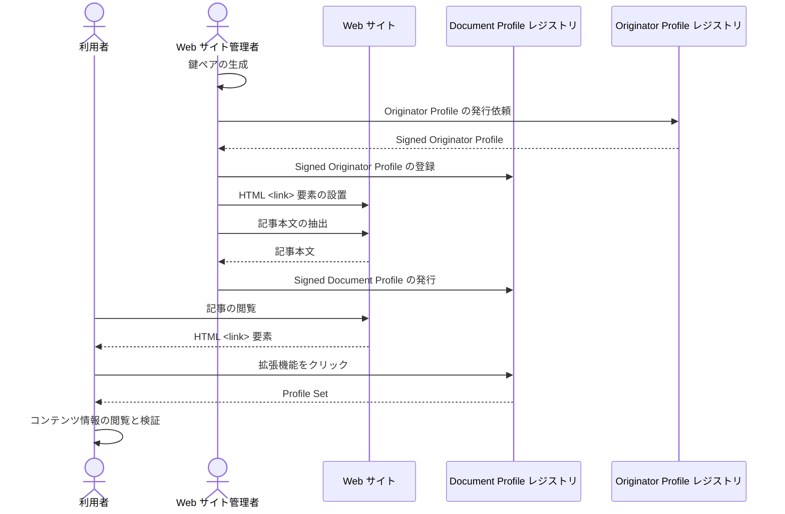

# Web サイト連携

Document Profile レジストリを任意の Web サイトに連携する方法を説明します。

以下の図は Web サイト連携に関するプロセスの概要を示しています。



## デモ

[拡張機能を用意](/web-ext/experimental-use.mdx)して https://originator-profile.org/ja-JP/ にアクセスし、拡張機能を起動してください。

## 構築ガイド

1. [Document Profile レジストリの構築](./document-profile-registry-creation.md)
2. HTML <link\> 要素の設置
3. 記事本文の抽出
4. Signed Document Profile の発行

## HTML <link\> 要素の設置

利用者が記事の検証をおこなう際 Document Profile レジストリ API エンドポイントから Profile Set が得られるようにします。

例えば、Document Profile レジストリのドメイン名が dprexpt.originator-profile.org、検証する対象の Web サイトが https://originator-profile.org/ であれば、<link\> 要素は下記のように書き表します。

```html
<link
  href="https://dprexpt.originator-profile.org/website/profiles?url=https%3A%2F%2Foriginator-profile.org%2F"
  rel="alternate"
  type="application/ld+json"
/>
```

<link\> 要素の設置後、記事を公開し、記事本文を抽出できるようにします。

## 記事本文の抽出

[記事本文の抽出 - CLI を使った実装ガイド](/integration-development/cli.md#extract-website)を参照してください。

## Signed Document Profile の発行

.website.json から Signed Document Profile を発行し Document Profile レジストリに登録します。あらかじめ Document Profile レジストリのデータベースの接続情報が必要です。

このとき使用するプライベート鍵は、[Originator Profile レジストリに登録した公開鍵](./document-profile-registry-creation.md#op-signing-request)とペアでなければなりません。

```
$ profile-registry publisher:website --identity <プライベート鍵> --id <管理者の UUID> --operation create
```

詳細は [Profile Registry ソースコード](https://github.com/originator-profile/profile-share/blob/main/apps/registry#readme)を参照してください。
