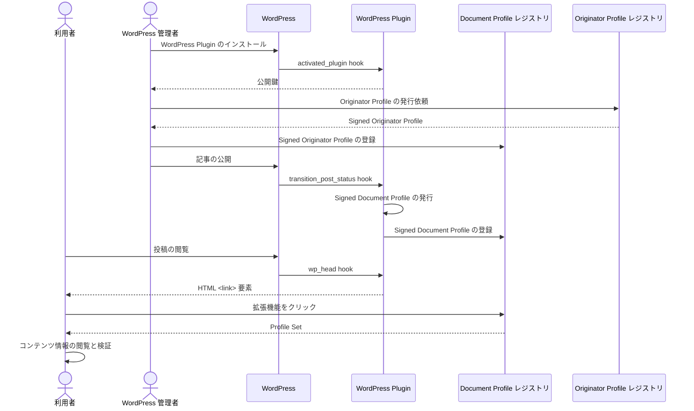

# WordPress 連携

## 概要

Document Profile レジストリを WordPress サイトに連携する方法を説明します。

以下の図は WordPress 連携に関するプロセスの概要を示しています。



Wordpress 連携プラグインは、 [hook](https://developer.wordpress.org/plugins/hooks/) によって、 Wordpress 本体からトリガーされ、そのフックに対応した処理を実行します。

1. `activate_plugin` hook が、プラグインを最初に有効化した際にトリガーされ、公開鍵ペアを生成して、プライベート鍵を Wordpress のサーバー内に保存します。
2. 次に、`transition_post_status` hook が記事の公開や更新のタイミングでトリガーされ、このときに SDP を発行します。
3. (2) で生成した SDP を DP レジストリに登録します。これは (2) の直後におこなれます。
4. 最後に `wp_head` hook が、ユーザーが記事に訪れて記事を閲覧した際にトリガーされ、これにより、記事の HTML に Profile Set へのリンクが <link\> 要素として追加されます。
5. ユーザーが、OP拡張機能をクリックすると、拡張機能はこの <link\> 要素から、記事に対応する Profile Set を取得・検証し、記事の信頼性や情報を表示します。

より詳細な動作については[Wordpress 連携のソースコード](https://github.com/originator-profile/profile-share/tree/main/packages/wordpress)を参照してください。

## デモ

私たちはすでに構築済みの Wordpress を wppdev.herokuapp.com ドメインで試験提供しています。この環境は Profile Plugin がインストール済みです。
[拡張機能を用意](/web-ext/experimental-use.mdx)し、 https://wppdev.herokuapp.com/2023/06/29/hello-world/ にアクセスして参照実装の実際の動作を確認できます。

## 構築ガイド

1. [Document Profile レジストリの構築](./document-profile-registry-creation.md)
2. プラグインのインストール

## プラグインのインストール {#install-plugin}

WordPress サイトに Profile Plugin をインストールします。
詳細は [プラグインのソースコード](https://github.com/originator-profile/profile-share/tree/main/packages/wordpress#readme)をご確認ください。

OP ID (組織のドメイン名) を、WordPress 管理者画面 > Settings > Profile > [Originator Profile ID] に入力します。

例:

```
media.example.com
```

Document Profile レジストリサーバーのホスト名を、WordPress 管理者画面 > Settings > Profile > [レジストリサーバーホスト名] に入力します。

例:

```
dprexpt.originator-profile.org
```

[レジストリの管理者を作成](./document-profile-registry-creation.md#admin-create)した際の認証情報、WordPress 管理者画面 > Settings > Profile > [認証情報] に入力します。

例:

```
cfbff0d1-9375-5685-968c-48ce8b15ae17:GVWoXikZIqzdxzB3CieDHL-FefBT31IfpjdbtAJtBcU
```

それぞれ適切な値を入力したら、保存を選択し、設定を反映します。
設定が反映されれば、それ以降、公開される投稿に対して SDP が自動で発行・登録され、記事から Profile Set へリンクされるようになります。
