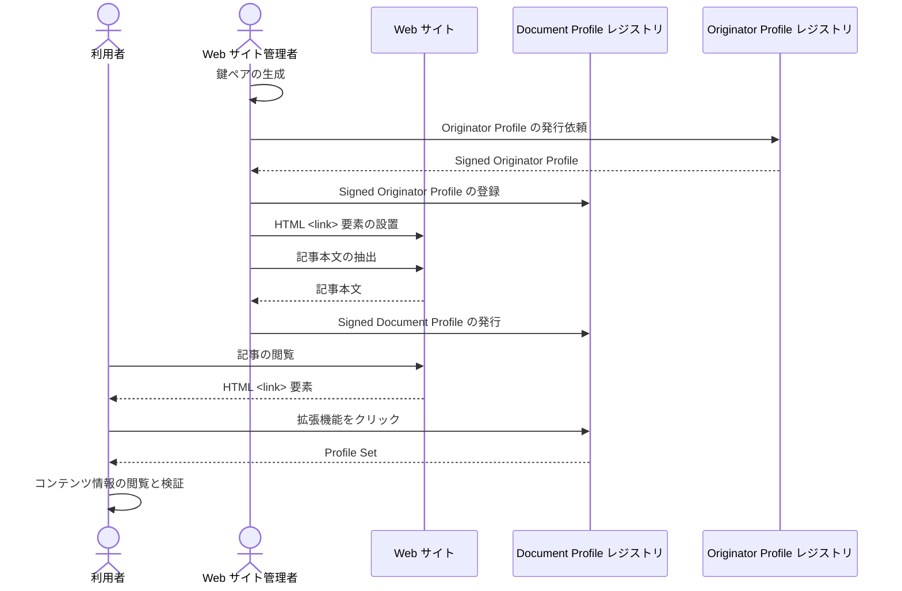

# Web サイト連携

Document Profile レジストリを任意の Web サイトに連携する方法を説明します。

以下の図は Web サイト連携に関するプロセスの概要を示しています。



## デモ

[拡張機能を用意](../web-ext/experimental-use)して https://originator-profile.org/ja-JP/ にアクセスし、拡張機能を起動してください。

## 構築ガイド

1. [Document Profile レジストリの構築](./document-profile-registry-creation)
2. HTML <link\> 要素の設置
3. 記事本文の抽出
4. Signed Document Profile の発行

## HTML <link\> 要素の設置

利用者が記事の検証をおこなう際 Document Profile レジストリ API エンドポイントから Profile Set が得られるようにします。

例えば、Document Profile レジストリのドメイン名が dprexpt.originator-profile.org、検証する対象の Web サイトが https://originator-profile.org/ であれば、<link\> 要素は下記のように書き表します。

```html
<link
  href="https://dprexpt.originator-profile.org/website/profiles?url=https%3A%2F%2Foriginator-profile.org%2F"
  rel="alternate"
  type="application/ld+json"
/>
```

<link\> 要素の設置後、記事を公開し、記事本文を抽出できるようにします。

## 記事本文の抽出

### .extract.json の用意

記事の URL、検証対象となるテキストの範囲、抽出結果の保存先を表明する JSON ファイルを作成します。

対象とする Web サイトを https://originator-profile.org とした場合の .extract.json の例:

```json
[
  {
    "url": "https://originator-profile.org/ja-JP/",
    "bodyFormat": "visibleText",
    "location": "[itemprop=articleBody]",
    "output": "src/ja-JP/.website.json"
  },
  {
    "url": "https://originator-profile.org/ja-JP/about/",
    "bodyFormat": "visibleText",
    "location": "[itemprop=articleBody]",
    "output": "src/ja-JP/about/.website.json"
  },
  {
    "url": "https://originator-profile.org/ja-JP/for-viewer/",
    "bodyFormat": "visibleText",
    "location": "[itemprop=articleBody]",
    "output": "src/ja-JP/for-viewer/.website.json"
  },
  {
    "url": "https://originator-profile.org/ja-JP/future/",
    "bodyFormat": "visibleText",
    "location": "[itemprop=articleBody]",
    "output": "src/ja-JP/future/.website.json"
  },
  {
    "url": "https://originator-profile.org/ja-JP/structure/",
    "bodyFormat": "visibleText",
    "location": "[itemprop=articleBody]",
    "output": "src/ja-JP/structure/.website.json"
  }
]
```

詳細は [Profile Registry ソースコード](https://github.com/webdino/profile/blob/main/apps/registry#readme)を参照してください。

### .website.json の用意

記事の OGP 等メタデータ、検証対象となるテキストの抽出をおこないます。

```
$ profile-registry publisher:extract-website --input .extract.json
```

前項で示した .extract.json から得られる .website.json の例:

```json
{
  "url": "https://originator-profile.org/ja-JP/",
  "location": "[itemprop=articleBody]",
  "bodyFormat": {
    "connect": {
      "value": "visibleText"
    }
  },
  "body": "一般的なネットユーザーの課題\nちゃんと事実を伝えているウェブ上の記事とか広告とかって、信頼できる情報だけ見る方法はないのかしら...？\nフェイクニュースや有害サイトってどうやってもなくならないの...？\n\nアテンションエコノミー（関心を引くことの価値化）を背景に、事実を伝える記事より例えフェイクニュースであっても目立つ記事の方が利益が上がる構造ができています。これはコンテンツ発信者とその信頼性を確認する一般的な手段が無いことが大きな原因の一つです。閲覧者や広告配信システムが良質な記事やメディアを識別可能にすれば、インターネットの情報流通はより健全化できます。\n\nウェブコンテンツを閲覧される方へ\n\n広告・メディア関係者の課題\nえええー！？ こんな危険なサイトにウチの広告が！！\nあれ、この記事の内容にウチの広告は合わないのでは！？\n\n不適切なサイト (メディア) に広告が掲載されたり、逆に、表示して欲しくない広告が掲載されることがあります。検索結果に偽サイトなどが表示されたり、SNS でもフェイクニュースが目立った形で拡散されたりしています。適切なサイトや広告主を識別し、適切なサイトと広告のマッチングをしたり、その配信記録を残すことでブランド毀損を防げます。\n\n一方で...\nでも、情報の規制は良くないよね、言論の自由も認められなければいけない。\n\nそのとおりです。ただし、Originator Profile技術はメディアや広告主の峻別しゅんべつをおこなうものではありません。現存する認証機関などに活用してもらうことを考えています。\n\n課題を解決するために\nコンテンツの発信元や流通経路を透明化する手段を提供します\n\nウェブ上の記事や広告といったコンテンツの発信者や掲載サイトの運営者の情報を付与し、公正な基準で第三者認証された発信者や運営者を確認出来るようにします。現在、これを実現するための技術と仕組みの開発と運用試験を、広告やメディアの関係企業や大学の研究機関と共に行っています。\n\n「Originator Profile 技術とは」についてもご覧ください。\n\nウェブ標準化に向けて\n\n情報の発信者や流通経路、広告主を透明化することで、様々な問題を解決できます。\n\nコンテンツ発信元や第三者認証情報をウェブブラウザで簡単に確認できます\nなりすましや改変を防ぎ安心してコンテンツを閲覧できます\n不適切な広告の掲載や、不適切なサイトへの広告掲載を防げます\n目をひくだけでなく、適切な記事の配信者の収益性を高めることができます\n\n次代のウェブをより健全で公益性の高いものとするべく、これらの問題を解決するため Originator Profile 技術を標準規格として Web 技術の標準化団体（W3C）に提案し、世界標準化と普及を目指した取り組みを行っています。",
  "datePublished": null,
  "author": null,
  "description": "Originator Profileの紹介ページ",
  "image": "https://originator-profile.org/image/ogp.png",
  "title": "Originator Profile"
}
```

詳細は [Profile Registry ソースコード](https://github.com/webdino/profile/blob/main/apps/registry#readme)を参照してください。

## Signed Document Profile の発行

.website.json から Signed Document Profile を発行し Document Profile レジストリに登録します。あらかじめ Document Profile レジストリのデータベースの接続情報が必要です。

このとき使用するプライベート鍵は、[Originator Profile レジストリに登録した公開鍵](./document-profile-registry-creation#originator-profile-%E3%83%AC%E3%82%B8%E3%82%B9%E3%83%88%E3%83%AA%E3%81%B8%E3%81%AE%E5%85%AC%E9%96%8B%E9%8D%B5%E3%81%AE%E7%99%BB%E9%8C%B2%E3%81%A8-signed-originator-profile-%E3%81%AE%E7%99%BA%E8%A1%8C%E4%BE%9D%E9%A0%BC)とペアでなければなりません。

```
$ profile-registry publisher:website --identity <プライベート鍵> --id <管理者の UUID> --operation create
```

詳細は [Profile Registry ソースコード](https://github.com/webdino/profile/blob/main/apps/registry#readme)を参照してください。
