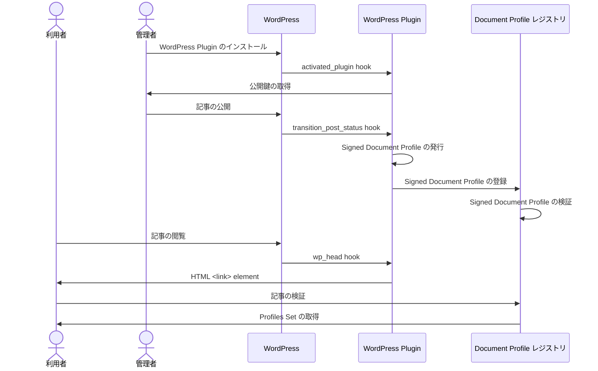

# WordPress 連携

## 概要

Document Profile レジストリを構築し WordPress サイトと連携する方法を説明します。

以下の図は WordPress 連携に関するプロセスの概要を示しています。

## 構築ガイド

1. Document Profile レジストリの準備
2. プラグインのインストール

## Document Profile レジストリの準備

[Document Profile レジストリ構築](./document-profile-registry-creation)を参照してください。

[レジストリの管理者を作成](./document-profile-registry-creation#レジストリの管理者の作成)した際に得られる認証情報は次項で使用します。

## プラグインのインストール

WordPress サイトに WordPress Profile Plugin をインストールします。
[WordPress Profile Plugin ソースコード](https://github.com/webdino/profile/tree/main/packages/wordpress#readme)を参照してください。

Document Profile レジストリのドメイン名は WordPress 管理者画面 > Settings > Profile > [レジストリドメイン名] に設定してください。

Document Profile レジストリの認証情報は WordPress 管理者画面 > Settings > Profile > [認証情報] に設定してください。
