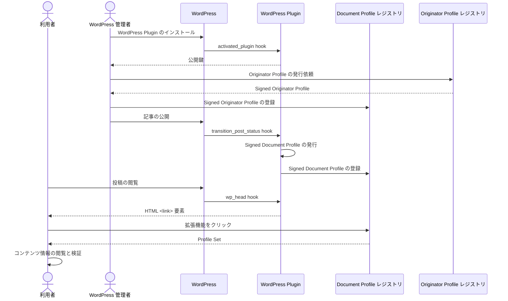

# WordPress 連携

## 概要

Document Profile レジストリを WordPress サイトに連携する方法を説明します。

以下の図は WordPress 連携に関するプロセスの概要を示しています。



## デモ

[拡張機能を用意](../web-ext/experimental-use.md)し、 https://wppdev.herokuapp.com/2023/06/29/hello-world/ にアクセスして参照実装の実際の動作を確認できます。

## 構築ガイド

1. [Document Profile レジストリの構築](./document-profile-registry-creation.md)
2. プラグインのインストール

## プラグインのインストール

WordPress サイトに WordPress Profile Plugin をインストールします。
[WordPress Profile Plugin ソースコード](https://github.com/originator-profile/profile-share/tree/main/packages/wordpress#readme)を参照してください。

Originator Profile ID を、WordPress 管理者画面 > Settings > Profile > [Originator Profile ID] に入力します。

例:

```
media.example.com
```

Document Profile レジストリサーバーのホスト名を、WordPress 管理者画面 > Settings > Profile > [レジストリサーバーホスト名] に入力します。

例:

```
dprexpt.originator-profile.org
```

[レジストリの管理者を作成](./document-profile-registry-creation.md#レジストリの管理者の作成)した際の認証情報、WordPress 管理者画面 > Settings > Profile > [認証情報] に入力します。

例:

```
cfbff0d1-9375-5685-968c-48ce8b15ae17:GVWoXikZIqzdxzB3CieDHL-FefBT31IfpjdbtAJtBcU
```

それぞれ適切な値を入力したら、保存を選択し、設定を反映します。
設定が反映されれば、それ以降公開される投稿で Profile Set が配信されるようになります。
