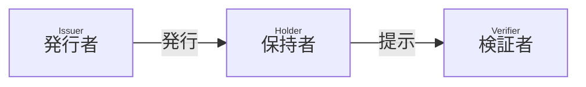

# Originator Profile - Editor's Draft

## 概要

本文書では、SD-JWT に基づく Verifiable Credential (SD-JWT VC) を使用して、基本的な組織に関する情報を表明する方法について説明します。

[SD-JWT VC Data Model](https://github.com/danielfett/sd-jwt-vc-dm) に従って、発行者は SD-JWT VC を発行し、保持者はそれを検証者に提示できます。SD-JWT VC には、発行者によって署名された組織に関する情報が含まれます。



このプロセスにより、保持者は組織に関する情報を暗号的に検証可能な情報として検証者に提示することができます。

## 用語

本文書に説明のない用語については、用語 RFC 文書を参照してください。

- [SD-JWT VC](https://datatracker.ietf.org/doc/draft-ietf-oauth-sd-jwt-vc/)
- Originator Profile ID (OP ID)
- Originator Profile (OP)

## Originator Profile ID (OP ID)

OP ID は保持者の組織を一意に識別するための識別子です。
発行者は各組織に一意の OP ID を割り当て、それを SD-JWT VC `sub` クレームに含められます。
使用される OP ID の形式は本仕様の範囲外です。

## Originator Profile (OP) の形式

OP は組織に関する情報を表明するために使用されるデータです。
必ず SD-JWT VC 形式でなければなりません (MUST)。

### クレーム

発行者はこの他にクレームを追加してもよいです (MAY) が、それらは本仕様の範囲外です。

:::note

Originator Profile 技術研究組合が開発するアプリケーションで使用されるクレームについては、 [Organization Metadata Schema RFC 文書](./07.md)を参照してください。

:::

#### `vct`

REQUIRED. SD-JWT VC のタイプの識別子です。 [SD-JWT VC セクション 6.3.1](https://www.ietf.org/archive/id/draft-ietf-oauth-sd-jwt-vc-04.html#name-from-a-url-in-the-vct-claim) に従い、`https://<authority>/.well-known/vct/<type>` への GET リクエストで Type Metadata を取得できなければなりません (MUST)。検証者はクレームの型を指定する JSON Schema や、選択的開示可能かどうか、各クレームの情報の正しさが誰によって確認されたかを知ることができます。

本セクションに挙げる必須クレームについて、[RFC 7519 セクション 4.1](https://www.rfc-editor.org/rfc/rfc7519#section-4.1) で定義されている JWT クレームを除き、`schema` プロパティあるいは `schema_url` プロパティにより構造を検証可能にしなければなりません (MUST)。

#### `vct#integrity`

REQUIRED. [SD-JWT VC Document Integrity](https://www.ietf.org/archive/id/draft-ietf-oauth-sd-jwt-vc-04.html#name-document-integrity) に従い検証可能にしなければなりません。

#### `iss`

REQUIRED. 発行者の識別子です。
`iss` クレームの値は、URL でなければなりません (MUST)。 JWT VC 発行者のメタデータを公開する場合、HTTPS の URL でなければなりません (MUST)。

#### `iss#integrity`

REQUIRED. [SD-JWT VC Document Integrity](https://www.ietf.org/archive/id/draft-ietf-oauth-sd-jwt-vc-04.html#name-document-integrity) に従い検証可能にしなければなりません。

#### `sub`

REQUIRED. OP 保有組織の OP ID です。

#### `jwks`

REQUIRED. 保持者の組織の公開鍵の [JSON Web Key Set](https://www.rfc-editor.org/rfc/rfc7517.html#section-5) です。

#### `iat`, `exp`

REQUIRED. [JWT (RFC 7519)](https://www.rfc-editor.org/rfc/rfc7519.html) の仕様に従います。

#### 例

クレームの具体例を次に示します。

```json
{
  "vct": "https://example.org/originator_profile",
  "vct#integrity": "sha256-o2zJ6gYOeJRgHgb05xK94kKKb8SIsBebOzalI0p2Pb4=",
  "iss": "https://example.org",
  "iss#integrity": "sha256-Vfeaz5AVsHE9XSJ+aDikjlQUl2FpXPKc5vh0VjMssBA=",
  "jwks": {
    "keys": [
      {
        "crv": "P-256",
        "kty": "EC",
        "x": "oXjYmCzMVb8ZAWYM2s0LqlzCA4AubxfwDEDdySrtf_o",
        "y": "Tx96jtb9W0_na6FohYNKVe-7S1h2oHtxXVDV1PQWQ-4"
      }
    ]
  },
  "iat": 1680274800,
  "exp": 1743433200,
  "sub": "example.jp",
  "locale": "ja-JP",
  "issuer": {
    "country": "JP",
    "name": "技術研究組合 (※開発用サンプル)",
    "domain_name": "example.org",
    "url": "https://example.org/",
    "logo": "https://example.org/image/icon.svg",
    "logo#integrity": "sha256-RB6bmjh+ge8+foSHzPMTMJmKjX/dwtmpCB9i/G79cdU=",
    "email": "sample@example.org",
    "phone_number": "00-0000-0000",
    "corporate_number": "8010005035933",
    "postal_code": "000-0000",
    "region": "東京都",
    "locality": "千代田区",
    "street_address": "大手町1丁目X番Y号",
    "contact_title": "お問い合わせ",
    "contact_url": "https://example.org/contact",
    "privacy_policy_title": "プライバシーポリシー",
    "privacy_policy_url": "https://example.org/privacy",
    "description": {
      "type": "text/plain",
      "data": "この文章はこの組織に関する補足情報です。"
    }
  },
  "holder": {
    "country": "JP",
    "name": "一般社団法人 ○○ (※開発用サンプル)",
    "domain_name": "example.jp",
    "url": "https://example.jp/",
    "logo": "https://example.jp/image/icon.svg",
    "logo#integrity": "sha256-RB6bmjh+ge8+foSHzPMTMJmKjX/dwtmpCB9i/G79cdU=",
    "corporate_number": "0000000000000",
    "postal_code": "000-0000",
    "region": "東京都",
    "locality": "千代田区",
    "street_address": "○○○",
    "contact_title": "お問い合わせ",
    "contact_url": "https://example.jp/contact",
    "privacy_policy_title": "プライバシーポリシー",
    "privacy_policy_url": "https://example.jp/privacy",
    "description": {
      "type": "text/plain",
      "data": "この文章はこの組織に関する補足情報です。"
    }
  }
}
```

:::note

例には本文書で定義されていないクレーム・プロパティも含んでいます。それらの定義は [Organization Metadata Schema RFC 文書](./07.md)を参照してください。

:::

## 暗号アルゴリズム

暗号アルゴリズムは「[暗号アルゴリズム](./19.md)」に従います。

## 公開鍵の配布

検証者は SD-JWT VC の署名を検証するために発行者の公開鍵を取得する必要があります。

発行者は JWT VC 発行者のメタデータによって公開鍵を配布してもよい (MAY) ですが、他の配布方法を禁止するものではありません。

JWT VC 発行者のメタデータには、SD-JWT VC の 署名に使ったプライベート鍵に対応する発行者の公開鍵が含まれます。

### JWT VC Issuer Metadata 例

JWT VC Issuer Metadata Response の具体例を次に示します。

```json
{
  "issuer": "https://example.org/",
  "jwks": {
    "keys": [
      {
        "alg": "ES256",
        "use": "sig",
        "kid": "7t4ppO9Ci-SPlKwRMWLrUvjkr9QmqDDVNViRRLBJztM",
        "crv": "P-256",
        "kty": "EC",
        "x": "ySDJ7orlv-kj0vuZclAFPPCXh_yy7qucQCsuiLDPJVk",
        "y": "mbYRzJaIAYYfi5jonGYVN-_9B3AcgCZwFs022UwFOSc"
      }
    ]
  }
}
```

## 検証プロセス

_このセクションはより詳細な定義が求められます。_

OP を検証するアプリケーションは次のことを検証することができます。

1. [SD-JWT VC 3.4節](https://www.ietf.org/archive/id/draft-ietf-oauth-sd-jwt-vc-04.html#name-verification-and-processing) に従った検証
   1. JWT VC Issuer Metadata の検証（[SD-JWT VC セクション 5.3](https://www.ietf.org/archive/id/draft-ietf-oauth-sd-jwt-vc-04.html#name-jwt-vc-issuer-metadata-vali)）
   2. SD-JWT VC Type Metadata の検証（[SD-JWT VC セクション 6.5.2](https://www.ietf.org/archive/id/draft-ietf-oauth-sd-jwt-vc-04.html#name-schema-validation)）
   3. SD-JWT VC Type Metadata に各クレームが適合しているかの検証
   4. その他上記仕様に定められている検証
2. 各クレーム・プロパティの値がこの仕様に準拠しているかの確認
3. `#integrity` の検証（[SD-JWT VC 7章 Document Integrity](https://www.ietf.org/archive/id/draft-ietf-oauth-sd-jwt-vc-04.html#name-document-integrity)）

:::note

将来、各検証の失敗に対応するエラーオブジェクトを定義する可能性があります。

:::

## 失効プロセス

_本セクションは参考情報です。_

発行者は SD-JWT VC `status` クレームを含めることができます (OPTIONAL)。
SD-JWT VC に基づく Status Provider による失効プロセスをサポートできます。

## セキュリティ

_本セクションは参考情報です。_

SD-JWT VC のセキュリティに依存します。実装者はプライベート鍵や機密情報の取り扱いに十分注意し、それらを保護する必要な予防措置を講じる必要があります。
