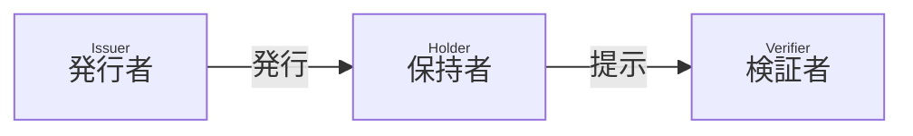
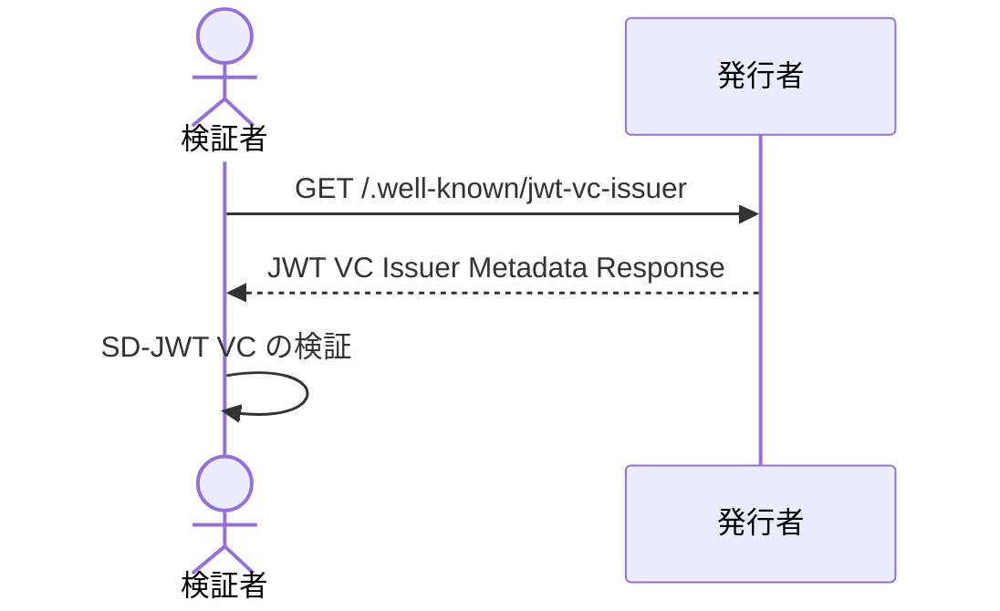

# Originator Profile - Editor's Draft

## 概要

本文書では、SD-JWT に基づく Verifiable Credential (SD-JWT VC) を使用して、基本的な組織に関する情報を表明する方法について説明します。

[SD-JWT VC Data Model](https://github.com/danielfett/sd-jwt-vc-dm) に従って、発行者は SD-JWT VC を発行し、保持者はそれを検証者に提示できます。SD-JWT VC には、発行者によって署名された組織に関する情報が含まれます。



このプロセスにより、保持者は組織に関する情報を暗号的に検証可能な情報として検証者に提示することができます。

## 用語

本文書に説明のない用語については、用語 RFC 文書を参照してください。

- [SD-JWT VC](https://datatracker.ietf.org/doc/draft-ietf-oauth-sd-jwt-vc/)
- Originator Profile ID (OP ID)
- Originator Profile (OP)

## Originator Profile ID (OP ID)

OP ID は保持者の組織を一意に識別するための識別子です。
発行者は各組織に一意の OP ID を割り当て、それを SD-JWT VC `sub` クレームに含められます。
使用される OP ID の形式は本仕様の範囲外です。

## Originator Profile (OP) の形式

OP は組織に関する情報を表明するために使用されるデータです。
必ず SD-JWT VC 形式でなければなりません (MUST)。

### クレーム

発行者はこの他にクレームを追加してもよいです (MAY) が、それらは本仕様の範囲外です。

:::info

Originator Profile 技術研究組合が開発するアプリケーションで使用されるクレームについては、 Organization Metadata Schema RFC 文書を参照してください。

:::

#### `vct`

REQUIRED. SD-JWT VC のタイプの識別子です。 [SD-JWT VC Type Metadata セクション 3](https://vcstuff.github.io/sd-jwt-vc-types/draft-fett-oauth-sd-jwt-vc-types.html#name-retrieving-metadata) に基づき、`https://<authority>/.well-known/vct/<type>` への GET リクエストで metadata document を取得できなければなりません (MUST)。検証者はクレームの型を指定する JSON Schema や、選択的開示可能かどうか、各クレームの情報の正しさが誰によって確認されたかを知ることができます。

本セクションに挙げる必須クレームについて、[RFC7519 セクション 4.1](https://datatracker.ietf.org/doc/html/rfc7519#section-4.1) で定義されている JWT クレームを除き、[SD-JWT VC Type Metadata セクション 9](https://vcstuff.github.io/sd-jwt-vc-types/draft-fett-oauth-sd-jwt-vc-types.html#name-schema) に基づく schema プロパティあるいは schema_url プロパティにより構造を検証可能にしなければなりません (MUST)。 `schema`, `schema_url` プロパティで指定した JSON Schema はこの仕様を満たす必要があります (MUST)。

#### `vct#integrity`

REQUIRED. [SD-JWT VC Type Metadata セクション 4](https://vcstuff.github.io/sd-jwt-vc-types/draft-fett-oauth-sd-jwt-vc-types.html) に従い検証可能にしなければなりません。

#### `iss`

REQUIRED. 発行者の識別子です。
`iss` クレームの値は、URL でなければなりません (MUST)。 JWT VC 発行者のメタデータを公開する場合、HTTPS の URL でなければなりません (MUST)。

#### `iss#integrity`

REQUIRED. [SD-JWT VC Type Metadata セクション 4](https://vcstuff.github.io/sd-jwt-vc-types/draft-fett-oauth-sd-jwt-vc-types.html) に従い検証可能にしなければなりません。

#### `sub`

REQUIRED. OP 保有組織の OP ID です。

#### `jwks`

REQUIRED. 保持者の組織の公開鍵の [JSON Web Key Set](https://datatracker.ietf.org/doc/html/rfc7517#section-5) です。

#### `iat`, `exp`

REQUIRED. [JWT (RFC 7519)](https://datatracker.ietf.org/doc/html/rfc7519) の仕様に従います。

:::note
本文書では外部参照リソースの `#integrity` クレームで使用するハッシュアルゴリズムについては未定義です。
コミュニティ内での議論と改稿を通じて確定され、明確に定義されることが求められます。

- `vct#integrity`
- `iss#integrity`

:::

#### 例

クレームの具体例を次に示します。

```json
{
  "vct": "https://example.org/originator_profile",
  "vct#integrity": "sha256-o2zJ6gYOeJRgHgb05xK94kKKb8SIsBebOzalI0p2Pb4",
  "iss": "https://example.org",
  "iss#integrity": "sha256-Vfeaz5AVsHE9XSJ+aDikjlQUl2FpXPKc5vh0VjMssBA",
  "jwks": {
    "keys": [
      {
        "crv": "P-256",
        "kty": "EC",
        "x": "oXjYmCzMVb8ZAWYM2s0LqlzCA4AubxfwDEDdySrtf_o",
        "y": "Tx96jtb9W0_na6FohYNKVe-7S1h2oHtxXVDV1PQWQ-4"
      }
    ]
  },
  "iat": 1680274800,
  "exp": 1743433200,
  "sub": "example.jp",
  "locale": "ja-JP",
  "issuer": {
    "domain_name": "example.org",
    "name": "技術研究組合 (※開発用サンプル)",
    "url": "https://example.org/",
    "logo": "https://example.org/image/icon.svg",
    "logo#integrity": "sha256-RwMeCLNu5pf-zCD1GgSH1P4ewytQMuUDqt-q5jHF8XQ",
    "email": "sample@example.org",
    "phone_number": "00-0000-0000",
    "corporate_number": "8010005035933",
    "postal_code": "000-0000",
    "country": "JP",
    "address": "東京都千代田区大手町1丁目7番1号 2F",
    "contact_title": "お問い合わせ",
    "contact_url": "https://example.org/contact",
    "privacy_policy_title": "プライバシーポリシー",
    "privacy_policy_url": "https://example.org/privacy",
    "description": {
      "type": "text/plain",
      "data": "この文章は、この組織の OP憲章へのコミットメントを表す文章です。"
    }
  },
  "holder": {
    "domain_name": "example.jp",
    "name": "一般社団法人 ○○ (※開発用サンプル)",
    "url": "https://example.jp/",
    "logo": "https://example.jp/image/icon.svg",
    "logo#integrity": "sha256-RwMeCLNu5pf-zCD1GgSH1P4ewytQMuUDqt-q5jHF8XQ",
    "corporate_number": "0000000000000",
    "postal_code": "000-0000",
    "country": "JP",
    "address": "東京都千代田区○○○",
    "contact_title": "お問い合わせ",
    "contact_url": "https://example.jp/contact",
    "privacy_policy_title": "プライバシーポリシー",
    "privacy_policy_url": "https://example.jp/privacy",
    "description": {
      "type": "text/plain",
      "data": "この文章は、この組織の OP憲章へのコミットメントを表す文章です。"
    }
  }
}
```

:::note

例には本文書で定義されていないクレーム・プロパティも含んでいます。それらの定義は metadata schema の定義を参照してください。

:::

### 署名アルゴリズム

許可リスト (検証側) は次のとおりです。

- `ES256` (RECOMMENDED)
- `ES384`
- `ES512`
- `PS256`
- `PS384`
- `PS512`

<!-- アルゴリズムを絞ったり、単一アルゴリズムを指定した上でバックアップアルゴリズムとして要実装なものを明記するとか、最初から署名側で利用するビット長を上げた仕様にするのかは大久保さんなどのインプットを待つ -->

これらの許可リストに含まれるいずれかの署名アルゴリズムをサポートする必要があります (MUST)。

検証者は、この許可リストに含まれない署名アルゴリズムでの検証を拒否しなければなりません (MUST)。

パフォーマンスとセキュリティのバランスを考慮し `ES256` を推奨しますが、他の署名アルゴリズムの使用を禁止するものではありません。

実装者はアルゴリズムを定期的に見直し、危殆化したアルゴリズムの使用を中止してください (RECOMMENDED)。

:::note

C2PA 2.0 署名アルゴリズムの許可リストに含まれる `EdDSA` は[^1]、本仕様が書かれた時点ではサポートしない実装が一定数存在するため[^2]、`EdDSA` は許可リストに含めていません。

[^1]: https://c2pa.org/specifications/specifications/2.0/specs/C2PA_Specification.html#_signature_algorithms

[^2]: https://github.com/WICG/webcrypto-secure-curves/issues/20

:::

:::note

Originator Profile 技術研究組合の開発するアプリケーションでは、当面の間、署名アルゴリズムは ES256 のみをサポートします。

:::

## 公開鍵の配布

検証者は SD-JWT VC の署名を検証するために発行者の公開鍵を取得する必要があります。

発行者は JWT VC 発行者のメタデータによって公開鍵を配布してもよい (MAY) ですが、他の配布方法を禁止するものではありません。

JWT VC 発行者のメタデータには、SD-JWT VC の 署名に使ったプライベート鍵に対応する発行者の公開鍵が含まれます。

### JWT VC Issuer Metadata 例

JWT VC Issuer Metadata Response の具体例を次に示します。

```json
{
  "issuer": "https://example.org",
  "jwks": {
    "keys": [
      {
        "alg": "ES256",
        "use": "sig",
        "kid": "7t4ppO9Ci-SPlKwRMWLrUvjkr9QmqDDVNViRRLBJztM",
        "crv": "P-256",
        "kty": "EC",
        "x": "ySDJ7orlv-kj0vuZclAFPPCXh_yy7qucQCsuiLDPJVk",
        "y": "mbYRzJaIAYYfi5jonGYVN-_9B3AcgCZwFs022UwFOSc"
      }
    ]
  }
}
```

## 検証プロセス

_本セクションは参考情報です。_

検証者は次の手順に従って SD-JWT VC を検証できます (OPTIONAL)。



1. 検証者は SD-JWT VC 発行者のメタデータを要求します。
2. 発行者は JWT VC Issuer Metadata Response を返却します。
3. 検証者は SD-JWT VC Verification and Processing に従って、SD-JWT VC の内容を検証します。

### エラー

具体的なエラーのシンタックスとセマンティクスは本文書の範囲外です。
検証者はこの他に検証プロセスを追加してもよいです (MAY)。
検証者のポリシーに従い SD-JWT VC の開示を拒否または承認できます。

## 失効プロセス

_本セクションは参考情報です。_

発行者は SD-JWT VC `status` クレームを含めることができます (OPTIONAL)。
SD-JWT VC に基づく Status Provider による失効プロセスをサポートできます。

## セキュリティ

_本セクションは参考情報です。_

SD-JWT VC のセキュリティに依存します。実装者はプライベート鍵や機密情報の取り扱いに十分注意し、それらを保護する必要な予防措置を講じる必要があります。
