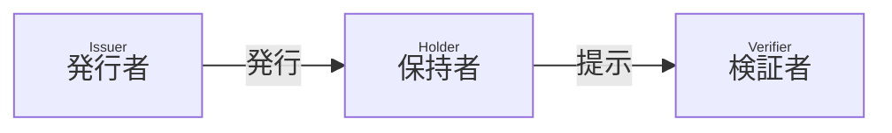
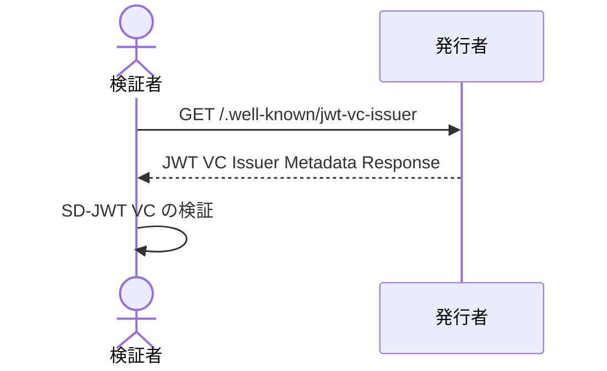
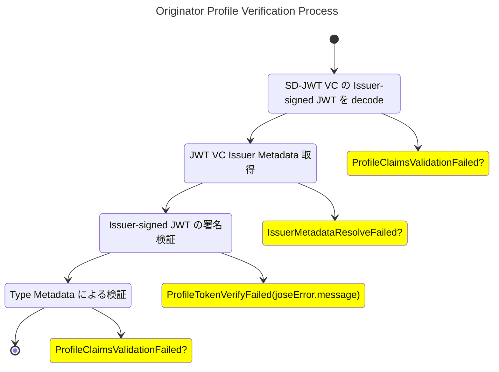

# Trust Mark - Editor's draft

## 概要

本文書では、SD-JWT に基づく Verifiable Credential (SD-JWT VC) を使用して、組織の保有する認証を表明する方法について説明します。

[SD-JWT VC Data Model](https://github.com/danielfett/sd-jwt-vc-dm) に従って、発行者は SD-JWT VC を発行し、保持者はそれを検証者に提示できます。SD-JWT VC には、発行者によって署名された組織の認証が含まれます。



このプロセスにより、保持者は組織に関する情報を暗号的に検証可能な情報として検証者に提示することができます。

## 用語

本文書に説明のない用語については、用語 RFC 文書を参照してください。

- [SD-JWT VC](https://datatracker.ietf.org/doc/draft-ietf-oauth-sd-jwt-vc/)
- Originator Profile ID (OP ID)
- Originator Profile (OP)

## Originator Profile ID (OP ID)

OP ID は保持者の組織を一意に識別するための識別子です。
発行者は各組織に一意の OP ID を割り当て、それを SD-JWT VC `sub` クレームに含められます。
使用される OP ID の形式は本仕様の範囲外です。

## Trust Mark (OP) の形式

Trust Mark は組織が受けた認定を表明するデータです。
必ず SD-JWT VC 形式でなければなりません (MUST)。

### クレーム

発行者はこの他にクレームを追加してもよいです (MAY) が、それらは本仕様の範囲外です。

:::note

Originator Profile 技術研究組合が開発するアプリケーションで使用されるクレームについては、 [Organization Metadata Schema RFC 文書](./7.md)を参照してください。

:::

#### `vct`

REQUIRED. SD-JWT VC のタイプの識別子です。 [SD-JWT VC セクション 6.3.1](https://www.ietf.org/archive/id/draft-ietf-oauth-sd-jwt-vc-04.html#name-from-a-url-in-the-vct-claim) に従い、`https://<authority>/.well-known/vct/<type>` への GET リクエストで Type Metadata を取得できなければなりません (MUST)。検証者はクレームの型を指定する JSON Schema や、選択的開示可能かどうか、各クレームの情報の正しさが誰によって確認されたかを知ることができます。

本セクションに挙げる必須クレームについて、[RFC 7519 セクション 4.1](https://www.rfc-editor.org/rfc/rfc7519#section-4.1) で定義されている JWT クレームを除き、`schema` プロパティあるいは `schema_url` プロパティにより構造を検証可能にしなければなりません (MUST)。

#### `vct#integrity`

REQUIRED. [SD-JWT VC Document Integrity](https://www.ietf.org/archive/id/draft-ietf-oauth-sd-jwt-vc-04.html#name-document-integrity) に従い検証可能にしなければなりません (MUST)。

#### `iss`

REQUIRED. 発行者の識別子です。
`iss` クレームの値は、URL でなければなりません (MUST)。 JWT VC 発行者のメタデータを公開する場合、HTTPS の URL でなければなりません (MUST)。

#### `iss#integrity`

REQUIRED. [SD-JWT VC Document Integrity](https://www.ietf.org/archive/id/draft-ietf-oauth-sd-jwt-vc-04.html#name-document-integrity) に従い検証可能にしなければなりません (MUST)。

#### `sub`

REQUIRED. Trust Mark 保有組織の OP ID です。

#### 例

クレームの具体例を次に示します。

```json
{
  "vct": "https://originator-profile.org/certificate",
  "vct#integrity": "sha256-yYu9mVg5URjeq3jfVl2e6SAkVVdJYbJihKlP/0bYmEg=",
  "iss": "https://example.org/",
  "iss#integrity": "sha256-yYu9mVg5URjeq3jfVl2e6SAkVVdJYbJihKlP/0bYmEg=",
  "sub": "example.jp",
  "iat": 1680274800,
  "exp": 1743433200,
  "locale": "ja-JP",
  "name": "○○認証 (※開発用サンプル)",
  "description": "これは○○認証の開発用サンプルです。",
  "ref": "https://example.or.jp/about",
  "image": "https://example.or.jp/credential/image.svg",
  "image#integrity": "sha256-aA2O5YTvhXCYA9ci7rtJ/zJIpsbAyOhy3YXeQEYGZV8=",
  "certification_system_id": "5374a35f-57ce-43fd-84c3-2c9b0163e3df",
  "certifier": {
    "domain_name": "example.or.jp",
    "url": "https://example.or.jp/",
    "country": "JP",
    "name": "○○協会 (※開発用サンプル)",
    "logo": "https://example.or.jp/image/icon.svg",
    "logo#integrity": "sha256-aA2O5YTvhXCYA9ci7rtJ/zJIpsbAyOhy3YXeQEYGZV8=",
    "corporate_number": "0000000000000",
    "postal_code": "000-0000",
    "region": "東京都",
    "locality": "千代田区",
    "street_address": "○○○",
    "contact_title": "お問い合わせ",
    "contact_url": "https://example.or.jp/contact",
    "privacy_policy_title": "プライバシーポリシー",
    "privacy_policy_url": "https://example.or.jp/privacy"
  },
  "verifier": {
    "domain_name": "example.or.jp",
    "url": "https://example.or.jp/",
    "country": "JP",
    "name": "○○協会 (※開発用サンプル)",
    "logo": "https://example.or.jp/image/icon.svg",
    "logo#integrity": "sha256-aA2O5YTvhXCYA9ci7rtJ/zJIpsbAyOhy3YXeQEYGZV8=",
    "corporate_number": "0000000000000",
    "postal_code": "000-0000",
    "region": "東京都",
    "locality": "千代田区",
    "street_address": "○○○",
    "contact_title": "お問い合わせ",
    "contact_url": "https://example.or.jp/contact",
    "privacy_policy_title": "プライバシーポリシー",
    "privacy_policy_url": "https://example.or.jp/privacy"
  }
}
```

:::note

例には本文書で定義されていないクレーム・プロパティも含んでいます。それらの定義は Certificate Metadata Schema RFC 文書を参照してください。

:::

## 署名アルゴリズム

<!-- [暗号アルゴリズム RFC文書](./19.md)を参照してください。 -->

## 公開鍵の配布

検証者は SD-JWT VC の署名を検証するために発行者の公開鍵を取得する必要があります。

発行者は JWT VC 発行者のメタデータによって公開鍵を配布してもよい (MAY) ですが、他の配布方法を禁止するものではありません。

JWT VC 発行者のメタデータには、SD-JWT VC の 署名に使ったプライベート鍵に対応する発行者の公開鍵が含まれます。

### JWT VC Issuer Metadata 例

JWT VC Issuer Metadata Response の具体例を次に示します。

```json
{
  "issuer": "https://example.org/",
  "jwks": {
    "keys": [
      {
        "alg": "ES256",
        "use": "sig",
        "kid": "7t4ppO9Ci-SPlKwRMWLrUvjkr9QmqDDVNViRRLBJztM",
        "crv": "P-256",
        "kty": "EC",
        "x": "ySDJ7orlv-kj0vuZclAFPPCXh_yy7qucQCsuiLDPJVk",
        "y": "mbYRzJaIAYYfi5jonGYVN-_9B3AcgCZwFs022UwFOSc"
      }
    ]
  }
}
```

## 検証プロセス

_本セクションは参考情報です。_

:::note

TODO: 検証プロセスの定義はまだ途中です。

:::

検証者は次の手順に従って SD-JWT VC を検証できます (OPTIONAL)。



1. 検証者は SD-JWT VC 発行者のメタデータを要求します。
2. 発行者は JWT VC Issuer Metadata Response を返却します。
3. 検証者は SD-JWT VC Verification and Processing に従って、SD-JWT VC の内容を検証します。



### エラー

具体的なエラーのシンタックスは本文書の範囲外です。
検証者はこの他に検証プロセスを追加してもよいです (MAY)。
検証者のポリシーに従い SD-JWT VC の開示を拒否または承認できます。

## 失効プロセス

_本セクションは参考情報です。_

発行者は SD-JWT VC `status` クレームを含めることができます (OPTIONAL)。
SD-JWT VC に基づく Status Provider による失効プロセスをサポートできます。

## セキュリティ

_本セクションは参考情報です。_

SD-JWT VC のセキュリティに依存します。実装者はプライベート鍵や機密情報の取り扱いに十分注意し、それらを保護する必要な予防措置を講じる必要があります。
