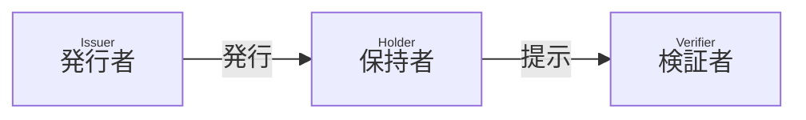

# Certificate - Editor's draft

## 概要

本文書では、SD-JWT に基づく Verifiable Credential (SD-JWT VC) を使用する方法について説明します。

[SD-JWT VC Data Model](https://github.com/danielfett/sd-jwt-vc-dm) に従って、発行者は SD-JWT VC を発行し、保持者はそれを検証者に提示できます。



## 用語

本文書に説明のない用語については、用語 RFC 文書を参照してください。

- [SD-JWT VC](https://datatracker.ietf.org/doc/draft-ietf-oauth-sd-jwt-vc/)
- Certificate: 本文書で定義される証明書

## Certificate の形式

必ず SD-JWT VC 形式でなければなりません (MUST)。

### クレーム

発行者はこの他にクレームを追加してもよいです (MAY) が、それらは本仕様の範囲外です。

:::note

Originator Profile 技術研究組合が開発するアプリケーションで使用されるクレームについては、Certificate Metadata を参照してください。

:::

#### `vct`

REQUIRED. 必ず https://originator-profile.org/certificate でなければなりません (MUST)。

これは SD-JWT VC のタイプの識別子です。 [SD-JWT VC セクション 6.3.1](https://www.ietf.org/archive/id/draft-ietf-oauth-sd-jwt-vc-04.html#name-from-a-url-in-the-vct-claim) に従い、`https://<authority>/.well-known/vct/<type>` への GET リクエストで Type Metadata を取得できなければなりません (MUST)。検証者はクレームの型を指定する JSON Schema や、選択的開示可能かどうか、各クレームの情報の正しさが誰によって確認されたかを知ることができます。

本セクションに挙げる必須クレームについて、[RFC 7519 セクション 4.1](https://www.rfc-editor.org/rfc/rfc7519#section-4.1) で定義されている JWT クレームを除き、`schema` プロパティあるいは `schema_url` プロパティにより構造を検証可能にしなければなりません (MUST)。

#### `vct#integrity`

REQUIRED. [SD-JWT VC セクション 7 Document Integrity](https://www.ietf.org/archive/id/draft-ietf-oauth-sd-jwt-vc-04.html#name-document-integrity) に従い検証可能にしなければなりません (MUST)。

#### `iss`

REQUIRED. 発行者の識別子です。
`iss` クレームの値は、URL でなければなりません (MUST)。 JWT VC 発行者のメタデータを公開する場合、HTTPS の URL でなければなりません (MUST)。

#### `sub`

REQUIRED. 保有者の Originator Profile ID です。

#### 例

クレームの具体例を次に示します。

```json
{
  "vct": "https://originator-profile.org/certificate",
  "vct#integrity": "sha256-yYu9mVg5URjeq3jfVl2e6SAkVVdJYbJihKlP/0bYmEg=",
  "iss": "https://example.org/",
  "iss#integrity": "sha256-yYu9mVg5URjeq3jfVl2e6SAkVVdJYbJihKlP/0bYmEg=",
  "sub": "example.jp",
  "first_issued_at": 1620294800,
  "iat": 1680274800,
  "exp": 1743433200,
  "locale": "ja-JP",
  "name": "○○認証 (※開発用サンプル)",
  "description": "これは○○認証の開発用サンプルです。",
  "ref": "https://example.or.jp/about",
  "image": "https://example.or.jp/credential/image.svg",
  "image#integrity": "sha256-aA2O5YTvhXCYA9ci7rtJ/zJIpsbAyOhy3YXeQEYGZV8=",
  "certification_system_id": "5374a35f-57ce-43fd-84c3-2c9b0163e3df",
  "certifier": {
    "domain_name": "example.or.jp",
    "url": "https://example.or.jp/",
    "country": "JP",
    "name": "○○協会 (※開発用サンプル)",
    "logo": "https://example.or.jp/image/icon.svg",
    "logo#integrity": "sha256-aA2O5YTvhXCYA9ci7rtJ/zJIpsbAyOhy3YXeQEYGZV8=",
    "corporate_number": "0000000000000",
    "postal_code": "000-0000",
    "region": "東京都",
    "locality": "千代田区",
    "street_address": "○○○",
    "contact_title": "お問い合わせ",
    "contact_url": "https://example.or.jp/contact",
    "privacy_policy_title": "プライバシーポリシー",
    "privacy_policy_url": "https://example.or.jp/privacy"
  },
  "verifier": {
    "domain_name": "example.or.jp",
    "url": "https://example.or.jp/",
    "country": "JP",
    "name": "○○協会 (※開発用サンプル)",
    "logo": "https://example.or.jp/image/icon.svg",
    "logo#integrity": "sha256-aA2O5YTvhXCYA9ci7rtJ/zJIpsbAyOhy3YXeQEYGZV8=",
    "corporate_number": "0000000000000",
    "postal_code": "000-0000",
    "region": "東京都",
    "locality": "千代田区",
    "street_address": "○○○",
    "contact_title": "お問い合わせ",
    "contact_url": "https://example.or.jp/contact",
    "privacy_policy_title": "プライバシーポリシー",
    "privacy_policy_url": "https://example.or.jp/privacy"
  },
  "category": "業界団体による認証"
}
}
```

## 公開鍵の配布

検証者は SD-JWT VC の署名を検証するために発行者の公開鍵を取得する必要があります。

発行者は JWT VC 発行者のメタデータによって公開鍵を配布してもよい (MAY) ですが、他の配布方法を禁止するものではありません。

JWT VC 発行者のメタデータには、SD-JWT VC の 署名に使ったプライベート鍵に対応する発行者の公開鍵が含まれます。

### JWT VC Issuer Metadata 例

JWT VC Issuer Metadata Response の具体例を次に示します。

```json
{
  "issuer": "https://example.org/",
  "jwks": {
    "keys": [
      {
        "alg": "ES256",
        "use": "sig",
        "kid": "7t4ppO9Ci-SPlKwRMWLrUvjkr9QmqDDVNViRRLBJztM",
        "crv": "P-256",
        "kty": "EC",
        "x": "ySDJ7orlv-kj0vuZclAFPPCXh_yy7qucQCsuiLDPJVk",
        "y": "mbYRzJaIAYYfi5jonGYVN-_9B3AcgCZwFs022UwFOSc"
      }
    ]
  }
}
```

## 検証エラー

_本セクションは参考情報です。_

具体的なエラーのシンタックスとセマンティクスは本文書の範囲外です。
検証者はこの他に検証プロセスを追加してもよいです (MAY)。
検証者のポリシーに従い SD-JWT VC の開示を拒否または承認できます。

## 失効プロセス

_本セクションは参考情報です。_

発行者は SD-JWT VC `status` クレームを含めることができます (OPTIONAL)。
SD-JWT VC に基づく Status Provider による失効プロセスをサポートできます。

## セキュリティ

_本セクションは参考情報です。_

SD-JWT VC のセキュリティに依存します。実装者はプライベート鍵や機密情報の取り扱いに十分注意し、それらを保護する必要な予防措置を講じる必要があります。
