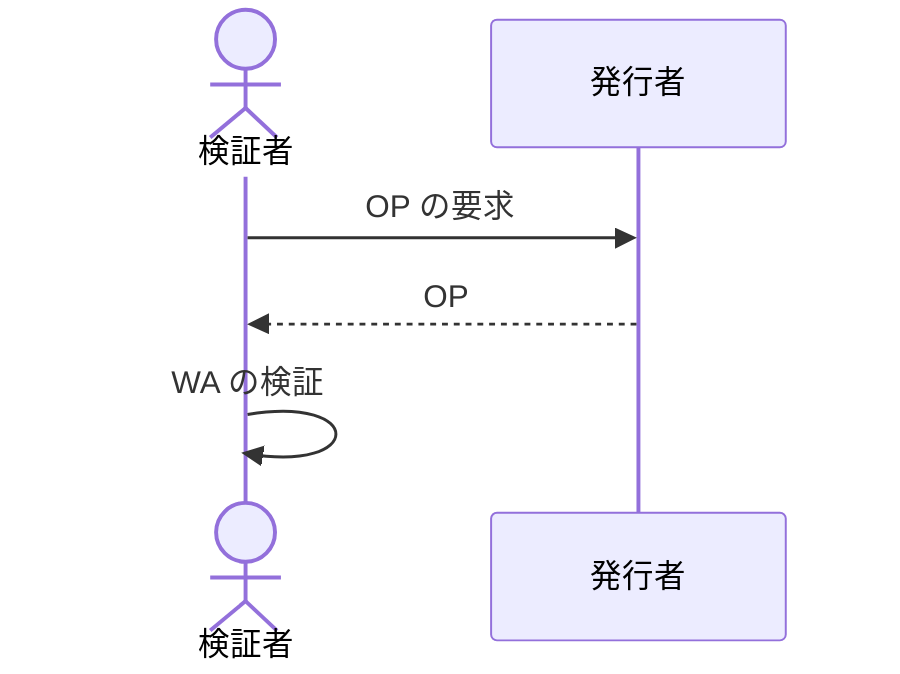

# Web Assertion - Editor's Draft

## 概要

本文書では、SD-JWT に基づく Verifiable Credential (SD-JWT VC) を使用して、Web コンテンツの範囲を表明する方法について説明します。

[SD-JWT VC Data Model](https://github.com/danielfett/sd-jwt-vc-dm) に従って、発行者は SD-JWT VC を発行し、保持者はそれを検証者に提示できます。SD-JWT VC には、発行者によって署名された Web コンテンツの範囲に関する情報が含まれます。
発行者はコンテンツの範囲に関する情報を暗号的に検証可能な情報として送信できます。

## 範囲

- Web サイト、DOM Content (HTML/Text/Visible Text Target)、画像ファイルなどの静的な外部のリソース (External Resource Target) に関する情報への署名を対象とします。
- DOM Content は HTML に静的に埋め込まれたものか JavaScript で動的に生成されたものか問いません。
- Web ページ、Web コンテンツの集合をパッケージ化したもの (具体例: Signed HTTP Exchange や eBook など) については本文書の範囲外です。
- 検証のタイミングについては本文書の範囲外です。

:::note

検証対象としてはページロード完了時、利用者の能動的な確認操作などに起因する特定イベントベースでの検証の他に、リアルタイムでの動的な DOM の読み込み、書き換え中の検証も考えられるが、CSS セレクターの対象要素の変更や Visible Text Target のように Rendered なテキストを署名対象とするアルゴリズムが DOM 書き換え中のリアルタイム検証とは相性が悪い。ブラウザの性能/消費電力に対するインパクトからも一定のタイミングでの検証とするのが良いのではないか。

また、危険なサイトなどのブロックと異なり情報発信者の検証はセキュリティ的に読み込みすること自体を避けるべき危険性は低いこと、Rendered テキストに対する署名をするというアルゴリズムの存在からも、読み込み/表示をブロックせず読み込み後に検証し、検証が通らない場合には対象コンテンツを隠す/警告する程度の対応をブラウザとして実装する事が想定されるため、検証タイミングは描画段階/リアルタイム性を必要としない想定である。

:::

## 用語

本文書に説明のない用語については、用語 RFC 文書を参照してください。

- [SD-JWT VC](https://datatracker.ietf.org/doc/draft-ietf-oauth-sd-jwt-vc/)
- Originator Profile (OP)
- Web Content
- Content Metadata: Web Content についての情報。
- Target Integrity
- Web Assertion (WA)

## Web Assertion (WA) の形式

WA はコンテンツの範囲に関する情報を表明するために使用されるデータです。
必ず SD-JWT VC 形式でなければなりません (MUST)。

:::note

同じページに対して複数の WA を発行する場合に、 WA の間の関係性を示すクレーム・プロパティは存在しません。実験においてこれで支障ないか確認する予定です。参考: https://github.com/originator-profile/profile/issues/1428

:::

### クレーム

発行者はこの他にクレームを追加してもよいです (MAY) が、それらは本仕様の範囲外です。

:::info

Originator Profile 技術研究組合が開発するアプリケーションで使用されるクレームについては、次の RFC 文書を参照してください。

- Content Metadata Schema
- Advertisement Metadata Schema
- Website Metadata Schema

:::

特別な要件がない限り、実装によってそのクレームをどう解釈するべきか分からない、あるいは認識できないクレームは必ず無視されなければなりません (MUST)。

#### `vct`

REQUIRED. SD-JWT VC のタイプの識別子です。 [SD-JWT VC Type Metadata セクション 3](https://vcstuff.github.io/sd-jwt-vc-types/draft-fett-oauth-sd-jwt-vc-types.html#name-retrieving-metadata) に基づき、`https://<authority>/.well-known/vct/<type>` への GET リクエストで metadata document を取得できなければなりません (MUST)。検証者はクレームの型を指定する JSON Schema や、選択的開示可能かどうか、各クレームの情報の正しさが誰によって確認されたかを知ることができます。

本セクションに挙げる必須クレームについて、[RFC7519 セクション 4.1](https://datatracker.ietf.org/doc/html/rfc7519#section-4.1) で定義されている JWT クレームを除き、[SD-JWT VC Type Metadata セクション 9](https://vcstuff.github.io/sd-jwt-vc-types/draft-fett-oauth-sd-jwt-vc-types.html#name-schema) に基づく schema プロパティあるいは schema_url プロパティにより構造を検証可能にしなければなりません (MUST)。 `schema`, `schema_url` プロパティで指定した JSON Schema はこの仕様を満たす必要があります (MUST)。

#### `vct#integrity`

REQUIRED. [SD-JWT VC Type Metadata セクション 4](https://vcstuff.github.io/sd-jwt-vc-types/draft-fett-oauth-sd-jwt-vc-types.html) に従い検証可能にしなければなりません。

#### `iss`

REQUIRED. WA 発行組織の OP ID を [RFC 4501](https://www.rfc-editor.org/rfc/rfc4501.html)に基づき URI で含めなければなりません (MUST)。例: `dns:example.com`

#### `sub`

REQUIRED. Web Content の WA ID でなければなりません (MUST)。 WA ID は [UUIDv4](https://www.rfc-editor.org/rfc/rfc9562.html#name-uuid-version-4) 形式の文字列です。 Web Content と WA ID は一対一対応します。

#### `iat`, `exp`

REQUIRED. [JWT の仕様 4.1 節](https://www.rfc-editor.org/rfc/rfc7519.html#section-4.1)に従います。

#### `allowed_urls`

OPTIONAL. この WA によって表明される情報の対象となる URL の配列です。
配列の要素の文字列は必ず [URL Pattern strings](https://urlpattern.spec.whatwg.org/) 形式でなければなりません (MUST)。

#### `allowed_origins`

OPTIONAL. この WA によって表明される情報の対象となる [origin](https://www.rfc-editor.org/rfc/rfc6454#section-7) の配列です。

具体例: `["https://example.com"]`, `["https://a.example.com", "https://b.example.com"]`

#### `target`

OPTIONAL. Target Integrity の配列でなければなりません (MUST)。

Target Integrity は次のプロパティを持つ JSON Object です。

- type: REQUIRED. Target Integrity のタイプです。
- integrity: REQUIRED. [SRI 3.1](https://www.w3.org/TR/SRI/#integrity-metadata) の Integrity metadata でなければなりません (MUST)。具体例: `sha256-cujGNHetNOZ9K5wc9hbZfhPuaiCJQfWp-2jkFjUCimc`
- Web Content の位置および範囲を特定するプロパティ。REQUIRED. Target Integrity のタイプによりプロパティ名は異なります。

Target Integrity のタイプごとの形式は本仕様の範囲外です。

:::note

Target Integrity のそれぞれの type の署名検証方法が適切か、他にあると良い type があるかは、実システムへの導入を通じて検証する予定です。参考: https://github.com/originator-profile/profile/issues/1427

:::

#### 例

_本セクションは参考情報です。_

WA の具体例を示します。この WA は https://media.example.com/articles/2024-06-30 で公開されている Web Content に紐づいています。

```json
{
  "vct": "https://example.org/web_assertion",
  "vct#integrity": "sha256-o2zJ6gYOeJRgHgb05xK94kKKb8SIsBebOzalI0p2Pb4",
  "iss": "dns:example.com",
  "sub": "78550fa7-f846-4e0f-ad5c-8d34461cb95b",
  "iat": 1680274800,
  "exp": 1743433200,
  "locale": "ja-JP",
  "title": "<Webページのタイトル>",
  "description": "<Webページの説明>",
  "source": "https://media2.example.com/articles/1",
  "image": "https://media.example.com/image.png",
  "image#integrity": "sha256-...",
  "date_published": "2023-07-04T19:14:00Z",
  "date_modified": "2023-07-04T19:14:00Z",
  "editor": "山田太郎",
  "author": "山田花子",
  "categories": [
    { "cat": "IAB1", "cattax": "1", "name": "Arts & Entertainment" }
  ],
  "allowed_urls": ["https://media.example.com/articles/2024-06-30"],
  "target": [
    {
      "type": "visibleText",
      "selector": "<CSS セレクター>",
      "integrity": "sha256-..."
    },
    {
      "type": "externalResource",
      "selector": "https://...",
      "integrity": "sha256-..."
    }
  ]
}
```

この WA は https://ad.example.com 配下の Web ページに掲載されている広告 Web Content に紐づいています。

```json
{
  "vct": "https://example.org/wa_advertisement",
  "vct#integrity": "sha256-o2zJ6gYOeJRgHgb05xK94kKKb8SIsBebOzalI0p2Pb4",
  "iss": "dns:example.com",
  "sub": "78550fa7-f846-4e0f-ad5c-8d34461cb95b",
  "iat": 1680274800,
  "exp": 1743433200,
  "locale": "ja-JP",
  "title": "<広告のタイトル>",
  "description": "<広告の説明>",
  "image": "https://ad.example.com/image.png",
  "image#integrity": "sha256-...",
  "allowed_origins": ["https://ad.example.com"],
  "target": [
    {
      "type": "externalResource",
      "url": "https://...",
      "integrity": "sha256-..."
    }
  ]
}
```

この WA は https://media.example.com のウェブサイトに紐づいています。

```json
{
  "vct": "https://example.org/wa_website",
  "vct#integrity": "sha256-o2zJ6gYOeJRgHgb05xK94kKKb8SIsBebOzalI0p2Pb4",
  "iss": "dns:example.com",
  "sub": "78550fa7-f846-4e0f-ad5c-8d34461cb95b",
  "iat": 1680274800,
  "exp": 1743433200,
  "locale": "ja-JP",
  "title": "<Webサイトのタイトル>",
  "description": "<Webサイトの説明>",
  "image": "https://media.example.com/image.png",
  "image#integrity": "sha256-...",
  "allowed_origins": ["https://media.example.com"]
}
```

:::note

例には本文書で定義されていないクレーム・プロパティも含んでいます。それらの定義は metadata schema の定義を参照してください。

:::

### ハッシュアルゴリズム

Target Integrity の検証者は、 SHA-256 ハッシュ値による検証をサポートしなければなりません (MUST)。また、SHA-384、SHA-512 ハッシュ値による検証をサポートしてもよいです (MAY)。

実装者はハッシュアルゴリズムを定期的に見直し、危殆化したハッシュアルゴリズムは使用しないようにしてください。

:::note

ハッシュ関数のサポートについて何を参考にしてどのような基準で仕様として決めていくかは議論中です。

:::

<!-- SHA-384 以降に最初から決めるべきかもしれない。そこは茂哉さん/大久保さんからのインプット次第 -->

<!-- SRI 仕様を参照/ベースとしており、そちらで MUST としているものはこちらも MUST にした上で利用するものは SHA-256 を推奨しつつも再評価をし続けるべきという SRI 仕様の記述を参考にすると良い https://www.w3.org/TR/SRI/#the-integrity-attribute -->

:::note

Originator Profile 技術研究組合の開発するアプリケーションでは、当面の間、ハッシュアルゴリズムは SHA-256 のみをサポートします。

:::

### ヘッダー

#### `typ`

[RFC 8725 セクション 3.11](https://www.rfc-editor.org/rfc/rfc8725.html#name-use-explicit-typing)に従い、必ず `web-assertion+jwt` でなければなりません (MUST)。

### 署名アルゴリズム

許可リスト (検証側) は次のとおりです。

- `ES256` (RECOMMENDED)
- `ES384`
- `ES512`
- `PS256`
- `PS384`
- `PS512`

<!-- アルゴリズムを絞ったり、単一アルゴリズムを指定した上でバックアップアルゴリズムとして要実装なものを明記するとか、最初から署名側で利用するビット長を上げた仕様にするのかは大久保さんなどのインプットを待つ -->

これらの許可リストに含まれるいずれかの署名アルゴリズムをサポートする必要があります (MUST)。

検証者は、この許可リストに含まれない署名アルゴリズムでの検証を拒否しなければなりません (MUST)。

パフォーマンスとセキュリティのバランスを考慮し `ES256` を推奨しますが、他の署名アルゴリズムの使用を禁止するものではありません。

検証者はサポートしているアルゴリズムを定期的に見直し、危殆化したアルゴリズムの使用を中止してください (RECOMMENDED)。

:::note

C2PA 2.0 署名アルゴリズムの許可リストに含まれる `EdDSA` は[^1]、本仕様が書かれた時点ではサポートしない実装が一定数存在するため[^2]、`EdDSA` は許可リストに含めていません。

[^1]: https://c2pa.org/specifications/specifications/2.0/specs/C2PA_Specification.html#_signature_algorithms

[^2]: https://github.com/WICG/webcrypto-secure-curves/issues/20

:::

:::note

Originator Profile 技術研究組合の開発するアプリケーションでは、当面の間、署名アルゴリズムは ES256 のみをサポートします。

:::

## 公開鍵の配布

_本セクションは参考情報です。_

検証者は JWT の署名を検証するために発行者の公開鍵を取得する必要があります。

発行者は OP 保持者でなければなりません。
OP 保持者はその OP に紐づく鍵で署名しなければなりません。
発行者は OP によって公開鍵を配布しなければなりません。

## 検証プロセス

_本セクションは参考情報です。_

検証者は次の手順に従って WA を検証できます (OPTIONAL)。



1. 検証者は WA 発行者の OP を要求します。
2. 発行者は OP を返却します。
3. 検証者は OP に紐づく鍵を使用して WA の内容を検証します。

### `allowed_urls` の検証

検証者は次の手順に従って `allowed_urls` クレームを検証できます (OPTIONAL)。

1. WA が提示されたウェブページの URL を取得します。
2. `allowed_urls` クレームに 1\. の URL が含まれているか検索します。

### `allowed_origins` の検証

検証者は次の手順に従って `allowed_origins` クレームを検証できます (OPTIONAL)。

1. WA が提示されたウェブページの URL オリジンを取得します。
2. `allowed_origins` クレームが含まれる場合、1\. の URL オリジンが含まれているか検索します。

### Target Integrity の検証

検証者は `target` クレームの Target Integrity を検証できます (OPTIONAL)。

:::note

Target Integrity のタイプによっては、検証者の環境では検証が不可能な場合があります。たとえば、ブラウザによる描画が実行できない環境では、ブラウザによる描画結果が検証時必要な Target Integrity は検証が不可能です。

:::

検証者は Target Integrity のタイプごとに定義される検証方法で検証しなければならず (MUST)、検証に失敗した場合にはその Target Integrity の検証が失敗したことを閲覧者に提示してください (RECOMMENDED)。Target Integrity の失敗を、 WA の検証失敗と同じまたはより高い深刻度 (Severity) でユーザーに表示することは避けてください (RECOMMENDED)。

:::note

将来的には、特定のアプリケーションの特定の使い方において、 Target Integrity の検証結果の表示の仕方を規定する可能性があります。例えば、ユーザーがブラウザでページを閲覧しているときに OP 対応ツール・機能を利用して OP, WA を確認する利用状況を想定しています。

:::

参考情報として、テキストの Web Content の Target Integrity 検証プロセスの例を示します。

1. `selector` プロパティの CSS セレクターで指定した要素を検索します。
2. それらの要素を DOMString として取得します。
3. すべての要素を UTF-8 に符号化します。もし仮に対象が複数存在する場合は、それらの内容を結合します。
4. 符号化した文字列のハッシュ値と `integrity` プロパティのハッシュ値が一致することを確認します。

### エラー

具体的なエラーのシンタックスとセマンティクスは本文書の範囲外です。
検証者はこの他に検証プロセスを追加してもよいです (MAY)。
