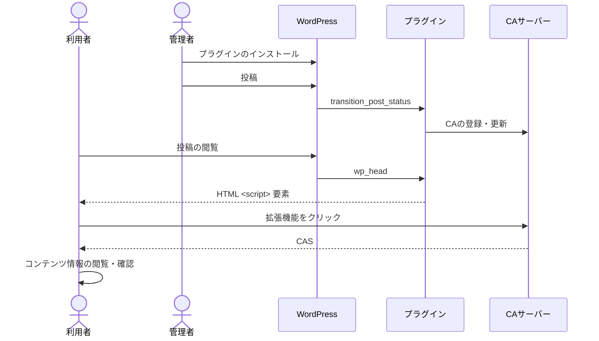

# WordPressプラグイン

## 概要

CMS運用の一例として、[OP CIP](https://originator-profile.org/)が提供するWordPressプラグインの実装について解説します。このプラグインの主な機能は以下の通りです。

1. WordPressでの投稿・更新時の投稿内容の処理
   - WordPressでの投稿または更新をトリガーとします
   - このトリガーにより投稿内容を処理し、CAサーバーのCA登録・更新エンドポイントに送信します
2. WordPressの投稿ページでのCAS配信
   - CAサーバーで管理されているコンテンツは投稿ページでCASとして配信されます

本文書は、このプラグインの技術的な仕組みや活用方法について詳しく解説し、CMS運用における活用例を紹介します。

## デモ

プラグインインストール済みの試験用 WordPress [wppdev.herokuapp.com](https://wppdev.herokuapp.com) にて運用しています。  
確認方法は[拡張機能での検証](/web-ext/verification-result.mdx)をご確認ください。

## インストール方法

以下の手順に沿ってWordPressプラグインをインストールおよび設定します。

1. プラグインのダウンロード  
   「Releases」にアクセスし、AssetsセクションからWordPressプラグイン（wordpress-profile-plugin.zip）を取得
2. プラグインのアップロード  
   WordPress公式サイトの[プラグイン新規追加画面](https://ja.wordpress.org/support/article/plugins-add-new-screen/)にある「プラグインをアップロード」の節を参照
3. プラグインの有効化
4. プラグインの設定  
   `WordPress 管理者画面 > Settings > Profile` にアクセスし、以下の必要項目を入力

### 設定項目

**[Originator Profile ID]: 事前に登録されているOriginator Profile IDを指定**

例:

```
dns:media.example.com
```

**[Content Attestation サーバーホスト名]: 利用するCAサーバーのホスト名を指定**

例:

```
dprexpt.originator-profile.org
```

**[認証情報]: CAサーバーへのアクセスに必要な情報を指定**

例:

```
cfbff0d1-9375-5685-968c-48ce8b15ae17:GVWoXikZIqzdxzB3CieDHL-FefBT31IfpjdbtAJtBcU
```

それぞれ適切な値を入力したら保存し、設定を反映します。
正しく設定が反映されると、それ以降の投稿は自動的にCAサーバーに送信されます。

## 処理の流れ

WordPress連携用プラグインでの処理の流れは以下の通りです。

利用者は、Webブラウザと拡張機能を利用していることを想定しています。



プラグインは、 [hook](https://developer.wordpress.org/plugins/hooks/) に対応した処理を実行します。

- `transition_post_status` : 投稿・更新のタイミングでトリガーされ、そのコンテンツの内容を変換し、CAサーバーの登録・更新エンドポイントに送信します
- `wp_head` : 投稿の閲覧のタイミングでトリガーされ、埋め込まれた `<script>` 要素を介して利用者はCASを取得します
  以上の処理により、投稿したコンテンツは自動的に管理され、利用者はその真正性を確認できます。

:::note
図中の拡張機能が CAS を CA サーバーに取得する箇所は、将来的に変更がある可能性があります。  
変更内容は CA 登録時に WordPress 側にCASを保存したものを拡張機能がWordPressから取得するというもので、変更ではなくモードを追加して対応することも検討中です。
:::
