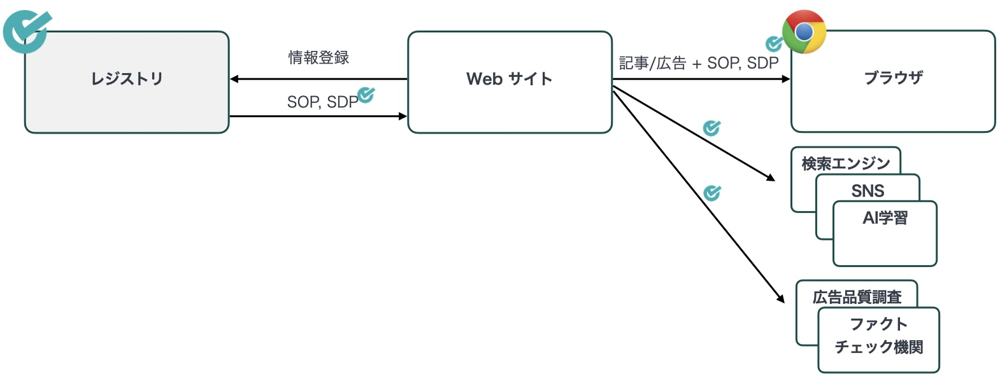
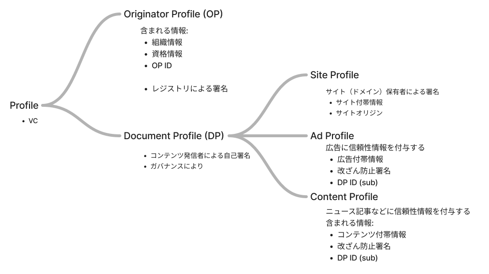
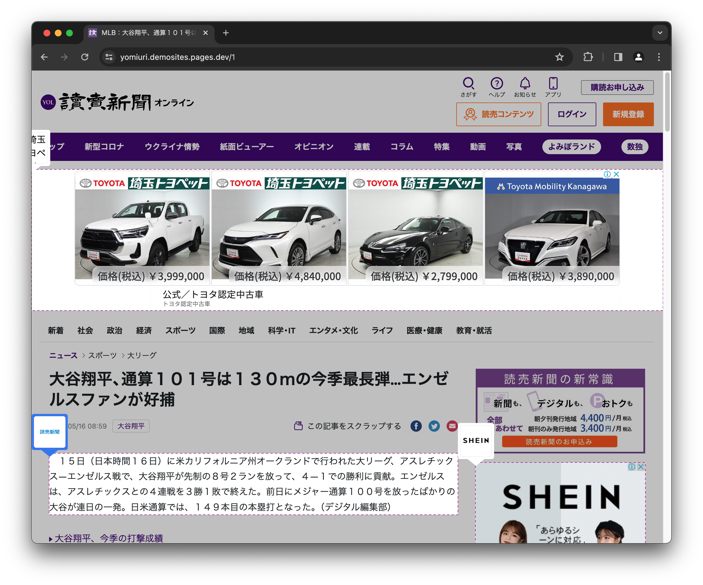

# OP の仕組み

次の図は OP の仕組みの概略です。

情報発信者がレジストリに登録/確認を受けて証明書 ([SOP](/terminology/signed-originator-profile.md)) を受け取り、作成したコンテンツとその情報に署名した証明書 ([SDP](/terminology/signed-document-profile.md)) と一緒にブラウザに送信する仕組みです。ブラウザは SOP, SDP を検証して受け取った情報の信頼性を確認・表示します。

将来的には検索エンジンなどのボット・クローラーや、ファクトチェックや広告品質に関する機関が、標準化された OP の仕組みを利用することを想定しています。

## データモデル

OP ではいくつかのデータ形式を定義しています。その関係性や主な特徴は次の図の通りです。

OP, DP はデータフォーマットとして Verifiable Credential (VC) を採用しています。 VC の仕様に基づき署名がされているため、記載情報の改ざんができません。また、 VC の IHV モデルの利点から OP, DP を利用者が検証する際にレジストリ等にアクセスがなくプライバシーの懸念がないことも特徴です。 OP, DP は署名付き (Signed) であることから、それぞれ **[SOP](/terminology/signed-originator-profile.md)**, **[SDP](/terminology/signed-document-profile.md)** と呼ぶことがあります。

**SOP** は情報の発信者の身元を表明するためのデータです。内容には基本的な組織情報だけでなく、組織の情報発信者ポリシーや、信頼性を示す第三者認証など資格情報も含みます。 OP の情報を見ることでユーザーは正しさの保証された情報から組織の信頼性を判断することができます。

**SDP** はコンテンツの付帯情報を表明するためのデータです。上の図のように、いくつかの種類に分けられます。広告向けの Ad Profile, ニュース記事向けの Document Profile, サイトの付帯情報を示す Site Profile があります。記載情報には真正性があり、 `iss` クレームにある OP ID から SOP と紐づけて発信者の信頼性を確認することができます。また、コンテンツの一部を指定して改竄を防止することもできます。

SOP は SOP を発行するレジストリによって署名がされています。レジストリは記載情報を確認してから署名・発行するため、 SOP 記載情報は第三者による確認がなされています。

SDP はコンテンツ発信者が自己署名をします。 SOP のように記載情報が第三者による確認を受けているわけではありません。虚偽・不正確な情報を記載する発信者が出てこないよう、 OP 全体のガバナンス設計によって SDP に正しい記載をすることを促す必要があります。

自己署名・第三者署名に関わらず、署名のおかげで SOP, SDP を自社サイト以外に流通させることができます。さまざまなサイトに表示される広告や、別メディアに再配信されるニュースなどのユースケースで活用できます。

コンテンツに SDP を紐づける場合、 SDP 署名者の SOP と合わせて Profile Set や Profile Pair などのデータ構造にまとめて配信してください。 SDP に対応する SOP がない場合 SDP の検証ができません。

## Web サイトでの利用

SOP, SDP を Web サイト上で利用するためには、 Web ページの HTML に [Profile Set](/terminology/profile-set.md), [Profile Pair](/terminology/profile-pair.md) へのリンクを埋め込みます。ユーザーは OP 拡張機能を開くことで、コンテンツに紐づく SOP, SDP を確認することができます。

import PopUpDp from "./assets/popup-dp.png";
import popUpOp from "./assets/popup-op.png";

  
  

ページ内の各コンテンツの位置も特定されます。

SOP, SDP の検証に失敗した場合、 OP 拡張機能に検証失敗の画面が表示されます。ユーザーに危険なサイトを閲覧している可能性があることを警告します。

import verificationFailed from "./assets/verification-failed.png";

