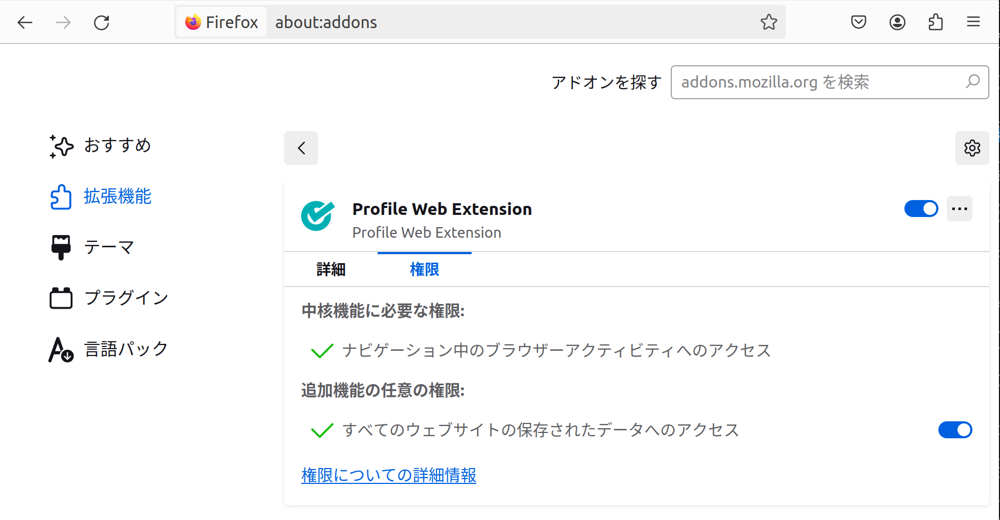

# 拡張機能の実験的利用

## ビルド

ルートディレクトリで `pnpm i && pnpm build` を実行すると `apps/web-ext/web-ext-artifacts/profile_web_extension-0.0.0.zip` のような ZIP ファイル
が生成されます。

## 配布

生成された ZIP ファイルを配布してください。

## インストール

### Chrome

1. ZIP ファイルを展開します。
2. chrome://extensions にアクセスします。
3. デベロッパーモードを有効にします。
4. 「パッケージ化されていない拡張機能を読み込む」を選択します。
5. ZIP ファイルから展開されたディレクトリを選択します。

## 利用

1. https://originator-profile.org にアクセスします。
2. 拡張機能を起動します。

## Firefoxでの初期設定手順 {#setup-in-firefox}

アドオンをインストールした後、以下の手順でサイトへのアクセス権限を有効にします。

1. メニューバーにあるアドオンのアイコンを右クリックします。
2. 「拡張機能を管理」を選択します。
3. 「権限」タブを選択します。
4. 「追加機能の任意の権限」欄に列挙されているアクセス権限を無効から有効に変更します。
