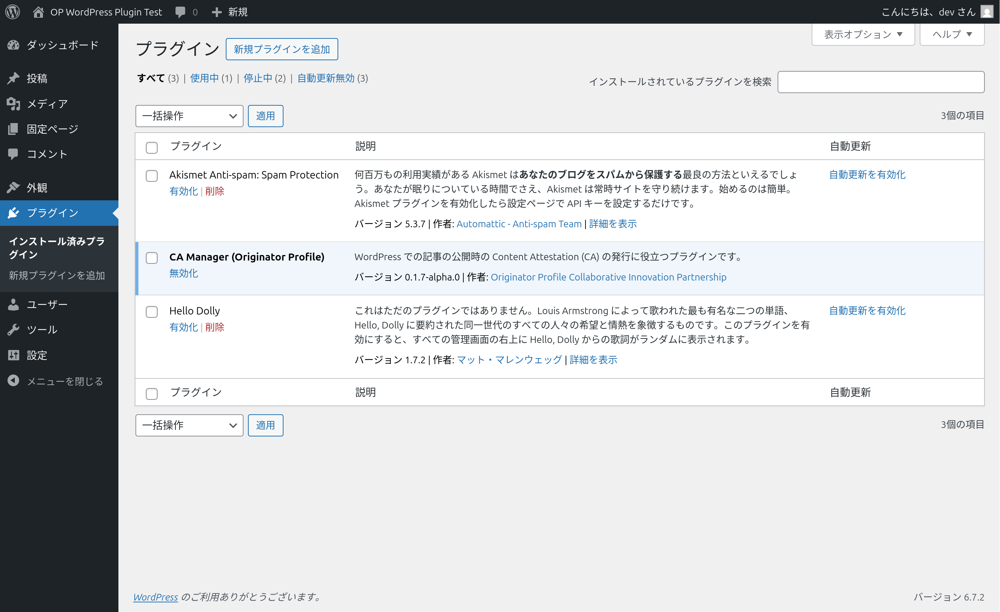
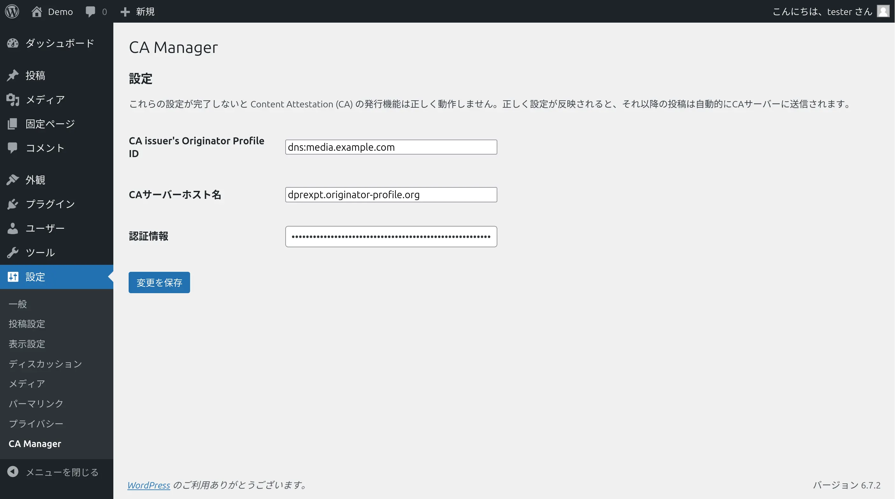
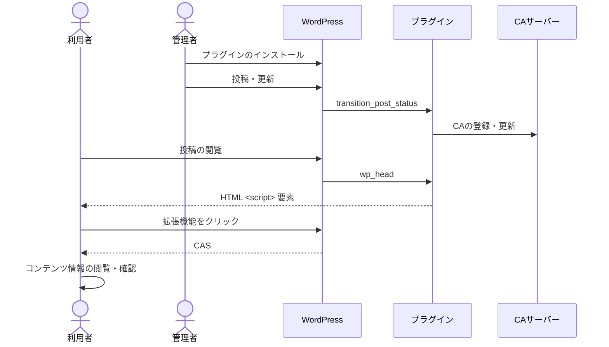

# CA Manager

WordPress での記事の公開時の Content Attestation (CA) の発行に役立つプラグインです。

## 機能

このプラグインの主な機能は以下の通りです。

1. WordPressでの投稿・更新時の投稿内容の処理
   - WordPressでの投稿または更新をトリガーとします
   - このトリガーにより投稿内容を処理し、CAサーバーのCA登録・更新エンドポイントに送信します
2. WordPressの投稿ページでのCAS配信

## デモ

プラグインインストール済みの試験用環境 [wppdev.herokuapp.com](https://wppdev.herokuapp.com) にて運用しています。

## プラグインのインストール



1. プラグインのダウンロード:
   「[Releases](https://github.com/originator-profile/profile-share/releases)」にアクセスし、AssetsセクションからWordPressプラグイン（wordpress-profile-plugin.zip）を取得
2. プラグインのアップロード:
   WordPress公式サイト「[プラグイン新規追加画面](https://ja.wordpress.org/support/article/plugins-add-new-screen/)」にある「プラグインをアップロード」の節を参照
3. プラグインの有効化
4. プラグインの設定:
   WordPress 管理者画面の「設定 > CA Manager」にアクセスし、以下の必要項目を入力 (後述)
5. `/.well-known/sp.json` の配置:
   詳細は「[サイトのOP対応](https://docs.originator-profile.org/studies/general-instruction/sp-setup-guide/)」を参照

### プラグインの設定



プラグイン有効化後、以下の必須項目を入力を行い設定する必要があります。

**[CA issuer's Originator Profile ID]: 自身のOriginator Profile IDを指定**

例:

```
dns:media.example.com
```

**[CAサーバーホスト名]: 利用するCAサーバーのホスト名を指定**

例:

```
dprexpt.originator-profile.org
```

**[認証情報]: CAサーバーへのアクセスに必要な情報を指定**

例:

```
cfbff0d1-9375-5685-968c-48ce8b15ae17:GVWoXikZIqzdxzB3CieDHL-FefBT31IfpjdbtAJtBcU
```

設定は WordPress 管理画面の「設定 > CA Manager」から行います。
これらの設定が完了しないと Content Attestation の発行機能は正しく動作しません。
正しく設定が反映されると、それ以降の投稿は自動的にCAサーバーに送信されます。

### `/.well-known/sp.json` の配置

配置場所:

ドキュメントルートが /var/www/html の場合、以下のパスに配置します。

```
/var/www/html/.well-known/sp.json
```

Webサーバーの設定によっては .well-known ディレクトリへのアクセスが制限されている場合があります。以下のように .well-known へのアクセスを許可します。

Apache:

```.htaccess
<Directory "/var/www/html/.well-known">
  AllowOverride None
  Require all granted
</Directory>
```

確認方法:

```
$ curl -sSf https://example.com/.well-known/sp.json
```

OPの含まれるSPが正しく取得できれば設定は完了です。

### 別の方法: OPの埋め込み

HTML中にscript要素を用いてOPを埋め込むことが可能です。

具体例:

```html
<script type="application/ops+json">
  [
    {
      "core": "eyJ...",
      "annotations": ["eyJ..."],
      "media": "eyJ..."
    }
  ]
</script>
```

詳細は「[サイトのOP対応](https://docs.originator-profile.org/studies/general-instruction/sp-setup-guide/)」または「[Linking Content Attestation Set and Originator Profile Set to A HTML Document](https://docs.originator-profile.org/rfc/link-to-html/)」をご確認ください。

## 処理の流れ

WordPress連携用プラグインでの処理の流れは以下の通りです。
ここでの利用者はWebブラウザと拡張機能を利用していることを想定しています。



[Hooks](https://developer.wordpress.org/plugins/hooks/) に応じた処理を実行します。

- `transition_post_status` : 投稿・更新のタイミングでトリガーされ、そのコンテンツの内容を変換し、CAサーバーの登録・更新エンドポイントに送信します
- `wp_head` : 投稿の閲覧のタイミングでトリガーされ、埋め込まれた `<script>` 要素を介して利用者はCASを取得します

以上の処理により、投稿したコンテンツは自動的に管理され、利用者はその真正性を確認できます。

## CA サーバー API の認証

CA サーバー API の Basic 認証をサポートしています。
Basic 認証以外の認証方式 (例: OAuth、JWT、API キー) を利用する場合、カスタマイズが必要です。
カスタマイズの方法については、[includes/issue.php](./includes/issue.php) `issue_ca()` の実装をご確認ください。

## ファイル構成

### config.php

`includes` ディレクトリの中に置かれている `config.php` ファイルには、このプラグインの設定値が含まれています。

#### PROFILE_DEFAULT_CA_SERVER_HOSTNAME

Content Attestation サーバーのホスト名の設定の初期値です。
このホスト名のエンドポイントを介して Content Attestation の登録・更新・取得を行います。
もし設定画面から設定を変更した場合、この値は参照されません。

#### PROFILE_CA_TARGET_TYPE

検証する対象の型です。現在、対象の要素の子孫のテキストへの署名を表す `TextTargetIntegrity` のみサポートしています。

#### PROFILE_CA_TARGET_CSS_SELECTOR

検証する対象の要素の場所を特定するための CSS セレクターです。
このプラグインは、投稿の各ページの内容から子要素の Node: textContent プロパティを結合した結果のテキストを対象として署名を行います。

## 開発ガイド

開発用 WordPress サーバーを利用して動作を確認できます。
Docker を利用し、ローカル環境に開発用の WordPress サーバーを構築します。

開発環境の構築

```
$ cd packages/wordpress
$ cp .env.development .env
$ docker compose run --rm -w /var/www/html/wp-content/plugins/ca-manager wordpress composer install
$ docker compose up -d
$ WORDPRESS_ADMIN_USER=tester WORDPRESS_ADMIN_PASSWORD=$(openssl rand -hex 16 | tee /dev/stderr) e2e/docker-setup.sh
: http://localhost:9000/wp-admin/ にアクセスし、下記の認証情報でログインできます。
:   Username: tester
:   Password: {上のコマンドの実行時に表示された32文字の16進数文字列}
```

コマンドの詳細は下記の通りです。

.env ファイルの配置

```
$ cp .env.development .env
```

開発用サーバーの起動

```
$ docker compose up -d
: http://localhost:9000 にアクセス
```

開発用サーバーの終了

```
$ docker compose down
```

Composer 依存関係の解決

```
$ docker compose run --rm -w /var/www/html/wp-content/plugins/ca-manager wordpress composer install
```

Composer スクリプトの実行

```
$ docker compose run --rm -w /var/www/html/wp-content/plugins/ca-manager wordpress composer run
```

## Composer スクリプト

help
: このテキストの表示

test
: テスト

lint
: 静的コード解析

format
: コード整形

## npm scripts

e2e
: E2E テスト

## 環境変数

WORDPRESS_IMAGE
: WordPress コンテナイメージ (デフォルト: `wordpress`)

WORDPRESS_IMAGE_DOCKERFILE
: WordPress コンテナイメージの Dockerfile (デフォルト: 無効)

WORDPRESS_DEBUG=1
: `WP_DEBUG` 有効化 (デフォルト: 無効)

WORDPRESS_USER
: 実行時のユーザー (デフォルト: `www-data`)

WORDPRESS_DB_PASSWORD
: データベースの初期パスワード

WORDPRESS_DB_ROOT_PASSWORD
: データベースの root ユーザーの初期パスワード

## パッケージング

プラグインをパッケージングします:

```
$ docker build --output=dist .
```

デプロイするには「[リリース方法](https://docs.originator-profile.org/release/)」を参照してください。
