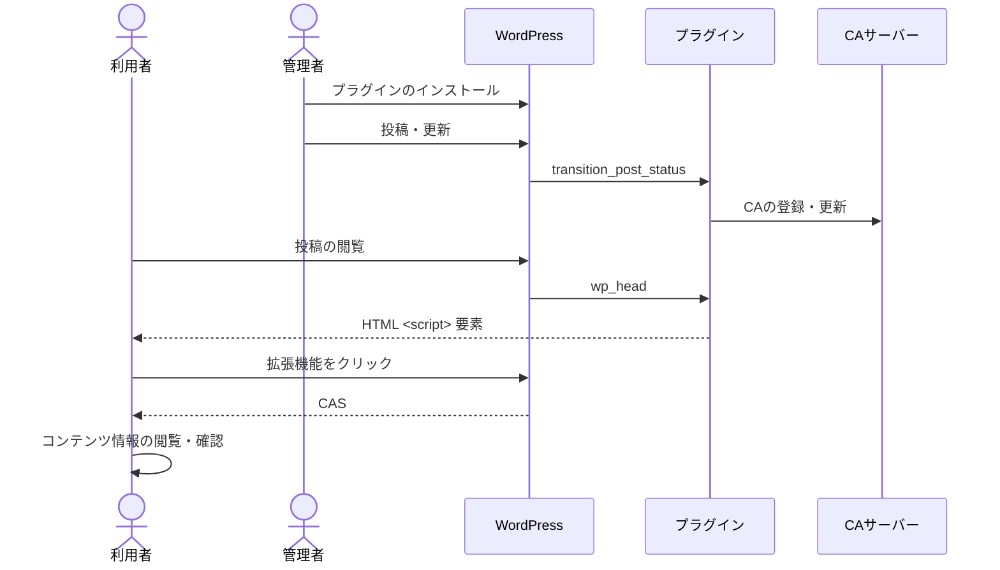

# WordPressプラグイン (CA Manager)

WordPress での記事の公開時の Content Attestation (CA) の発行に役立つプラグインです。

## 機能

このプラグインの主な機能は以下の通りです。

1. WordPressでの投稿・更新時の投稿内容の処理
   - WordPressでの投稿または更新をトリガーとします
   - このトリガーにより投稿内容を処理し、CAサーバーのCA登録・更新エンドポイントに送信します
2. WordPressの投稿ページでのCAS配信

## デモ

プラグインインストール済みの試験用環境を用意しています。

- https://op.cms.am/ (最新のメイン試験環境)

デモサイトの編集権限が必要な方は開発チームに相談してください。

## プラグインのインストール


1. プラグインのダウンロード:
   「[Releases](https://github.com/originator-profile/profile-share/releases)」にアクセスし、AssetsセクションからWordPressプラグイン（wordpress-ca-manager.zip）を取得
2. プラグインのアップロード:
   WordPress公式サイト「[プラグイン新規追加画面](https://ja.wordpress.org/support/article/plugins-add-new-screen/)」にある「プラグインをアップロード」の節を参照
3. プラグインの有効化
4. プラグインの設定:
   WordPress 管理者画面の「設定 > CA Manager」にアクセスし、以下の必要項目を入力 (後述)
5. `/.well-known/sp.json` の配置:
   詳細は「[サイトのOP対応](https://docs.originator-profile.org/studies/general-instruction/sp-setup-guide/)」を参照

### プラグインの設定

### 利用テーマに追加function

```
themes/functions.php
```

### 配置ファイル(WEBサーバ)

```
/extra/cas-auth.php (pluginディレクトリパスを要確認)
```

### 固定ページ追加(API認証リダイレクト用)

- 固定ページ作成
  - タイトル：cas-auth
  - 公開して page_id をメモ
- ヘッダー/フッター削除
  - 外観 > テーマ > カスタマイズ > スタイル > 追加CSS
  - 以下の追加CSSを貼り付ける
    ```
    /* API認証固定ページでヘッダーとフッターを非表示にする */
        .page-id-[固定ページID] header,
        .page-id-[固定ページID] footer {
          display: none;
        }
    ```
- ショートコード配置
  ```
  [requireApiAuth]
  ```
- パーマリンク(/cas-auth/)
  - 設定 > パーマリンク
  - パーマリンク構造：投稿名

## 設定

### (事前)CAサーバ管理画面

- APIアカウント設定
  - APIアカウントメールアドレス
  - APIアカウントパスワード
  - WebサイトURL
  - クライアントID
  - クライアントシークレット
  - リダイレクトURL(https://サイトURL/cas-auth/)
- WP認証情報の取得


プラグイン有効化後、以下の必須項目を入力を行い設定する必要があります。

**[CA issuer's Originator Profile ID]: 自身のOriginator Profile IDを指定**

例:

```
dns:media.example.com
```

**[CAサーバーホスト名]: 利用するCAサーバーのホスト名を指定**

例:

```
dprexpt.originator-profile.org
```

**[認証情報]: CAサーバーへのアクセスに必要な情報を指定**

例:

```
cfbff0d1-9375-5685-968c-48ce8b15ae17:GVWoXikZIqzdxzB3CieDHL-FefBT31IfpjdbtAJtBcU
```

**検証対象の種別**

例:

```
TextTargetIntegrity
```

**検証対象要素CSSセレクター**

例:

```
.wp-block-post-content>*:not(.post-nav-links)
```

**検証対象要素の存在するHTML**

例:

```html
<!DOCTYPE html>
<html>
  <head>
    <meta charset="UTF-8" />
  </head>
  <body class="wp-block-post-content">
    %CONTENT%
  </body>
</html>
```

`%CONTENT%` は `apply_filters()` 適用後の WordPress 投稿内容に置換され、リクエストコンテンツ `target[0].content` プロパティとしてCAサーバーに送信されます。

**[CA Presentation Type]: CASを埋め込み形式かリンク形式か指定**

デフォルトは Embedded となっています。

- Embedded: CAS を埋め込み形式(Embedded)にして記事を投稿します。

例:

```html
<script type="application/cas+json">
  ["eyJ..."]
</script>
```

- External: CAS を静的ファイルとして生成し、リンク形式(External)にして記事を投稿します。

CA Presentaion Type が External 時、静的ファイルを生成するディレクトリとして下記のように定義されています。

```
const PROFILE_DEFAULT_CA_EXTERNAL_DIR = 'cas';
```

ドキュメントルートが /var/www/html の場合、以下のパスに静的ファイルが配置されます。

```
/var/www/html/cas/<ポストid>_cas.json
```

例:

```html
<script
  src="https://example.com/cas/1_cas.json"
  type="application/cas+json"
></script>
```

ドキュメントルート配下に cas ディレクトリが存在しない場合、 cas ディレクトリが作成されます。  
 また、ポストidが同一の場合、静的ファイルは上書きされます。

確認方法:

```
$ curl -sSf https://example.com/cas/1_cas.json
```

設定は WordPress 管理画面の「設定 > CA Manager」から行います。
これらの設定が完了しないと Content Attestation の発行機能は正しく動作しません。
正しく設定が反映されると、それ以降に更新した投稿と新規投稿は自動的にCAサーバーに送信されます。

**ログの出力設定**

デフォルトは無効となっています。

有効にすると CA Manager プラグインに関するログが出力され、内容が表示されるようになります。  
ログファイルを生成するディレクトリとして下記のように定義されています。

```
const PROFILE_DEFAULT_CA_LOG_DIR = 'ca-manager-log';
```

ドキュメントルートが /var/www/html の場合、以下のパスにログが出力されます。
ログファイルが存在しない場合、新たに生成されます。

```
/var/www/html/wp-content/ca-manager-log/ca-manager-debug.log
```

また、CA Manager プラグイン有効化時、以下のパスに以下の内容でアクセス制御を行うファイルを自動生成します。

```
/var/www/html/wp-content/ca-manager-log/.htaccess
/var/www/html/wp-content/ca-manager-log/index.php
```

Apache:

```.htaccess
<FilesMatch "\.(log|txt)$">
  Require all denied
</FilesMatch>
```

Apache 以外のアクセス制御を行うファイルは自動生成されませんので、適宜アクセス制御を行うようにしてください（推奨）。

無効にするとログは出力されず、内容も表示されなくなります。

### `/.well-known/sp.json` の配置

配置場所:

ドキュメントルートが /var/www/html の場合、以下のパスに配置します。

```
/var/www/html/.well-known/sp.json
```

Webサーバーの設定によっては .well-known ディレクトリへのアクセスが制限されている場合があります。以下のように .well-known へのアクセスを許可します。

Apache:

```.htaccess
<Directory "/var/www/html/.well-known">
  AllowOverride None
  Require all granted
</Directory>
```

確認方法:

```
$ curl -sSf https://example.com/.well-known/sp.json
```

OPの含まれるSPが正しく取得できれば設定は完了です。

### 別の方法: OPの埋め込み

HTML中にscript要素を用いてOPを埋め込むことが可能です。

具体例:

```html
<script type="application/ops+json">
  [
    {
      "core": "eyJ...",
      "annotations": ["eyJ..."],
      "media": "eyJ..."
    }
  ]
</script>
```

詳細は「[サイトのOP対応](https://docs.originator-profile.org/studies/general-instruction/sp-setup-guide/)」または「[Linking Content Attestation Set and Originator Profile Set to A HTML Document](https://docs.originator-profile.org/opb/link-to-html/)」をご確認ください。

## 処理の流れ

WordPress連携用プラグインでの処理の流れは以下の通りです。
ここでの利用者はWebブラウザと拡張機能を利用していることを想定しています。



[Hooks](https://developer.wordpress.org/plugins/hooks/) に応じた処理を実行します。

- `transition_post_status` : 投稿・更新のタイミングでトリガーされ、そのコンテンツの内容を変換し、CAサーバーの登録・更新エンドポイントに送信します
- `wp_head` : 投稿の閲覧のタイミングでトリガーされ、埋め込まれた `<script>` 要素を介して利用者はCASを取得します

以上の処理により、投稿したコンテンツは自動的に管理され、利用者はその真正性を確認できます。

## CA サーバー API の認証

CA サーバー API の Basic 認証をサポートしています。
Basic 認証以外の認証方式 (例: OAuth、JWT、API キー) を利用する場合、カスタマイズが必要です。
カスタマイズの方法については、[includes/issue.php](./includes/issue.php) `issue_ca()` の実装をご確認ください。

## ファイル構成

### config.php

`includes` ディレクトリの中に置かれている `config.php` ファイルには、このプラグインの設定値が含まれています。

#### PROFILE_DEFAULT_CA_SERVER_HOSTNAME

Content Attestation サーバーのホスト名の設定の初期値です。
このホスト名のエンドポイントを介して Content Attestation の登録・更新・取得を行います。
もし設定画面から設定を変更した場合、この値は参照されません。

#### PROFILE_DEFAULT_CA_SERVER_REQUEST_TIMEOUT

Content Attestation サーバーのリクエストアウト (秒) の初期値です。

#### PROFILE_DEFAULT_CA_TARGET_TYPE

検証対象の種別の初期値です。

#### PROFILE_DEFAULT_CA_TARGET_CSS_SELECTOR

検証対象要素 CSS セレクターの初期値です。

#### PROFILE_DEFAULT_CA_TARGET_HTML

検証対象要素の存在する HTML の初期値です。

## 既知の問題

### パーマリンク設定の変更による影響

WordPressのパーマリンク設定を変更すると、各記事のURLが変更されるため、既に発行済みのContent Attestation（CA）は`allowedUrl`の不一致により無効となります。

**影響する操作**:

- 設定 > パーマリンク設定
  - 設定変更
  - カスタム構造の変更

パーマリンク設定を変更した場合、影響を受ける全ての投稿を再度更新（編集・保存）することで、新しいURLに対応したCAが再発行されます。

### プラグイン・フィルター・テーマによるHTMLの変形

WordPressでは、投稿本文に `<!--nextpage-->` を挿入することでページ分割が可能です。ただし、プラグインやテーマ、あるいはフィルターフックの影響により、これが `<p><!--nextpage--></p>` のように不適切なマークアップで出力される場合があります。このような出力は、意図しない改行や空行の原因となります。

**回避策**: 次のように置換処理を行うことで不適切なマークアップを修正できます。

```php
// includes/issue.php

/**
 * 未署名 Content Attestation の一覧の作成
 *
 * @param \WP_Post $post Post object.
 * @param string   $issuer_id CA 発行者 ID
 * @return list<Uca> 未署名 Content Attestation の一覧
 */
function create_uca_list( \WP_Post $post, string $issuer_id ): array {
	// ... 省略 ...

	// 置換処理を追加
	$post->post_content = str_replace('<p><!--nextpage--></p>', '<!--nextpage-->', $post->post_content);

	$postdata = \generate_postdata( $post );

	// ... 省略 ...
}
```

### Autoptimize プラグインとの競合

[Autoptimize](https://ja.wordpress.org/plugins/autoptimize/)（[Pro版](https://autoptimize.com/pro/)を含む）は、HTMLや画像の最適化（minify）を行うプラグインです。これにより、以下のような問題が発生する可能性があります。

#### 署名対象HTMLとの不整合

Autoptimizeによるminify前のHTMLがCA Serverに送信される場合、実際に表示されるHTMLと一致せず、署名検証が失敗する可能性があります。

**対応方針**: Autoptimizeのminify処理後のHTMLを調整し、それをCA Serverに送信

#### Pro版CDNによる画像URLの変換

Pro版では、画像がCDN経由で変換され、URLが変化する場合があります。これにより署名対象のHTMLと実際の表示内容に差異が生じます。

**対応方針**: CDN変換後の画像URLを取得し、それを反映したHTMLをCA Serverに送信

## 開発ガイド

開発用 WordPress サーバーを利用して動作を確認できます。
Docker を利用し、ローカル環境に開発用の WordPress サーバーを構築します。

開発環境の構築

```
$ cd packages/wordpress
$ cp .env.development .env
$ docker compose run --rm -w /var/www/html/wp-content/plugins/ca-manager wordpress composer install
$ docker compose up -d
$ WORDPRESS_ADMIN_USER=tester WORDPRESS_ADMIN_PASSWORD=$(openssl rand -hex 16 | tee /dev/stderr) e2e/docker-setup.sh
: http://localhost:9000/wp-admin/ にアクセスし、下記の認証情報でログインできます。
:   Username: tester
:   Password: {上のコマンドの実行時に表示された32文字の16進数文字列}
```

コマンドの詳細は下記の通りです。

.env ファイルの配置

```
$ cp .env.development .env
```

開発用サーバーの起動

```
$ docker compose up -d
: http://localhost:9000 にアクセス
```

開発用サーバーの終了

```
$ docker compose down
```

Composer 依存関係の解決

```
$ docker compose run --rm -w /var/www/html/wp-content/plugins/ca-manager wordpress composer install
```

Composer スクリプトの実行

```
$ docker compose run --rm -w /var/www/html/wp-content/plugins/ca-manager wordpress composer run
```

## Composer スクリプト

help
: このテキストの表示

test
: テスト

lint
: 静的コード解析

format
: コード整形

## npm scripts

e2e
: E2E テスト

## 環境変数

WORDPRESS_IMAGE
: WordPress コンテナイメージ (デフォルト: `wordpress`)

WORDPRESS_IMAGE_DOCKERFILE
: WordPress コンテナイメージの Dockerfile (デフォルト: 無効)

WORDPRESS_DEBUG=1
: `WP_DEBUG` 有効化 (デフォルト: 無効)

WORDPRESS_USER
: 実行時のユーザー (デフォルト: `www-data`)

WORDPRESS_DB_PASSWORD
: データベースの初期パスワード

WORDPRESS_DB_ROOT_PASSWORD
: データベースの root ユーザーの初期パスワード

## パッケージング

プラグインをパッケージングします:

```
$ docker build --output=dist .
```

デプロイするには「[リリース方法](https://docs.originator-profile.org/development/release/)」を参照してください。
